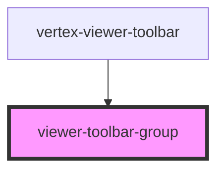

# viewer-toolbar-group

The `viewer-toolbar-group` element is a simple wrapper element that will provide some default
styling to the group of elements contained within it to provide similar styling to the base
`vertex-viewer-toolbar`.

## Style Overrides

| Variable Name                                    | Description                               | Default                                                         |
| ------------------------------------------------ | ----------------------------------------- | --------------------------------------------------------------- |
| `--vertex-viewer-toolbar-group-background-color` | The background color of the toolbar group | `rgba(245, 245, 245, 0.95)`                                     |
| `--vertex-viewer-toolbar-group-box-shadow`       | The box shadow of the toolbar group       | `-1px 0 2px rgba(0, 0, 0, 0.12), 1px 0 2px rgba(0, 0, 0, 0.13)` |
| `--vertex-viewer-toolbar-group-padding`          | The padding around items in the toolbar   | `0 0.25rem`                                                     |
| `--vertex-viewer-toolbar-group-margin`           | The margin around items in the toolbar    | `0 0.25rem`                                                     |
| `--vertex-viewer-toolbar-group-height`           | The height of the toolbar group           | `2.25rem`                                                       |

<!-- Auto Generated Below -->

## Dependencies

### Used by

 - [vertex-viewer-toolbar](../viewer-toolbar)

### Graph

----------------------------------------------

*Built with [StencilJS](https://stenciljs.com/)*
