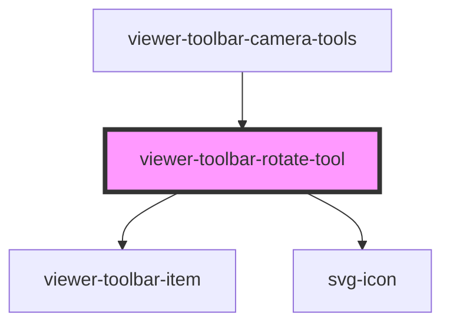

# viewer-toolbar-rotate-tool

The `viewer-toolbar-rotate-tool` element is a simple camera tool that renders a button-like element
that will display hovered and selected states.

<!-- Auto Generated Below -->

## Properties

| Property   | Attribute  | Description                                                                | Type      | Default     |
| ---------- | ---------- | -------------------------------------------------------------------------- | --------- | ----------- |
| `selected` | `selected` | Whether to display conditional selected state styling to this tool's icon. | `boolean` | `undefined` |

## Dependencies

### Used by

 - [viewer-toolbar-camera-tools](../viewer-toolbar-camera-tools)

### Depends on

- [viewer-toolbar-item](../viewer-toolbar-item)
- [svg-icon](../../icons)

### Graph

----------------------------------------------

*Built with [StencilJS](https://stenciljs.com/)*
