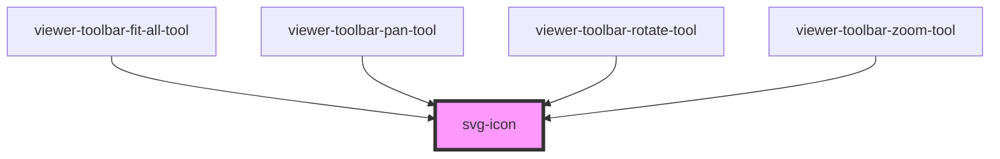

# svg-icon

<!-- Auto Generated Below -->

## Dependencies

### Used by

 - [viewer-toolbar-fit-all-tool](../components/viewer-toolbar-fit-all-tool)
 - [viewer-toolbar-pan-tool](../components/viewer-toolbar-pan-tool)
 - [viewer-toolbar-rotate-tool](../components/viewer-toolbar-rotate-tool)
 - [viewer-toolbar-zoom-tool](../components/viewer-toolbar-zoom-tool)

### Graph

----------------------------------------------

*Built with [StencilJS](https://stenciljs.com/)*
