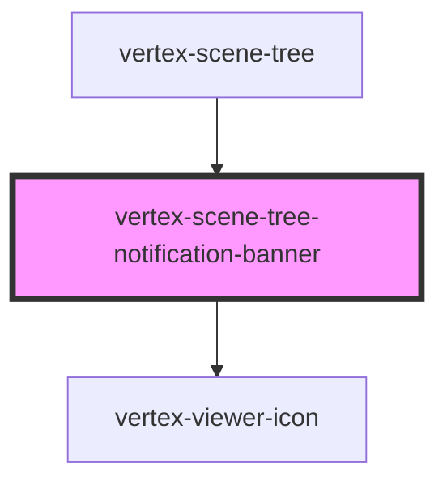

# vertex-scene-tree-notification-banner

<!-- Auto Generated Below -->

## Overview

A notification banner that displays a message and an action button.

## Properties

| Property      | Attribute      | Description                           | Type                  | Default     |
| ------------- | -------------- | ------------------------------------- | --------------------- | ----------- |
| `actionLabel` | `action-label` | The label of the action button.       | `string \| undefined` | `undefined` |
| `message`     | `message`      | The message to display in the banner. | `string \| undefined` | `undefined` |

## Events

| Event    | Description                                                 | Type                |
| -------- | ----------------------------------------------------------- | ------------------- |
| `action` | An event that is emitted when the action button is clicked. | `CustomEvent<void>` |

## Dependencies

### Used by

 - [vertex-scene-tree](../scene-tree)

### Depends on

- [vertex-viewer-icon](../viewer-icon)

### Graph

----------------------------------------------

*Built with [StencilJS](https://stenciljs.com/)*
