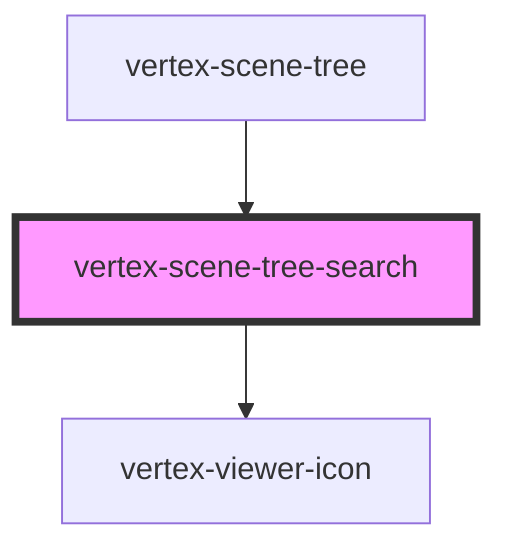

# vertex-scene-tree-search

<!-- Auto Generated Below -->

## Properties

| Property      | Attribute     | Description | Type                  | Default     |
| ------------- | ------------- | ----------- | --------------------- | ----------- |
| `debounce`    | `debounce`    |             | `number`              | `250`       |
| `disabled`    | `disabled`    |             | `boolean`             | `false`     |
| `placeholder` | `placeholder` |             | `string \| undefined` | `undefined` |
| `value`       | `value`       |             | `string`              | `''`        |

## Events

| Event    | Description | Type                  |
| -------- | ----------- | --------------------- |
| `search` |             | `CustomEvent<string>` |

## Methods

### `setFocus() => Promise<void>`

#### Returns

Type: `Promise<void>`

## Dependencies

### Used by

 - [vertex-scene-tree](../scene-tree)

### Depends on

- [vertex-viewer-icon](../viewer-icon)

### Graph

----------------------------------------------

*Built with [StencilJS](https://stenciljs.com/)*
