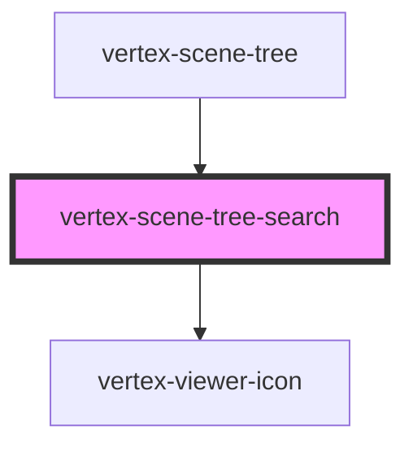

# vertex-scene-tree-search

The `<vertex-scene-tree-search>` represents a text field that can be used to
search for scene tree items. The component contains a search icon, text field
for user input, and a button to clear the search term.

The component emits a `search` event whenever the user changes the value of the
input through user interaction.

When the component is added as a child of a
[`<vertex-scene-tree>`](#../scene-tree/readme.md) the search functionality will
be handled automatically. If added outside the scene tree, the search
functionality will need to be wired programmatically to
`HTMLVertexSceneTreeElement.filterItems()` method.

<!-- Auto Generated Below -->

## Properties

| Property      | Attribute     | Description                                                                     | Type                  | Default     |
| ------------- | ------------- | ------------------------------------------------------------------------------- | --------------------- | ----------- |
| `debounce`    | `debounce`    | Specifies the delay, in milliseconds, to emit `search` events after user input. | `number`              | `250`       |
| `disabled`    | `disabled`    | If `true`, disables user interaction of the component.                          | `boolean`             | `false`     |
| `placeholder` | `placeholder` | Placeholder text if `value` is empty.                                           | `string \| undefined` | `undefined` |
| `value`       | `value`       | The current text value of the component. Value is updated on user interaction.  | `string`              | `''`        |

## Events

| Event    | Description                                                                                                                                       | Type                  |
| -------- | ------------------------------------------------------------------------------------------------------------------------------------------------- | --------------------- |
| `search` | An event that is emitted when a user has inputted or cleared the search term. The event may be delayed according to the current `debounce` value. | `CustomEvent<string>` |

## Methods

### `setFocus() => Promise<void>`

Gives focus to the the component's internal text input.

#### Returns

Type: `Promise<void>`

## Slots

| Slot            | Description                                               |
| --------------- | --------------------------------------------------------- |
| `"clear-icon"`  | A slot that replaces the component's default clear icon.  |
| `"search-icon"` | A slot that replaces the component's default search icon. |

## Dependencies

### Used by

 - [vertex-scene-tree](../scene-tree)

### Depends on

- [vertex-viewer-icon](../viewer-icon)

### Graph

----------------------------------------------

*Built with [StencilJS](https://stenciljs.com/)*
