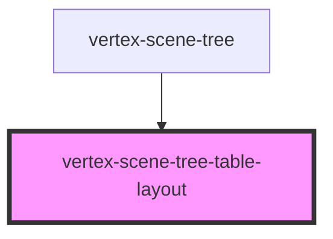

# vertex-scene-tree-table

<!-- Auto Generated Below -->

## Properties

| Property        | Attribute         | Description                                                                                                                                                                                                                                                                                               | Type                                                   | Default     |
| --------------- | ----------------- | --------------------------------------------------------------------------------------------------------------------------------------------------------------------------------------------------------------------------------------------------------------------------------------------------------- | ------------------------------------------------------ | ----------- |
| `overScanCount` | `over-scan-count` | The number of offscreen rows above and below the viewport to render. Having a higher number reduces the chance of the browser not displaying a row while scrolling.  This prop will be automatically populated based on the `overScanCount` prop specified in the parent `<vertex-scene-tree />` element. | `number`                                               | `25`        |
| `rowData`       | --                | A callback that is invoked immediately before a row is about to rendered. This callback can return additional data that can be bound to in a template.  This prop will be automatically populated based on the `rowData` prop specified in the parent `<vertex-scene-tree />` element.                    | `((row: Row) => Record<string, unknown>) \| undefined` | `undefined` |
| `tree`          | --                | A reference to the scene tree to perform operations for interactions. Such as expansion, visibility and selection.                                                                                                                                                                                        | `HTMLVertexSceneTreeElement \| undefined`              | `undefined` |

## Methods

### `scrollToPosition(top: number, options: Pick<DomScrollToOptions, 'behavior'>) => Promise<void>`

Scrolls the table to the provided top value.

#### Returns

Type: `Promise<void>`

## Dependencies

### Used by

 - [vertex-scene-tree](../scene-tree)

### Graph

----------------------------------------------

*Built with [StencilJS](https://stenciljs.com/)*
