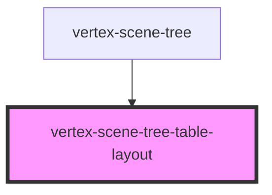

# vertex-scene-tree-table

<!-- Auto Generated Below -->

## Properties

| Property                  | Attribute         | Description                                                                                                                                                                                                                                                                                                                                  | Type                                                   | Default     |
| ------------------------- | ----------------- | -------------------------------------------------------------------------------------------------------------------------------------------------------------------------------------------------------------------------------------------------------------------------------------------------------------------------------------------- | ------------------------------------------------------ | ----------- |
| `overScanCount`           | `over-scan-count` | The number of offscreen rows above and below the viewport to render. Having a higher number reduces the chance of the browser not displaying a row while scrolling.  This prop will be automatically populated based on the `overScanCount` prop specified in the parent `<vertex-scene-tree />` element.                                    | `number`                                               | `25`        |
| `rowData`                 | --                | A callback that is invoked immediately before a row is about to rendered. This callback can return additional data that can be bound to in a template.  This prop will be automatically populated based on the `rowData` prop specified in the parent `<vertex-scene-tree />` element.                                                       | `((row: Row) => Record<string, unknown>) \| undefined` | `undefined` |
| `selectionValidPredicate` | --                | An optional predicate that will be checked prior to performing a selection. If no predicate is specified, all `pointerup` events will be considered for selection.  Any predicate specified on this `vertex-scene-tree` element will override the `selectionValidPredicate` specified on any nested `vertex-scene-tree-table-cell` elements. | `((event: PointerEvent) => boolean) \| undefined`      | `undefined` |
| `tree`                    | --                | A reference to the scene tree to perform operations for interactions. Such as expansion, visibility and selection.                                                                                                                                                                                                                           | `HTMLVertexSceneTreeElement \| undefined`              | `undefined` |

## Methods

### `scrollToPosition(top: number, options: Pick<DomScrollToOptions, 'behavior'>) => Promise<void>`

Scrolls the table to the provided top value.

#### Returns

Type: `Promise<void>`

## CSS Custom Properties

| Name                                      | Description                                                                                 |
| ----------------------------------------- | ------------------------------------------------------------------------------------------- |
| `--scene-tree-table-column-gap`           | CSS length that specifies the amount of padding between columns in the table.               |
| `--scene-tree-table-column-resize-cursor` | A CSS cursor value that will be displayed when resizing a column. Defaults to `col-resize`. |
| `--scene-tree-table-row-padding`          | CSS lengths that specifies the amount of padding between the row's border and content.      |

## Dependencies

### Used by

 - [vertex-scene-tree](../scene-tree)

### Graph

----------------------------------------------

*Built with [StencilJS](https://stenciljs.com/)*
