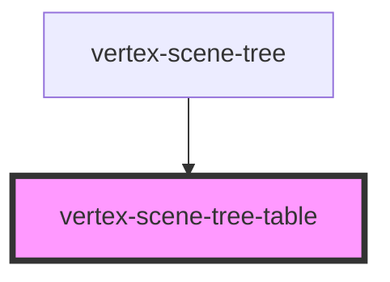

# vertex-scene-tree-table

<!-- Auto Generated Below -->

## Properties

| Property                         | Attribute                           | Description                                                                                                                                                                                                                                                                                               | Type                                                   | Default     |
| -------------------------------- | ----------------------------------- | --------------------------------------------------------------------------------------------------------------------------------------------------------------------------------------------------------------------------------------------------------------------------------------------------------- | ------------------------------------------------------ | ----------- |
| `interactionsDisabled`           | `interactions-disabled`             | A flag that disables the default interactions of this component. If disabled, you can use the event handlers to be notified when certain operations are performed by the user.                                                                                                                            | `boolean`                                              | `false`     |
| `overScanCount`                  | `over-scan-count`                   | The number of offscreen rows above and below the viewport to render. Having a higher number reduces the chance of the browser not displaying a row while scrolling.  This prop will be automatically populated based on the `overScanCount` prop specified in the parent `<vertex-scene-tree />` element. | `number`                                               | `25`        |
| `recurseParentSelectionDisabled` | `recurse-parent-selection-disabled` | A flag that disables selection of the node's parent if the user selects the row multiple times. When enabled, selection of the same row multiple times will recursively select the next unselected parent until the root node is selected.                                                                | `boolean`                                              | `false`     |
| `rowData`                        | --                                  | A callback that is invoked immediately before a row is about to rendered. This callback can return additional data that can be bound to in a template.  This prop will be automatically populated based on the `rowData` prop specified in the parent `<vertex-scene-tree />` element.                    | `((row: Row) => Record<string, unknown>) \| undefined` | `undefined` |
| `tree`                           | --                                  | A reference to the scene tree to perform operations for interactions. Such as expansion, visibility and selection.                                                                                                                                                                                        | `HTMLVertexSceneTreeElement \| undefined`              | `undefined` |

## Methods

### `getViewportEndIndex() => Promise<number>`

#### Returns

Type: `Promise<number>`

### `getViewportStartIndex() => Promise<number>`

#### Returns

Type: `Promise<number>`

## CSS Custom Properties

| Name                             | Description                                                                            |
| -------------------------------- | -------------------------------------------------------------------------------------- |
| `--scene-tree-table-column-gap`  | CSS length that specifies the amount of padding between columns in the table.          |
| `--scene-tree-table-row-padding` | CSS lengths that specifies the amount of padding between the row's border and content. |

## Dependencies

### Used by

 - [vertex-scene-tree](../scene-tree)

### Graph

----------------------------------------------

*Built with [StencilJS](https://stenciljs.com/)*
