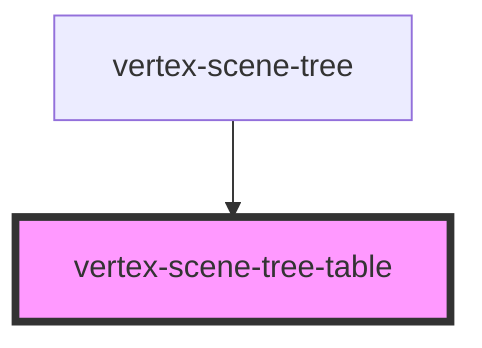

# vertex-scene-tree-table

<!-- Auto Generated Below -->

## Properties

| Property        | Attribute         | Description                                                                                                        | Type                                                   | Default     |
| --------------- | ----------------- | ------------------------------------------------------------------------------------------------------------------ | ------------------------------------------------------ | ----------- |
| `layoutOffset`  | `layout-offset`   |                                                                                                                    | `number`                                               | `0`         |
| `overScanCount` | `over-scan-count` |                                                                                                                    | `number`                                               | `25`        |
| `rowData`       | --                |                                                                                                                    | `((row: Row) => Record<string, unknown>) \| undefined` | `undefined` |
| `rowHeight`     | `row-height`      |                                                                                                                    | `number`                                               | `24`        |
| `rows`          | --                |                                                                                                                    | `Row[]`                                                | `[]`        |
| `scrollOffset`  | `scroll-offset`   |                                                                                                                    | `number`                                               | `0`         |
| `totalRows`     | `total-rows`      |                                                                                                                    | `number`                                               | `0`         |
| `tree`          | --                | A reference to the scene tree to perform operations for interactions. Such as expansion, visibility and selection. | `HTMLVertexSceneTreeElement \| undefined`              | `undefined` |

## Dependencies

### Used by

 - [vertex-scene-tree](../scene-tree)

### Graph

----------------------------------------------

*Built with [StencilJS](https://stenciljs.com/)*
