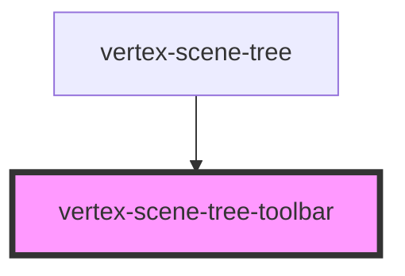

# vertex-scene-tree-toolbar

A `<vertex-scene-tree-toolbar>` represents a container for a scene tree that
will horizontally layout its children. The component is intended to be added to
a [`<vertex-scene-tree>`](../scene-tree/readme.md)'s header or footer slots.

When added to a scene tree, the toolbar will render a bottom border when added
as a header and a top border when added as a footer. You can customize the
border color via the `border-color` CSS property on this component.

## Toolbar Groups

Use the
[`<vertex-scene-tree-toolbar-group>`](../scene-tree-toolbar-group/readme.md) to
group content with the toolbar. The group will automatically space children with
the group with a fractional gap size of this component.

## Usage

```html
<vertex-scene-tree-toolbar slot="header">
  <button slot="before">A</button>

  <vertex-scene-tree-search></vertex-scene-tree-search>

  <vertex-scene-tree-toolbar-group slot="after">
    <button>B</button>
    <button>C</button>
  </vertex-scene-tree-toolbar-group>
</vertex-scene-tree-toolbar>
```

<!-- Auto Generated Below -->


## Slots

| Slot                                                                                                                 | Description                                        |
| -------------------------------------------------------------------------------------------------------------------- | -------------------------------------------------- |
| `"The primary content that will be placed in the center of the toolbar and stretch to container's available width."` |                                                    |
| `"after"`                                                                                                            | Content that is placed after the primary content.  |
| `"before"`                                                                                                           | Content that is placed before the primary content. |


## CSS Custom Properties

| Name                       | Description                                                   |
| -------------------------- | ------------------------------------------------------------- |
| `--scene-tree-toolbar-gap` | A CSS length that specifies the horizontal gap between slots. |


## Dependencies

### Used by

 - [vertex-scene-tree](../scene-tree)

### Graph


----------------------------------------------

*Built with [StencilJS](https://stenciljs.com/)*
