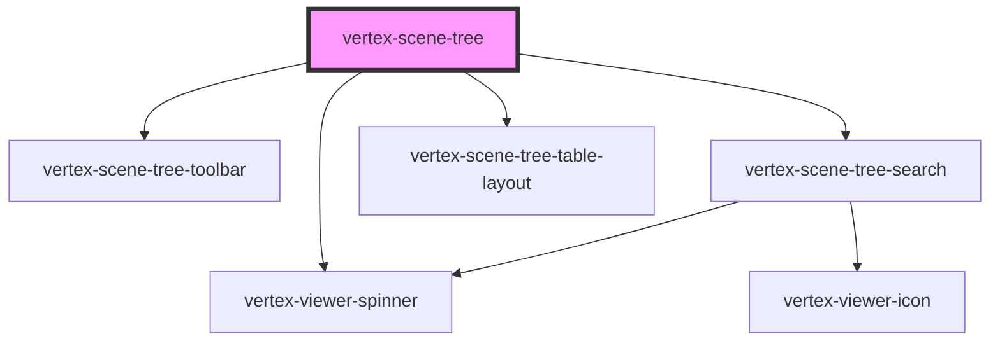

# vertex-scene-tree

The `<vertex-scene-tree>` is a component that renders the items that belong to a
scene.

Because scenes can be large, this component uses a list virtualization strategy
to minimize the number of DOM elements created. The component uses [HTML
templates](https://developer.mozilla.org/en-US/docs/Web/Web_Components/Using_templates_and_slots)
to stamp DOM elements when needed and manages an internal pool of previously
created DOM elements to maximize performance.

## Initializing a Scene Tree

The tree requires that it's connected to an instance of the viewer to perform
certain operations. You can either set the viewer directly through the `viewer`
property, or specify `viewerSelector` with a CSS selector to search for a viewer
instance.

**Example:** Specifying a viewer.

```html
<html>
  <body>
    <vertex-scene-tree viewer-selector="#viewer"></vertex-scene-tree>
    <vertex-viewer id="viewer" src="urn:vertex:stream-key:xwa3EgD3xfeETw164U9XmxopKZ0c8n1gt93j"></vertex-viewer>
  </body>
</html>
```

## Customizing Tree Display

The tree provides a default table layout, with a single column of cells that is
responsible for displaying the content for a row. If you want to customize the appearance
or behavior of a row, you can use a combination of the `<vertex-scene-tree-table-layout>`,
`<vertex-scene-tree-table-column>`, and `<vertex-scene-tree-table-cell>` elements, or
provide your own HTML.

Custom rows require the use of [binding][#binding] to bind row data to the
template. You can use the `rowData` callback in conjunction with binding to
pass custom data and handlers to your row.

**Example:** Customizing a `<vertex-scene-tree-table-layout>`.

Refer to the [`<vertex-scene-tree-table-layout>`](../scene-tree-table-layout/readme.md),
[`<vertex-scene-tree-table-column>`](../scene-tree-table-column/readme.md), and 
[`<vertex-scene-tree-table-cell>`](../scene-tree-table-cell/readme.md) docs for more
information about these components.

```html
<html>
  <head>
    <style>
      .my-btn {
        color: red;
      }
    </style>
  </head>
  <body>
    <vertex-scene-tree viewer-selector="#viewer">
      <vertex-scene-tree-table-layout>
        <vertex-scene-tree-table-column>
          <template>
            <vertex-scene-tree-table-cell prop:value="{{row.node.name}}" expand-toggle visibility-toggle>
              <button class="my-btn" slot="right-gutter" event:click="{{row.data.handleClick}}">
                {{row.data.buttonLabel}}
              </button>
            </vertex-scene-tree-table-cell>
          </template>
        </vertex-scene-tree-table-column>
      </vertex-scene-tree-table-layout>
    </vertex-scene-tree>

    <vertex-viewer id="viewer" src="urn:vertex:stream-key:xwa3EgD3xfeETw164U9XmxopKZ0c8n1gt93j"></vertex-viewer>

    <script type="module">
      function main() {
        const tree = document.querySelector('vertex-scene-tree');
        tree.rowData = (row) => {
          return {
            handleClick: () => console.log('clicked row button', row),
            buttonLabel: `Click ${row.index}`
          }
        }
      }

      main();
    </script>
  </body>
</html>
```

**Example:** Using your own HTML.

```html
<html>
  <head>
    <style>
      .my-row {
        display: flex;
      }

      .my-btn {
        color: red;
        margin-left: auto;
      }

      .my-expand-btn {
        color: green;
      }

      .my-expand-btn[data-can-expand="false"] {
        pointer-events: none;
        display: none;
      }

      .my-expand-label[data-expanded="true"] {
        display: none;
      }

      .my-collapse-label[data-expanded="false"] {
        display: none;
      }

      span[data-can-expand="false"] {
        margin-left: 0.25rem;
      }
    </style>
  </head>
  <body>
    <vertex-scene-tree viewer-selector="#viewer">
      <vertex-scene-tree-table-layout>
        <vertex-scene-tree-table-column>
          <template>
            <div class="my-row">
              <button class="my-expand-btn" event:click="{{row.data.handleExpansion}}" attr:data-can-expand="{{row.data.canExpand}}">
                <span class="my-expand-label" attr:data-expanded="{{row.data.expanded}}">></span>
                <span class="my-collapse-label" attr:data-expanded="{{row.data.expanded}}">v</span>
              </button>
              <span attr:data-can-expand="{{row.data.canExpand}}">{{row.node.name}}</span>
              <button class="my-btn">Click Me</button>
            </div>
          </template>
        </vertex-scene-tree-table-column>
      </vertex-scene-tree-table-layout>
    </vertex-scene-tree>

    <vertex-viewer id="viewer" src="urn:vertex:stream-key:xwa3EgD3xfeETw164U9XmxopKZ0c8n1gt93j"></vertex-viewer>

    <script type="module">
      function main() {
        const tree = document.querySelector('vertex-scene-tree');
        tree.rowData = (row) => {
          return {
            handleExpansion: () => tree.toggleExpandItem(row),
            canExpand: !row.node.isLeaf,
            expanded: row.node.expanded
          }
        }
      }

      main();
    </script>
  </body>
</html>
```

**Example:** Customizing column data.

```html
<html>
  <body>
    <vertex-scene-tree viewer-selector="#viewer">
      <vertex-scene-tree-table-layout>
        <vertex-scene-tree-table-column>
          <template>
            <vertex-scene-tree-table-cell prop:value="{{row.node.name}}" expand-toggle></vertex-scene-tree-table-cell>
          </template>
        </vertex-scene-tree-table-column>
        <vertex-scene-tree-table-column>
          <template>
            <vertex-scene-tree-table-cell prop:value="{{row.node.depth}}" visibility-toggle></vertex-scene-tree-table-cell>
          </template>
        </vertex-scene-tree-table-column>
      </vertex-scene-tree-table-layout>
    </vertex-scene-tree>

    <vertex-viewer id="viewer" src="urn:vertex:stream-key:xwa3EgD3xfeETw164U9XmxopKZ0c8n1gt93j"></vertex-viewer>
  </body>
</html>
```

## Metadata

The tree provides support for retrieving metadata values with each row, which can
then be leveraged to change the values displayed in each `<vertex-scene-tree-table-cell>`.
By providing a set of metadata keys using the `metadataKeys` property, these values will be
made available when binding to the `row.metadata` object.

**Example:** Customizing displayed metadata.

```html
<html>
  <body>
    <vertex-scene-tree viewer-selector="#viewer">
      <vertex-scene-tree-table-layout>
        <vertex-scene-tree-table-column>
          <template>
            <vertex-scene-tree-table-cell prop:value="{{row.node.name}}" expand-toggle></vertex-scene-tree-table-cell>
          </template>
        </vertex-scene-tree-table-column>
        <vertex-scene-tree-table-column>
          <template>
            <vertex-scene-tree-table-cell prop:value="{{row.metadata.InstanceID}}" visibility-toggle></vertex-scene-tree-table-cell>
          </template>
        </vertex-scene-tree-table-column>
      </vertex-scene-tree-table-layout>
    </vertex-scene-tree>

    <vertex-viewer id="viewer" src="urn:vertex:stream-key:xwa3EgD3xfeETw164U9XmxopKZ0c8n1gt93j"></vertex-viewer>

    <script type="module">
      function main() {
        const tree = document.querySelector('vertex-scene-tree');
        tree.metadataKeys = [
          "VERTEX_SCENE_ITEM_NAME",
          "InstanceID"
        ];
      }

      main();
    </script>
  </body>
</html>
```

## Filtering

The tree can be filtered to narrow in on specific rows based on a specified search term.
By default, this filter will match against both the item name (`VERTEX_SCENE_ITEM_NAME` metadata key)
and any additional specified `metadataKeys`. This behavior can be overridden by providing a set of
metadata keys to search against using the `metadataSearchKeys` property.

**Example:** Customizing metadata search keys.

```html
<html>
  <body>
    <vertex-scene-tree viewer-selector="#viewer">
      <vertex-scene-tree-table-layout>
        <vertex-scene-tree-table-column>
          <template>
            <vertex-scene-tree-table-cell prop:value="{{row.node.name}}" expand-toggle></vertex-scene-tree-table-cell>
          </template>
        </vertex-scene-tree-table-column>
        <vertex-scene-tree-table-column>
          <template>
            <vertex-scene-tree-table-cell prop:value="{{row.metadata.InstanceID}}" visibility-toggle></vertex-scene-tree-table-cell>
          </template>
        </vertex-scene-tree-table-column>
      </vertex-scene-tree-table-layout>
    </vertex-scene-tree>

    <vertex-viewer id="viewer" src="urn:vertex:stream-key:xwa3EgD3xfeETw164U9XmxopKZ0c8n1gt93j"></vertex-viewer>

    <script type="module">
      function main() {
        const tree = document.querySelector('vertex-scene-tree');
        
        tree.metadataKeys = [
          "VERTEX_SCENE_ITEM_NAME",
          "InstanceID"
        ];

        tree.metadataSearchKeys = [
          "InstanceID"
        ];
      }

      main();
    </script>
  </body>
</html>
```

In addition to filtering from the default [`<vertex-scene-tree-search>`](../scene-tree-search/readme.md) element, filtering
can also be done programmatically using the `filterItems` method.

**Example:**

```html
<html>
  <body>
    <vertex-scene-tree viewer-selector="#viewer">
      <div slot="header">My Custom Header</div>

      <vertex-scene-tree-table-layout>
        <vertex-scene-tree-table-column>
          <template>
            <vertex-scene-tree-table-cell prop:value="{{row.node.name}}" expand-toggle></vertex-scene-tree-table-cell>
          </template>
        </vertex-scene-tree-table-column>
        <vertex-scene-tree-table-column>
          <template>
            <vertex-scene-tree-table-cell prop:value="{{row.metadata.InstanceID}}" visibility-toggle></vertex-scene-tree-table-cell>
          </template>
        </vertex-scene-tree-table-column>
      </vertex-scene-tree-table-layout>
    </vertex-scene-tree>

    <vertex-viewer id="viewer" src="urn:vertex:stream-key:xwa3EgD3xfeETw164U9XmxopKZ0c8n1gt93j"></vertex-viewer>

    <button id="product-filter-one">Filter to product 1</button>
    <button id="product-filter-two">Filter to product 2</button>

    <script type="module">
      function main() {
        const tree = document.querySelector('vertex-scene-tree');
        
        tree.metadataKeys = [
          "VERTEX_SCENE_ITEM_NAME",
          "InstanceID"
        ];

        const button1 = document.querySelector('#product-filter-one');
        const button2 = document.querySelector('#product-filter-two');

        button1.addEventListener('click', () => {
          tree.filterItems("113950", {
            columns: ["InstanceID"],
            exactMatch: true
          });
        });
        button2.addEventListener('click', () => {
          tree.filterItems("111800", {
            columns: ["InstanceID"],
            exactMatch: true
          });
        });
      }

      main();
    </script>
  </body>
</html>
```

## Retrieving Metadata Keys

The tree also provides support for retrieving the set of available metadata keys for the
scene. This can be done by performing a lookup using the `controller` property of the 
`<vertex-scene-tree>` element. Once retrieved, these keys can then be used to filter
the tree. See the `SceneTreeController` class for more information.

**Example:** Retrieving available metadata keys.

```html
<html>
  <body>
    <vertex-scene-tree viewer-selector="#viewer">
      <vertex-scene-tree-table-layout>
        <vertex-scene-tree-table-column>
          <template>
            <vertex-scene-tree-table-cell prop:value="{{row.node.name}}" expand-toggle></vertex-scene-tree-table-cell>
          </template>
        </vertex-scene-tree-table-column>
        <vertex-scene-tree-table-column>
          <template>
            <vertex-scene-tree-table-cell prop:value="{{row.metadata.InstanceID}}" visibility-toggle></vertex-scene-tree-table-cell>
          </template>
        </vertex-scene-tree-table-column>
      </vertex-scene-tree-table-layout>
    </vertex-scene-tree>

    <vertex-viewer id="viewer" src="urn:vertex:stream-key:xwa3EgD3xfeETw164U9XmxopKZ0c8n1gt93j"></vertex-viewer>

    <script type="module">
      function main() {
        const tree = document.querySelector('vertex-scene-tree');
        
        // Ensure the component has initialized so the `controller` is defined.
        await tree.componentOnReady();

        tree.controller.stateChanged(async (sceneTreeState) => {
          // Verify that our controller is connected prior to attempting
          // to fetch the metadata keys.
          if (tree.controller.isConnected) {
            // ex. ['InstanceID', 'PRODUCT_NAME']
            console.log(await tree.fetchMetadataKeys());
          }
        });
      }

      main();
    </script>
  </body>
</html>
```

## Binding

The tree provides a simple binding syntax to pass data from your `rowData`
callback to your row template. A binding's specified with one of the following
syntaxes:

```html
<!-- Bind text content -->
<div>{{row.data.foo}}</div>

<!-- Bind to a DOM property -->
<input prop:value="{{row.data.foo}}"></div>

<!-- Bind to a DOM attribute -->
<div attr:title="{{row.data.foo}}"></div>

<!-- Bind to a DOM event -->
<button event:click="{{row.data.handler}}"></button>
```

### Attributes vs Properties

The `attr:name` syntax will use `element.setAttribute('name', value)` to assign
a value to a DOM attribute. The `prop:name` syntax uses `element.name = value`
for assignment.

With attribute binding, the browser can only assign strings to attributes.
Because of this, you cannot use an attribute binding to assign a JS object to an
attribute. In these scenarios, using a property binding is preferred. However,
because attribute bindings are string values, they can support string
interpolation. So doing `<div attr:title="Hello {{row.data.name}}"></div>` would
work for an attribute, but not for a property binding.

### Camel Cased Properties and Events

The DOM lowercases property names and events that you assign in your templates
HTML. Bind to a camel-cased property or event by separating words with a dash.
The binding syntax will convert dash case to camel case for properties and
events.

```html
<!-- Bind to a DOM property -->
<input prop:my-camel-cased-prop="{{row.data.foo}}"></div>

<!-- Bind to a DOM event -->
<button event:my-camel-cased-event="{{row.data.handler}}"></button>
```

## Headers and Footers

The component supports slots for specifying a header and footer. We provide a
[`<vertex-scene-tree-toolbar>`](../scene-tree-toolbar/readme.md) helper
component to layout content in the header and footer.

**Note:** By default, the component renders a search field in the header. If you
replace the header and want search behavior, your header slot should include a
[`<vertex-scene-tree-search>`](../scene-tree-search/readme.md).

**Example:** Supplying a header and footer.

```html
<html>
  <body>
    <vertex-scene-tree viewer-selector="#viewer">
      <vertex-scene-tree-toolbar slot="header">
        <vertex-scene-tree-search></vertex-scene-tree-search>

        <vertex-scene-tree-toolbar-group slot="after">
          <button>A</button>
          <button>B</button>
        </vertex-scene-tree-toolbar-group>
      </vertex-scene-tree-toolbar>

      <vertex-scene-tree-toolbar slot="footer">
        <button slot="before">A</button>
        <div>Footer Text</div>
        <button slot="after">A</button>
      </vertex-scene-tree-toolbar>
    </vertex-scene-tree>
    <vertex-viewer id="viewer" src="urn:vertex:stream-key:xwa3EgD3xfeETw164U9XmxopKZ0c8n1gt93j"></vertex-viewer>
  </body>
</html>
```

**Example:** Stacking headers and footers.

Pass multiple elements with a slot name of `header` or `footer` to vertically
stack toolbars.

```html
<html>
  <body>
    <vertex-scene-tree viewer-selector="#viewer">
      <!-- Main header toolbar -->
      <vertex-scene-tree-toolbar slot="header">
        <vertex-scene-tree-search></vertex-scene-tree-search>
      </vertex-scene-tree-toolbar>
      <!-- Secondary header toolbar -->
      <vertex-scene-tree-toolbar slot="header">
        <button>A</button>
        <button>B</button>
      </vertex-scene-tree-toolbar>

      <!-- Main footer toolbar -->
      <vertex-scene-tree-toolbar slot="footer">
        <button>A</button>
        <button>B</button>
      </vertex-scene-tree-toolbar>
      <!-- Secondary footer toolbar -->
      <vertex-scene-tree-toolbar slot="footer">
        <button slot="before">A</button>
        <div>Footer Text</div>
        <button slot="after">A</button>
      </vertex-scene-tree-toolbar>
    </vertex-scene-tree>
    <vertex-viewer id="viewer" src="urn:vertex:stream-key:xwa3EgD3xfeETw164U9XmxopKZ0c8n1gt93j"></vertex-viewer>
  </body>
</html>
```

## Troubleshooting

### Filtering

#### Expected results not appearing

By default, filtering occurs against the `VERTEX_SCENE_ITEM_NAME` metadata. This can be 
configured through a couple different options:
- Providing values via the `metadataSearchKeys` property will cause all filters to be checked
  against the provided metadata keys. This can be used to customize the filter behavior to either
  include additional metadata properties, or to exclude the default `VERTEX_SCENE_ITEM_NAME` metadata.
- Providing values via the `columns` option when programmatically filtering with the `filterItems` method.
  This behaves similarly to the `metadataSearchKeys`, but will not default to including the `VERTEX_SCENE_ITEM_NAME`
  metadata. To have the programmatic filter behave the same way as the default search, [`VERTEX_SCENE_ITEM_NAME`] can
  be provided for this option.

#### Working with metadata that includes spaces

When binding data for metadata keys that include spaces, we expect that the space is preserved in the binding.

**Example:** Binding metadata values for a key with a space

```html
<html>
  <body>
    <vertex-scene-tree viewer-selector="#viewer">
      <vertex-scene-tree-table-layout>
        <vertex-scene-tree-table-column>
          <template>
            <vertex-scene-tree-table-cell prop:value="{{row.node.name}}" expand-toggle></vertex-scene-tree-table-cell>
          </template>
        </vertex-scene-tree-table-column>
        <vertex-scene-tree-table-column>
          <template>
            <vertex-scene-tree-table-cell prop:value="{{row.metadata.Metadata property with spaces}}" visibility-toggle></vertex-scene-tree-table-cell>
          </template>
        </vertex-scene-tree-table-column>
      </vertex-scene-tree-table-layout>
    </vertex-scene-tree>

    <vertex-viewer id="viewer" src="urn:vertex:stream-key:my-key"></vertex-viewer>

    <script type="module">
      function main() {
        const tree = document.querySelector('vertex-scene-tree');
        tree.metadataKeys = [
          "VERTEX_SCENE_ITEM_NAME",
          "Metadata property with spaces"
        ];
      }

      main();
    </script>
  </body>
</html>
```

<!-- Auto Generated Below -->


## Properties

| Property                   | Attribute                     | Description                                                                                                                                                                                                                                                                                                                                                                            | Type                                                   | Default      |
| -------------------------- | ----------------------------- | -------------------------------------------------------------------------------------------------------------------------------------------------------------------------------------------------------------------------------------------------------------------------------------------------------------------------------------------------------------------------------------- | ------------------------------------------------------ | ------------ |
| `config`                   | `config`                      | An object to configure the scene tree.                                                                                                                                                                                                                                                                                                                                                 | `Config \| string \| undefined`                        | `undefined`  |
| `configEnv`                | `config-env`                  | Sets the default environment for the viewer. This setting is used for auto-configuring network hosts.  Use the `config` property for manually setting hosts.                                                                                                                                                                                                                           | `"platdev" \| "platprod" \| "platstaging"`             | `'platprod'` |
| `controller`               | --                            |                                                                                                                                                                                                                                                                                                                                                                                        | `SceneTreeController \| undefined`                     | `undefined`  |
| `metadataKeys`             | --                            | A list of part metadata keys that will be made available to each row. This metadata can be used for data binding inside the scene tree's template.  **Note:** for the values of these metadata keys to be evaluated for search, they must be provided to the `metadataSearchKeys` specified in the `searchOptions`. Otherwise the search will only be performed against the item name. | `string[]`                                             | `[]`         |
| `metadataSearchExactMatch` | `metadata-search-exact-match` | <span style="color:red">**[DEPRECATED]**</span> Use `searchOptions` Indicates whether the metadata search should use an exact match.<br/><br/>                                                                                                                                                                                                                                         | `boolean`                                              | `false`      |
| `metadataSearchKeys`       | --                            | <span style="color:red">**[DEPRECATED]**</span> Use `searchOptions` A list of the metadata keys that a scene tree search should be performed on.<br/><br/>                                                                                                                                                                                                                             | `string[]`                                             | `[]`         |
| `overScanCount`            | `over-scan-count`             | The number of offscreen rows above and below the viewport to render. Having a higher number reduces the chance of the browser not displaying a row while scrolling.                                                                                                                                                                                                                    | `number`                                               | `25`         |
| `rowData`                  | --                            | A callback that is invoked immediately before a row is about to rendered. This callback can return additional data that can be bound to in a template.                                                                                                                                                                                                                                 | `((row: Row) => Record<string, unknown>) \| undefined` | `undefined`  |
| `searchOptions`            | --                            | A set of options to configure scene tree searching behavior.                                                                                                                                                                                                                                                                                                                           | `FilterOptions`                                        | `{}`         |
| `viewer`                   | --                            | An instance of a `<vertex-viewer>` element. Either this property or `viewerSelector` must be set.                                                                                                                                                                                                                                                                                      | `HTMLVertexViewerElement \| null \| undefined`         | `undefined`  |
| `viewerSelector`           | `viewer-selector`             | A CSS selector that points to a `<vertex-viewer>` element. Either this property or `viewer` must be set.                                                                                                                                                                                                                                                                               | `string \| undefined`                                  | `undefined`  |


## Events

| Event              | Description                                                                                | Type                                 |
| ------------------ | ------------------------------------------------------------------------------------------ | ------------------------------------ |
| `connectionError`  | An event that is emitted when this <vertex-scene-tree> encounters a connection error.      | `CustomEvent<SceneTreeErrorDetails>` |
| `firstRowRendered` | An event that is emitted when the first row of this <vertex-scene-tree> has been rendered. | `CustomEvent<void>`                  |


## Methods

### `collapseAll() => Promise<void>`

Performs an API call to collapse all nodes in the tree.

#### Returns

Type: `Promise<void>`


### `collapseItem(row: RowArg) => Promise<void>`

Performs an API call that will collapse the node associated to the
specified row or row index.

#### Returns

Type: `Promise<void>`


### `deselectItem(row: RowArg) => Promise<void>`

Performs an API call that will deselect the item associated to the given
row or row index.

#### Returns

Type: `Promise<void>`


### `expandAll() => Promise<void>`

Performs an API call to expand all nodes in the tree.

#### Returns

Type: `Promise<void>`


### `expandItem(row: RowArg) => Promise<void>`

Performs an API call that will expand the node associated to the specified
row or row index.

#### Returns

Type: `Promise<void>`


### `fetchMetadataKeys() => Promise<MetadataKey[]>`

Fetches the metadata keys that are available to the scene tree. Metadata
keys can be assigned to the scene tree using the `metadataKeys` property.
The scene tree will fetch this metadata and make these values available
for data binding.

#### Returns

Type: `Promise<string[]>`

A promise that resolves with the names of available keys.

### `filterItems(term: string, options?: FilterTreeOptions) => Promise<void>`

Performs an async request that will filter the displayed items in the tree
that match the given term and options.

#### Returns

Type: `Promise<void>`

A promise that completes when the request has completed. Note,
items are displayed asynchronously. So the displayed items may not reflect
the result of this filter when the promise completes.

### `getRowAtClientY(clientY: number) => Promise<Row>`

Returns the row data from the given vertical client position.

#### Returns

Type: `Promise<Row>`

A row or `undefined` if the row hasn't been loaded.

### `getRowAtIndex(index: number) => Promise<Row>`

Returns a row at the given index. If the row data has not been loaded,
returns `undefined`.

#### Returns

Type: `Promise<Row>`

A row, or `undefined` if the row hasn't been loaded.

### `getRowForEvent(event: MouseEvent | PointerEvent) => Promise<Row>`

Returns the row data from the given mouse or pointer event. The event must
originate from a `vertex-scene-tree-table-cell` contained by this element,
otherwise `undefined` is returned.

#### Returns

Type: `Promise<Row>`

A row, or `undefined` if the row hasn't been loaded.

### `hideItem(row: RowArg) => Promise<void>`

Performs an API call that will hide the item associated to the given row
or row index.

#### Returns

Type: `Promise<void>`


### `invalidateRows() => Promise<void>`

Schedules a render of the rows in the scene tree. Useful if any custom
data in your scene tree has changed, and you want to update the row's
contents.

**Note:** This is an asynchronous operation. The update may happen on the
next frame.

#### Returns

Type: `Promise<void>`


### `scrollToIndex(index: number, options?: ScrollToOptions) => Promise<void>`

Scrolls the tree to the given row index.

#### Returns

Type: `Promise<void>`


### `scrollToItem(itemId: string, options?: ScrollToOptions) => Promise<void>`

Scrolls the tree to an item with the given ID. If the node for the item is
not expanded, the tree will expand each of its parent nodes.

#### Returns

Type: `Promise<void>`

A promise that resolves when the operation is finished.

### `selectFilteredItems(term: string, options?: SceneTreeOperationOptions | undefined) => Promise<void>`

Performs an async request that will select the filtered items in the tree
that match the given term.

#### Returns

Type: `Promise<void>`

A promise that completes when the request has completed.

### `selectItem(row: RowArg, { recurseParent, ...options }?: SelectItemOptions) => Promise<void>`

Performs an API call that will select the item associated to the given row
or row index.

This method supports a `recurseParent` option that allows for recursively
selecting the next unselected parent node. This behavior is considered
stateful. Each call to `selectItem` will track the ancestry of the passed
in `rowArg`. If calling `selectItem` with a row not belonging to the
ancestry of a previous selection, then this method will perform a standard
selection.

#### Returns

Type: `Promise<void>`


### `showItem(row: RowArg) => Promise<void>`

Performs an API call that will show the item associated to the given row
or row index.

#### Returns

Type: `Promise<void>`


### `toggleExpandItem(row: RowArg) => Promise<void>`

Performs an API call that will either expand or collapse the node
associated to the given row or row index.

#### Returns

Type: `Promise<void>`


### `toggleItemVisibility(row: RowArg) => Promise<void>`

Performs an API call that will either hide or show the item associated to
the given row or row index.

#### Returns

Type: `Promise<void>`


## Slots

| Slot       | Description                                                                                                                                                                           |
| ---------- | ------------------------------------------------------------------------------------------------------------------------------------------------------------------------------------- |
| `"footer"` | A slot that places content below the rows in the tree. Elements can be stacked by assigning multiple elements to this slot.                                                           |
| `"header"` | A slot that places content above the rows in the tree. By default, a search toolbar will be placed in this slot. Elements can be stacked by assigning multiple elements to this slot. |


## CSS Custom Properties

| Name                             | Description                                                               |
| -------------------------------- | ------------------------------------------------------------------------- |
| `--scene-tree-toolbar-separator` | A CSS border value that specifies the border between scene tree toolbars. |


## Dependencies

### Depends on

- [vertex-scene-tree-toolbar](../scene-tree-toolbar)
- [vertex-scene-tree-search](../scene-tree-search)
- [vertex-viewer-spinner](../viewer-spinner)
- [vertex-scene-tree-table-layout](../scene-tree-table-layout)

### Graph


----------------------------------------------

*Built with [StencilJS](https://stenciljs.com/)*
