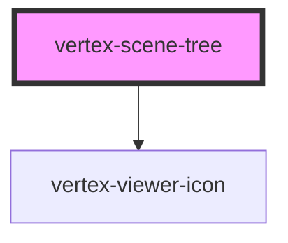

# vertex-scene-tree

<!-- Auto Generated Below -->

## Properties

| Property            | Attribute            | Description                                                                                                                                                         | Type                                                   | Default      |
| ------------------- | -------------------- | ------------------------------------------------------------------------------------------------------------------------------------------------------------------- | ------------------------------------------------------ | ------------ |
| `config`            | --                   | An object to configure the scene tree.                                                                                                                              | `Config \| undefined`                                  | `undefined`  |
| `configEnv`         | `config-env`         | Sets the default environment for the viewer. This setting is used for auto-configuring network hosts.  Use the `config` property for manually setting hosts.        | `"platdev" \| "platprod" \| "platstaging"`             | `'platprod'` |
| `overScanCount`     | `over-scan-count`    | The number of offscreen rows above and below the viewport to render. Having a higher number reduces the chance of the browser not displaying a row while scrolling. | `number`                                               | `10`         |
| `rowData`           | --                   | A callback that is invoked immediately before a row is about to rendered. This callback can return additional data that can be bound to in a template.              | `((row: Row) => Record<string, unknown>) \| undefined` | `undefined`  |
| `selectionDisabled` | `selection-disabled` | Disables the default selection behavior of the tree. Can be used to implement custom selection behavior via the trees selection methods.                            | `boolean`                                              | `false`      |
| `viewer`            | --                   | An instance of a `<vertex-viewer>` element. Either this property or `viewerSelector` must be set.                                                                   | `HTMLVertexViewerElement \| null \| undefined`         | `undefined`  |
| `viewerSelector`    | `viewer-selector`    | A CSS selector that points to a `<vertex-viewer>` element. Either this property or `viewer` must be set.                                                            | `string \| undefined`                                  | `undefined`  |

## Events

| Event   | Description | Type                                 |
| ------- | ----------- | ------------------------------------ |
| `error` |             | `CustomEvent<SceneTreeErrorDetails>` |

## Methods

### `collapseAll() => Promise<void>`

Performs an API call to collapse all nodes in the tree.

#### Returns

Type: `Promise<void>`

### `collapseItem(rowOrIndex: number | Row) => Promise<void>`

Performs an API call that will collapse the node associated to the
specified row or row index.

#### Returns

Type: `Promise<void>`

### `deselectItem(rowOrIndex: number | Row) => Promise<void>`

Performs an API call that will deselect the item associated to the given
row or row index.

#### Returns

Type: `Promise<void>`

### `expandAll() => Promise<void>`

Performs an API call to expand all nodes in the tree.

#### Returns

Type: `Promise<void>`

### `expandItem(rowOrIndex: number | Row) => Promise<void>`

Performs an API call that will expand the node associated to the specified
row or row index.

#### Returns

Type: `Promise<void>`

### `getRowAtClientY(clientY: number) => Promise<Row>`

Returns the row data from the given vertical client position.

#### Returns

Type: `Promise<Row>`

### `getRowAtIndex(index: number) => Promise<Row>`

Returns a row at the given index. If the row data has not been loaded,
returns `undefined`.

#### Returns

Type: `Promise<Row>`

### `getRowForEvent(event: MouseEvent | PointerEvent) => Promise<Row>`

Returns the row data from the given mouse or pointer event. The event
must originate from this component otherwise `undefined` is returned.

#### Returns

Type: `Promise<Row>`

### `hideItem(rowOrIndex: number | Row) => Promise<void>`

Performs an API call that will hide the item associated to the given row
or row index.

#### Returns

Type: `Promise<void>`

### `invalidateRows() => Promise<void>`

Schedules a render of the rows in the scene tree. Useful if any custom
data in your scene tree has changed, and you want to update the row's
contents.

**Note:** This is an asynchronous operation. The update may happen on the
next frame.

#### Returns

Type: `Promise<void>`

### `scrollToIndex(index: number, options?: ScrollToOptions) => Promise<void>`

Scrolls the tree to the given row index.

#### Returns

Type: `Promise<void>`

### `scrollToItem(itemId: string, options?: ScrollToOptions) => Promise<void>`

Scrolls the tree to an item with the given ID. If the node for the item is
not expanded, the tree will expand each of its parent nodes.

#### Returns

Type: `Promise<void>`

### `selectItem(rowOrIndex: number | Row, options?: SelectItemOptions) => Promise<void>`

Performs an API call that will select the item associated to the given row
or row index.

#### Returns

Type: `Promise<void>`

### `showItem(rowOrIndex: number | Row) => Promise<void>`

Performs an API call that will show the item associated to the given row
or row index.

#### Returns

Type: `Promise<void>`

### `toggleExpandItem(rowOrIndex: number | Row) => Promise<void>`

Performs an API call that will either expand or collapse the node
associated to the given row or row index.

#### Returns

Type: `Promise<void>`

### `toggleItemVisibility(rowOrIndex: number | Row) => Promise<void>`

Performs an API call that will either hide or show the item associated to
the given row or row index.

#### Returns

Type: `Promise<void>`

## CSS Custom Properties

| Name                          | Description                                  |
| ----------------------------- | -------------------------------------------- |
| `--scene-tree-hover-color`    | The background color of a row when hovered.  |
| `--scene-tree-row-height`     | The height of each row in the scene tree.    |
| `--scene-tree-row-padding`    | The padding of each row in the scene tree.   |
| `--scene-tree-selected-color` | The background color of a row when selected. |

## Dependencies

### Depends on

- [vertex-viewer-icon](../viewer-icon)

### Graph

----------------------------------------------

*Built with [StencilJS](https://stenciljs.com/)*
