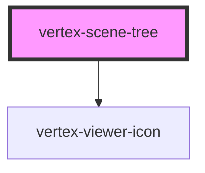

# vertex-scene-tree

<!-- Auto Generated Below -->

## Properties

| Property                | Attribute                 | Description                                                                                                                                                  | Type                                           | Default      |
| ----------------------- | ------------------------- | ------------------------------------------------------------------------------------------------------------------------------------------------------------ | ---------------------------------------------- | ------------ |
| `approximateItemHeight` | `approximate-item-height` |                                                                                                                                                              | `number`                                       | `20`         |
| `config`                | --                        |                                                                                                                                                              | `Config \| undefined`                          | `undefined`  |
| `configEnv`             | `config-env`              | Sets the default environment for the viewer. This setting is used for auto-configuring network hosts.  Use the `config` property for manually setting hosts. | `"platdev" \| "platprod" \| "platstaging"`     | `'platprod'` |
| `jwt`                   | `jwt`                     |                                                                                                                                                              | `string \| undefined`                          | `undefined`  |
| `overScanCount`         | `over-scan-count`         |                                                                                                                                                              | `number`                                       | `10`         |
| `rowData`               | --                        |                                                                                                                                                              | `((row: Row) => object) \| undefined`          | `undefined`  |
| `viewer`                | --                        |                                                                                                                                                              | `HTMLVertexViewerElement \| null \| undefined` | `undefined`  |
| `viewerSelector`        | `viewer-selector`         |                                                                                                                                                              | `string \| undefined`                          | `undefined`  |

## Methods

### `collapseAll() => Promise<void>`

Performs an API call to collapse all nodes in the tree.

#### Returns

Type: `Promise<void>`

### `collapseItem(rowOrIndex: number | Row) => Promise<void>`

Performs an API call that will collapse the node associated to the
specified row or row index.

#### Returns

Type: `Promise<void>`

### `expandAll() => Promise<void>`

Performs an API call to expand all nodes in the tree.

#### Returns

Type: `Promise<void>`

### `expandItem(rowOrIndex: number | Row) => Promise<void>`

Performs an API call that will expand the node associated to the specified
row or row index.

#### Returns

Type: `Promise<void>`

### `getRowAtClientY(clientY: number) => Promise<Row>`

Returns the row data from the given vertical client position.

#### Returns

Type: `Promise<Row>`

### `getRowAtIndex(index: number) => Promise<Row>`

Returns a row at the given index. If the row data has not been loaded,
returns `undefined`.

#### Returns

Type: `Promise<Row>`

### `getRowFromEvent(event: MouseEvent | PointerEvent) => Promise<Row>`

Returns the row data from the given mouse or pointer event. The event
must originate from this component otherwise `undefined` is returned.

#### Returns

Type: `Promise<Row>`

### `hideItem(rowOrIndex: number | Row) => Promise<void>`

Performs an API call that will hide the item associated to the given row
or row index.

#### Returns

Type: `Promise<void>`

### `invalidateRows() => Promise<void>`

Schedules a render of the rows in the scene tree. Useful if any custom
data in your scene tree has changed, and you want to update the row's
contents.

**Note:** This is an asynchronous operation. The update may happen on the
next frame.

#### Returns

Type: `Promise<void>`

### `scrollToIndex(index: number) => Promise<void>`

#### Returns

Type: `Promise<void>`

### `showItem(rowOrIndex: number | Row) => Promise<void>`

Performs an API call that will show the item associated to the given row
or row index.

#### Returns

Type: `Promise<void>`

### `toggleExpandItem(rowOrIndex: number | Row) => Promise<void>`

Performs an API call that will either expand or collapse the node
associated to the given row or row index.

#### Returns

Type: `Promise<void>`

### `toggleItemVisibility(rowOrIndex: number | Row) => Promise<void>`

Performs an API call that will either hide or show the item associated to
the given row or row index.

#### Returns

Type: `Promise<void>`

## CSS Custom Properties

| Name                       | Description                                |
| -------------------------- | ------------------------------------------ |
| `--scene-tree-row-height`  | The height of each row in the scene tree.  |
| `--scene-tree-row-padding` | The padding of each row in the scene tree. |

## Dependencies

### Depends on

- [vertex-viewer-icon](../viewer-icon)

### Graph

----------------------------------------------

*Built with [StencilJS](https://stenciljs.com/)*
