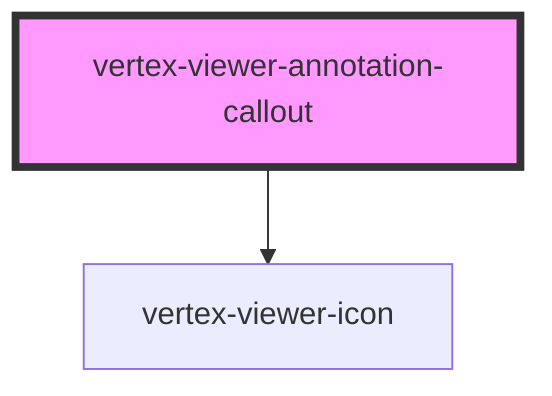

# vertex-viewer-annotation-callout

<!-- Auto Generated Below -->

## Properties

| Property            | Attribute   | Description                                                                                                                                                              | Type                                   | Default     |
| ------------------- | ----------- | ------------------------------------------------------------------------------------------------------------------------------------------------------------------------ | -------------------------------------- | ----------- |
| `data` _(required)_ | --          | The data that describes how to render the callout annotation.                                                                                                            | `CalloutAnnotationData`                | `undefined` |
| `depthBuffer`       | --          | The current depth buffer of the frame.  This property will automatically be set when supplying a viewer to the component, or when added as a child to `<vertex-viewer>`. | `DepthBuffer \| undefined`             | `undefined` |
| `iconSize`          | `icon-size` | The icon size to display.                                                                                                                                                | `"lg" \| "md" \| "sm" \| undefined`    | `'sm'`      |
| `viewer`            | --          | The viewer synced to this renderer.                                                                                                                                      | `HTMLVertexViewerElement \| undefined` | `undefined` |

## Events

| Event                  | Description                                               | Type                   |
| ---------------------- | --------------------------------------------------------- | ---------------------- |
| `occlusionStateChange` | Dispatched when the callout's occlusion state is changed. | `CustomEvent<boolean>` |

## CSS Custom Properties

| Name                                        | Description                                                          |
| ------------------------------------------- | -------------------------------------------------------------------- |
| `--viewer-annotation-callout-accent-color`  | A CSS color that specifies a contrasting color to the primary color. |
| `--viewer-annotation-callout-primary-color` | A CSS color that specifies the primary color of the callout.         |

## Dependencies

### Depends on

- [vertex-viewer-icon](../viewer-icon)

### Graph

----------------------------------------------

*Built with [StencilJS](https://stenciljs.com/)*
