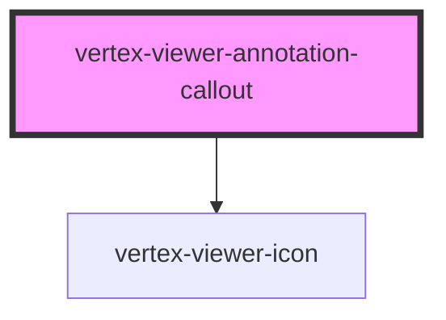

# vertex-viewer-annotation-callout

<!-- Auto Generated Below -->

## Properties

| Property            | Attribute   | Description                                                   | Type                                | Default     |
| ------------------- | ----------- | ------------------------------------------------------------- | ----------------------------------- | ----------- |
| `data` _(required)_ | --          | The data that describes how to render the callout annotation. | `CalloutAnnotationData`             | `undefined` |
| `iconSize`          | `icon-size` | The icon size to display.                                     | `"lg" \| "md" \| "sm" \| undefined` | `'sm'`      |

## Dependencies

### Depends on

- [vertex-viewer-icon](../viewer-icon)

### Graph

----------------------------------------------

*Built with [StencilJS](https://stenciljs.com/)*
