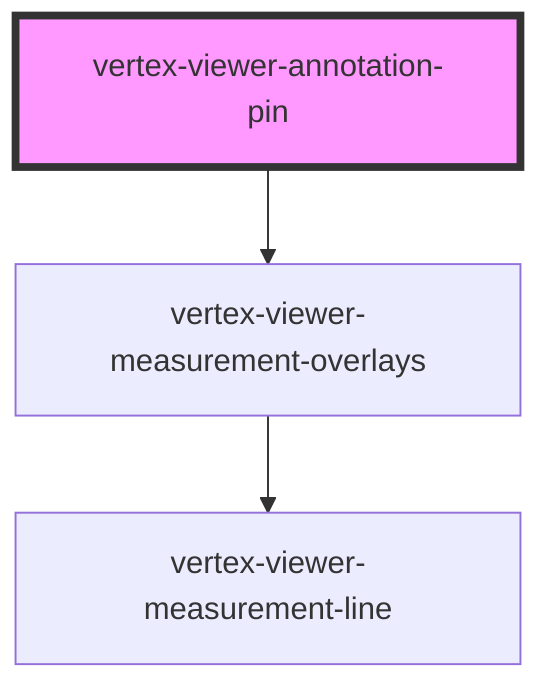

# vertex-viewer-annotation-pin

<!-- Auto Generated Below -->

## Properties

| Property                | Attribute    | Description                                                                                                                      | Type                                       | Default                           |
| ----------------------- | ------------ | -------------------------------------------------------------------------------------------------------------------------------- | ------------------------------------------ | --------------------------------- |
| `config`                | --           | An optional configuration to setup network configuration of measurement endpoints.                                               | `Config \| undefined`                      | `undefined`                       |
| `configEnv`             | `config-env` | The environment that will be used to request measurement results.                                                                | `"platdev" \| "platprod" \| "platstaging"` | `'platprod'`                      |
| `measurementController` | --           | The controller that is responsible for performing measurements and updating the model.                                           | `MeasurementController \| undefined`       | `undefined`                       |
| `measurementModel`      | --           | The model that contains the entities and outcomes from performing precise measurements.                                          | `MeasurementModel`                         | `new MeasurementModel()`          |
| `measurementOverlays`   | --           | The manager that is responsible for measurement overlays to present by this component.                                           | `MeasurementOverlayManager`                | `new MeasurementOverlayManager()` |
| `viewer`                | --           | The viewer that this component is bound to. This is automatically assigned if added to the light-dom of a parent viewer element. | `HTMLVertexViewerElement \| undefined`     | `undefined`                       |

## Dependencies

### Depends on

- [vertex-viewer-measurement-overlays](../viewer-measurement-overlays)

### Graph

----------------------------------------------

*Built with [StencilJS](https://stenciljs.com/)*
