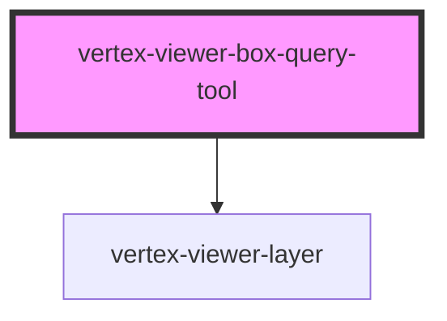

# vertex-viewer-box-query-tool

The `<vertex-viewer-box-query-tool>` is an element that assists in performing volume intersection queries.
When added as a child of a `<vertex-viewer>`, the tool will allow for drawing of a "box" representing an
area to query and perform operations against.

This tool supports two different types of queries, `inclusive` and `exclusive`. An `exclusive` query is
performed by creating a box by dragging from left to right on screen, and will query for items fully contained
by the box drawn. An `inclusive` query is performed by creating a box by dragging from right to left on screen,
and will query both for the items fully contained by and the items intersecting with the drawn box. The current
type of query to be performed on pointer up is populated on the `<vertex-viewer-box-query-tool>` using the
`inclusive` and `exclusive` attributes.

**Example:** Customizing the box displayed using a slotted element

```html
<html>
  <head>
    <style>
      .my-box {
        position: relative;
        width: 100%;
        height: 100%;
      }

      vertex-viewer-box-query-tool[inclusive="true"] .my-box {
        border: 3px solid green;
      }

      vertex-viewer-box-query-tool[exclusive="true"] .my-box {
        border: 3px dotted blue;
      }
    </style>
  </head>
  <body>
    <vertex-viewer id="viewer" src="urn:vertex:stream-key:my-key">
      <vertex-viewer-box-query-tool>
        <div class="my-box" slot="bounds"></div>
      </vertex-viewer-box-query-tool>
    </vertex-viewer>
  </body>
</html>
```

<!-- Auto Generated Below -->


## Overview

The `ViewerBoxQueryTool` allows for the drawing of a "box" on screen to represent
a query for items in a specific area of the viewer. This tool then allows for an
operation to be performed on the items contained (exclusive) by the box or both
contained by and intersecting with (inclusive) the box.

## Properties

| Property        | Attribute        | Description                                                                                                                                                                                                                                                                                                                                                                                                                                                                                                                                                                                                                                                                                    | Type                                             | Default            |
| --------------- | ---------------- | ---------------------------------------------------------------------------------------------------------------------------------------------------------------------------------------------------------------------------------------------------------------------------------------------------------------------------------------------------------------------------------------------------------------------------------------------------------------------------------------------------------------------------------------------------------------------------------------------------------------------------------------------------------------------------------------------- | ------------------------------------------------ | ------------------ |
| `controller`    | --               | The controller that is responsible for performing operations using the volume intersection query defined by the drawn box and updating the model.                                                                                                                                                                                                                                                                                                                                                                                                                                                                                                                                              | `VolumeIntersectionQueryController \| undefined` | `undefined`        |
| `mode`          | `mode`           | An optional value to specify a singular mode of intersection query. This value defaults to `undefined`, which will indicate that both `exclusive` and `inclusive` queries should be made, with `inclusive` being represented by a left to right drag behavior and `exclusive` being represented by a right to left drag.  Setting this value to `inclusive` will cause dragging left to right and left to right to result in an `inclusive` query, and the box will only be styled for `inclusive` queries.  Setting this value to `exclusive` will cause dragging left to right and left to right to result in an `exclusive` query, and the box will only be styled for `exclusive` queries. | `"exclusive" \| "inclusive" \| undefined`        | `undefined`        |
| `model`         | --               | The model that contains the points representing the corners of the box displayed on screen, the type of the query to be performed, and methods for setting these values.                                                                                                                                                                                                                                                                                                                                                                                                                                                                                                                       | `VolumeIntersectionQueryModel \| undefined`      | `undefined`        |
| `operationType` | `operation-type` | The default operation to perform when a drag has completed and the intersection query will be run. Defaults to `clearAndSelect`, and can be changed to `select` or `deselect`.  `clearAndSelect` will clear all existing selection, and select the results of the query. `select` will maintain existing selection, and select the results of the query. `deselect` will maintain existing selection, and deselect the results of the query.  The operation behavior for this intersection query tool can also be changed by providing a custom implementation of the `VolumeIntersectionQueryController`, or by using the `setOperationTransform` method of the default controller.           | `"clearAndSelect" \| "deselect" \| "select"`     | `'clearAndSelect'` |
| `viewer`        | `viewer`         | The viewer that this component is bound to. This is automatically assigned if added to the light-dom of a parent viewer element.                                                                                                                                                                                                                                                                                                                                                                                                                                                                                                                                                               | `any`                                            | `undefined`        |


## Events

| Event               | Description                                                                                   | Type                                             |
| ------------------- | --------------------------------------------------------------------------------------------- | ------------------------------------------------ |
| `controllerChanged` | Event emitted when the `VolumeIntersectionQueryController` associated with this tool changes. | `CustomEvent<VolumeIntersectionQueryController>` |


## CSS Custom Properties

| Name                                                | Description                                                                                                                                                                                                     |
| --------------------------------------------------- | --------------------------------------------------------------------------------------------------------------------------------------------------------------------------------------------------------------- |
| `--viewer-box-query-outline-border-radius`          | A CSS length that specifies the border radius of the drawn box. Defaults to `0.25rem`.                                                                                                                          |
| `--viewer-box-query-outline-exclusive-border-style` | A border style that specifies the type of border to display around the box for an exclusive query. Defaults to `solid`.                                                                                         |
| `--viewer-box-query-outline-exclusive-color`        | A CSS color that specifies the color of box for an exclusive query. This will be used in combination with `--viewer-box-query-outline-fill-opacity` for the background color of the box. Defaults to `#0099cc`. |
| `--viewer-box-query-outline-fill-opacity`           | A number between 0 and 1 that specifies the opacity of the background of the drawn box. Defaults to `0.25`.                                                                                                     |
| `--viewer-box-query-outline-inclusive-border-style` | A border style that specifies the type of border to display around the box for an inclusive query. Defaults to `dashed`.                                                                                        |
| `--viewer-box-query-outline-inclusive-color`        | A CSS color that specifies the color of box for an inclusive query. This will be used in combination with `--viewer-box-query-outline-fill-opacity` for the background color of the box. Defaults to `#00cc00`. |


## Dependencies

### Depends on

- [vertex-viewer-layer](../viewer-layer)

### Graph


----------------------------------------------

*Built with [StencilJS](https://stenciljs.com/)*
