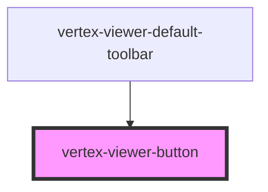

# vertex-viewer-button

<!-- Auto Generated Below -->

## Dependencies

### Used by

 - [vertex-viewer-default-toolbar](../viewer-default-toolbar)

### Graph

----------------------------------------------

*Built with [StencilJS](https://stenciljs.com/)*
