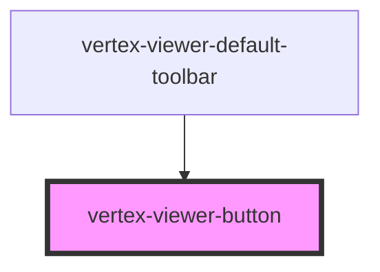

# vertex-viewer-button

The `<vertex-viewer-button>` provides a simple UI control to handle click
interactions. It's placeable in toolbars, toolbar groups, or other containers.

## Styling

By default, the button doesn't provide any styling. Provide styles via CSS to
customize the styling to your application.

```html
<style>
  .btn {
    background: lightgrey;
    border-radius: 0.125rem;
    padding: 0.25rem;
  }

  .btn:hover {
    background: grey;
  }
</style>

<vertex-viewer-button class="btn">Click Me</vertex-viewer-button>
```

<!-- Auto Generated Below -->


## Dependencies

### Used by

 - [vertex-viewer-default-toolbar](../viewer-default-toolbar)

### Graph


----------------------------------------------

*Built with [StencilJS](https://stenciljs.com/)*
