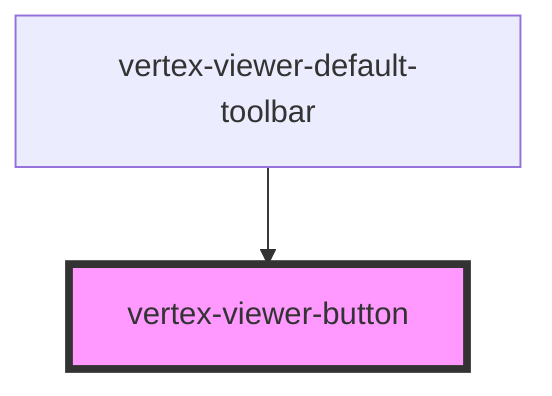

# vertex-viewer-button

The `<vertex-viewer-button>` provides a simple UI control to handle click
interactions. It's placeable in toolbars, toolbar groups, or other containers.

## Styling

By default, the button doesn't provide any styling. Provide styles via CSS to
customize the styling to your application.

```html
<style>
  .btn {
    background: lightgrey;
    border-radius: 0.125rem;
    padding: 0.25rem;
  }

  .btn:hover {
    background: grey;
  }
</style>

<vertex-viewer-button class="btn">Click Me</vertex-viewer-button>
```

## Accessibility

For icon-only buttons, provide an `aria-label`. The component applies this
value to its internal native `<button>`, making the accessible name available
to assistive technology.

```html
<vertex-viewer-button aria-label="Fit all">
  <vertex-viewer-icon name="fit-all" size="md"></vertex-viewer-icon>
</vertex-viewer-button>
```

<!-- Auto Generated Below -->

## Properties

| Property    | Attribute    | Description                                                                                                                                | Type             | Default |
| ----------- | ------------ | ------------------------------------------------------------------------------------------------------------------------------------------ | ---------------- | ------- |
| `ariaLabel` | `aria-label` | Accessible name applied to the internal native button. Use this for icon-only buttons or when the slotted content does not provide a name. | `null \| string` | `null`  |

## Dependencies

### Used by

- [vertex-viewer-default-toolbar](../viewer-default-toolbar)

### Graph


```mermaid
graph TD;
  vertex-viewer-default-toolbar --> vertex-viewer-button
  style vertex-viewer-button fill:#f9f,stroke:#333,stroke-width:4px
```

---

_Built with [StencilJS](https://stenciljs.com/)_
