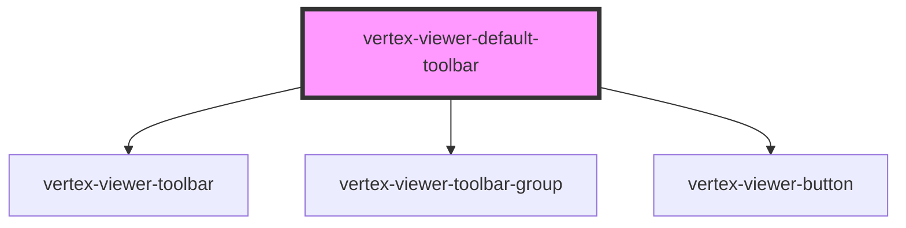

# vertex-viewer-default-toolbar

<!-- Auto Generated Below -->

## Properties

| Property | Attribute | Description | Type                                   | Default     |
| -------- | --------- | ----------- | -------------------------------------- | ----------- |
| `viewer` | --        |             | `HTMLVertexViewerElement \| undefined` | `undefined` |

## CSS Custom Properties

| Name    | Description                                                       |
| ------- | ----------------------------------------------------------------- |
| `--gap` | The spacing between elements in the group. Defaults to `0.25rem`. |

## Dependencies

### Depends on

- [vertex-viewer-toolbar](../viewer-toolbar)
- [vertex-viewer-toolbar-group](../viewer-toolbar-group)
- [vertex-viewer-button](../viewer-button)

### Graph

----------------------------------------------

*Built with [StencilJS](https://stenciljs.com/)*
