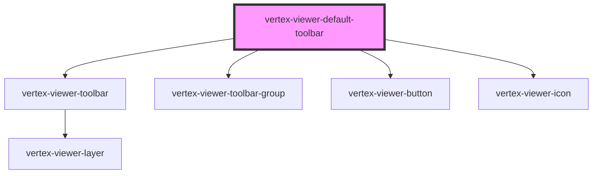

# vertex-viewer-default-toolbar

The `<vertex-viewer-default-toolbar>` is an out-of-the-box component that
provides common UI controls for interacting with a `<vertex-viewer>` component.

## Styling

The component's styled using the default Viewer SDK theme. We provide options
to customize the styling through CSS custom properties.

```html
<style>
  .toolbar {
    --viewer-toolbar-group-background: red;
    --viewer-toolbar-group-box-shadow: unset;
  }
</style>

<vertex-viewer-default-toolbar class="toolbar"></vertex-viewer-default-toolbar>
```

## Placement and Direction

By default, toolbar placement is at the bottom-center of the viewer, and
elements flow horizontally. These can be changed using the `placement` and
`direction` properties to create vertical toolbars.

```html
<vertex-viewer>
  <vertex-viewer-default-toolbar placement="middle-left" direction="vertical"></vertex-viewer-default-toolbar>
</vertex-viewer>
```

## Wiring

The viewer will automatically be connected when placed within a
`<vertex-viewer>` element. If you want to place the control outside the viewer,
then the viewer will need to be manually connected.

```html
<script>
  function connect() {
    const viewer = document.querySelector('vertex-viewer');
    const toolbar = document.querySelector('vertex-viewer-default-toolbar');

    toolbar.viewer = viewer;
  }
</script>

<div>
  <vertex-viewer></vertex-viewer>
  <vertex-viewer-default-toolbar></vertex-viewer-default-toolbar>
</div>
```

<!-- Auto Generated Below -->


## Properties

| Property             | Attribute             | Description                                                                                                                                                 | Type                                                                                                                                 | Default           |
| -------------------- | --------------------- | ----------------------------------------------------------------------------------------------------------------------------------------------------------- | ------------------------------------------------------------------------------------------------------------------------------------ | ----------------- |
| `animationMs`        | `animation-ms`        | The duration of animations, in milliseconds. Defaults to `1000`.                                                                                            | `number`                                                                                                                             | `1000`            |
| `animationsDisabled` | `animations-disabled` | Indicates whether animations will be used when performing camera operations. Defaults to `true`.                                                            | `boolean`                                                                                                                            | `false`           |
| `direction`          | `direction`           | Specifies the direction that UI elements are placed.                                                                                                        | `"horizontal" \| "vertical"`                                                                                                         | `'horizontal'`    |
| `placement`          | `placement`           | Specifies where the toolbar is positioned.                                                                                                                  | `"bottom-center" \| "bottom-left" \| "bottom-right" \| "middle-left" \| "middle-right" \| "top-center" \| "top-left" \| "top-right"` | `'bottom-center'` |
| `viewer`             | `viewer`              | An instance of the viewer that operations will be performed on. If contained within a `<vertex-viewer>` element, this property will automatically be wired. | `any`                                                                                                                                | `undefined`       |


## CSS Custom Properties

| Name                                   | Description                                                                                                                    |
| -------------------------------------- | ------------------------------------------------------------------------------------------------------------------------------ |
| `--viewer-toolbar-group-background`    | The background to apply to each group in the toolbar. Defaults to `rgba(245, 245, 245, 0.95)`                                  |
| `--viewer-toolbar-group-border-radius` | The corner radius to apply to each group in the toolbar. Defaults to `0.25rem`.                                                |
| `--viewer-toolbar-group-box-shadow`    | The shadow to apply to each group in the toolbar. Defaults to `-1px 0 2px rgba(0, 0, 0, 0.12), 1px 0 2px rgba(0, 0, 0, 0.13)`. |
| `--viewer-toolbar-group-gap`           | The spacing between each toolbar group. Defaults to `0.5rem`.                                                                  |
| `--viewer-toolbar-group-item-gap`      | The spacing between each item within a toolbar group. Defaults to `0.25rem`.                                                   |
| `--viewer-toolbar-group-padding`       | The padding to apply to each group in the toolbar. Defaults to `0.25rem`.                                                      |


## Dependencies

### Depends on

- [vertex-viewer-toolbar](../viewer-toolbar)
- [vertex-viewer-toolbar-group](../viewer-toolbar-group)
- [vertex-viewer-button](../viewer-button)
- [vertex-viewer-icon](../viewer-icon)

### Graph


----------------------------------------------

*Built with [StencilJS](https://stenciljs.com/)*
