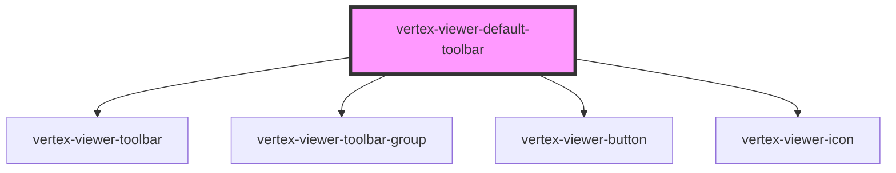

# vertex-viewer-default-toolbar

<!-- Auto Generated Below -->

## Properties

| Property             | Attribute             | Description                                                                                                                                                                       | Type                                                                                              | Default           |
| -------------------- | --------------------- | --------------------------------------------------------------------------------------------------------------------------------------------------------------------------------- | ------------------------------------------------------------------------------------------------- | ----------------- |
| `animationMs`        | `animation-ms`        | The duration of animations, in milliseconds. Defaults to `1000`.                                                                                                                  | `number`                                                                                          | `1000`            |
| `animationsDisabled` | `animations-disabled` | Indicates whether animations will be used when performing camera operations. Defaults to `true`.                                                                                  | `boolean`                                                                                         | `false`           |
| `position`           | `position`            | Specifies where the toolbar is positioned. Can be `'top-left' \| 'top-center' \| 'top-right' \| 'bottom-left' \| 'bottom-center' \| 'bottom-right'`. Defaults to `bottom-center`. | `"bottom-center" \| "bottom-left" \| "bottom-right" \| "top-center" \| "top-left" \| "top-right"` | `'bottom-center'` |
| `viewer`             | --                    | An instance of the viewer that operations will be performed on. If contained within a `<vertex-viewer>` element, this property will automatically be wired.                       | `HTMLVertexViewerElement \| undefined`                                                            | `undefined`       |

## CSS Custom Properties

| Name                                   | Description                                                                                                                                 |
| -------------------------------------- | ------------------------------------------------------------------------------------------------------------------------------------------- |
| `--viewer-toolbar-group-background`    | The background to apply to each group in the toolbar. Defaults to `rgba(245, 245, 245, 0.95)`                                               |
| `--viewer-toolbar-group-border-radius` | The corner radius to apply to each group in the toolbar. Defaults to `0.25rem`.                                                             |
| `--viewer-toolbar-group-box-shadow`    | The shadow to apply to each group in the toolbar. Defaults to `-1px 0 2px rgba(0, 0, 0, 0.12), 1px 0 2px rgba(0, 0, 0, 0.13)`.              |
| `--viewer-toolbar-group-gap`           | The spacing between each toolbar group. Defaults to `0.5rem`.                                                                               |
| `--viewer-toolbar-group-item-gap`      | The spacing between each item within a toolbar group. Defaults to `0.25rem`.                                                                |
| `--viewer-toolbar-group-padding`       | The padding to apply to each group in the toolbar. Defaults to `0.25rem`.                                                                   |
| `--viewer-toolbar-justify`             | The alignment of toolbar. Can be `flex-start \| flex-end \| center \| space-between \| space-around \| space-evenly`. Defaults to `center`. |

## Dependencies

### Depends on

- [vertex-viewer-toolbar](../viewer-toolbar)
- [vertex-viewer-toolbar-group](../viewer-toolbar-group)
- [vertex-viewer-button](../viewer-button)
- [vertex-viewer-icon](../viewer-icon)

### Graph

----------------------------------------------

*Built with [StencilJS](https://stenciljs.com/)*
