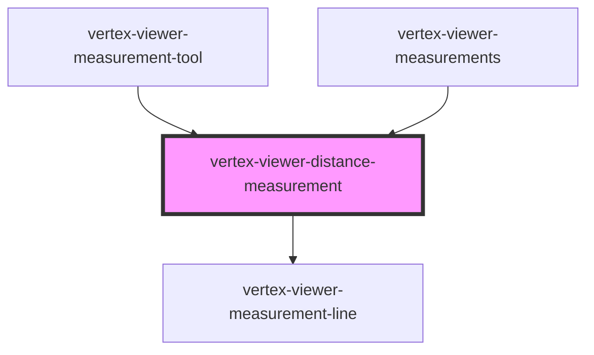

# vertex-viewer-distance-measurement

The `<vertex-viewer-distance-measurement>` is a component for displaying
point-to-point measurements between two 3D points. The component will place
anchors at each point with a line between the two anchors and display the
approximate distance between the two points.

Measurements should be placed in a `<vertex-viewer-layer>` in order to be
displayed correctly.

**Example:** Creating a measurement between two points.

```html
<html>
  <body>
    <vertex-viewer id="viewer" src="urn:vertexvis:stream-key:my-key">
      <vertex-viewer-layer>
        <vertex-viewer-distance-measurement
          start="[10, -5, 0]"
          end="[150, 100, -50]"
        ></vertex-viewer--element>
      </vertex-viewer-layer>
    </vertex-viewer>
  </body>
</html>
```

## Units of Measurement and Formatting

The displayed units of measurement and precision can be configured by setting
the `units` and `fractional-digits` attributes. Currently supported units
include: `millimeters`, `centimeters`, `meters`, `inches`, `feet`, `yards`.

**Example:** Settings units and fractional digits.

```html
<html>
  <body>
    <vertex-viewer id="viewer" src="urn:vertexvis:stream-key:my-key">
      <vertex-viewer-layer>
        <vertex-viewer-distance-measurement
          start="[10, -5, 0]"
          end="[150, 100, -50]"
          units="in"
          fractional-digits="1"
        ></vertex-viewer--element>
      </vertex-viewer-layer>
    </vertex-viewer>
  </body>
</html>
```

The default formatting can be overridden with by setting the `labelFormatter`
property. This is a function that is passed the distance in real space and
should return a string.

**Example:** Replacing the default distance formatter.

```html
<html>
  <body>
    <vertex-viewer id="viewer" src="urn:vertexvis:stream-key:my-key">
      <vertex-viewer-layer>
        <vertex-viewer-distance-measurement
          id="measurement"
          start="[10, -5, 0]"
          end="[150, 100, -50]"
          units="in"
        ></vertex-viewer--element>
      </vertex-viewer-layer>
    </vertex-viewer>

    <script type="module">
      const measurement = document.getElementById('measurement');
      measurement.labelFormatter = (distance) => `${distance}"`;
    </script>
  </body>
</html>
```

## Styling Anchors

The component exposes slots for customizing the HTML of the distance anchors.

**Example:** Providing custom anchors.

```html
<html>
  <head>
    <style>
      .anchor {
        width: 10px;
        height: 10px;
        background-color: blue;
        display: flex;
        align-items: center;
        justify-content: center;
      }
    </style>
  </head>
  <body>
    <vertex-viewer id="viewer" src="urn:vertexvis:stream-key:my-key">
      <vertex-viewer-layer>
        <vertex-viewer-distance-measurement
          id="measurement"
          start="[10, -5, 0]"
          end="[150, 100, -50]"
          units="in"
        >
          <div slot="start-anchor" class="anchor">A</div>
          <div slot="end-anchor" class="anchor">B</div>
        </vertex-viewer--element>
      </vertex-viewer-layer>
    </vertex-viewer>
  </body>
</html>
```

<!-- Auto Generated Below -->


## Properties

| Property               | Attribute             | Description                                                                                                                                                                                                                                                                                                                               | Type                                                                                                                                            | Default         |
| ---------------------- | --------------------- | ----------------------------------------------------------------------------------------------------------------------------------------------------------------------------------------------------------------------------------------------------------------------------------------------------------------------------------------- | ----------------------------------------------------------------------------------------------------------------------------------------------- | --------------- |
| `anchorLabelOffset`    | `anchor-label-offset` | The distance from an anchor to its label.                                                                                                                                                                                                                                                                                                 | `number`                                                                                                                                        | `20`            |
| `depthBuffer`          | --                    | The depth buffer that is used to optimistically determine the a depth value from a 2D screen point. If `viewer` is defined, then the depth buffer will be automatically set.                                                                                                                                                              | `DepthBuffer \| undefined`                                                                                                                      | `undefined`     |
| `distance`             | `distance`            | The distance between `start` and `end` in real world units. Value will be undefined if the start and end positions are undefined, or if the measurement is invalid.                                                                                                                                                                       | `number \| undefined`                                                                                                                           | `undefined`     |
| `end`                  | --                    | The position of the ending anchor. Can either be an instance of a `Vector3` or a JSON string representation in the format of `[x, y, z]` or `{"x": 0, "y": 0, "z": 0}`.                                                                                                                                                                   | `Vector3 \| undefined`                                                                                                                          | `undefined`     |
| `endJson`              | `end`                 | The position of the ending anchor, as a JSON string. Can either be an instance of a `Vector3` or a JSON string representation in the format of `[x, y, z]` or `{"x": 0, "y": 0, "z": 0}`.                                                                                                                                                 | `string \| undefined`                                                                                                                           | `undefined`     |
| `fractionalDigits`     | `fractional-digits`   | The number of fraction digits to display.                                                                                                                                                                                                                                                                                                 | `number`                                                                                                                                        | `2`             |
| `interactingAnchor`    | `interacting-anchor`  | A property that reflects which anchor is currently being interacted with.                                                                                                                                                                                                                                                                 | `"end" \| "none" \| "start"`                                                                                                                    | `'none'`        |
| `invalid`              | `invalid`             | Indicates if the measurement is invalid. A measurement is invalid if either the start or end position are not on the surface of the model.                                                                                                                                                                                                | `boolean`                                                                                                                                       | `false`         |
| `labelFormatter`       | --                    | An optional formatter that can be used to format the display of a distance. The formatting function is passed a calculated real-world distance and is expected to return a string.                                                                                                                                                        | `((distance: number \| undefined) => string) \| undefined`                                                                                      | `undefined`     |
| `mode`                 | `mode`                | A mode that specifies how the measurement component should behave. When unset, the component will not respond to interactions with the handles. When `edit`, the measurement anchors are interactive and the user is able to reposition them. When `replace`, anytime the user clicks on the canvas, a new measurement will be performed. | `"" \| "edit" \| "replace"`                                                                                                                     | `''`            |
| `projectionViewMatrix` | --                    | The projection view matrix used to position the anchors. If `viewer` is defined, then the projection view matrix of the viewer will be used.                                                                                                                                                                                              | `[number, number, number, number, number, number, number, number, number, number, number, number, number, number, number, number] \| undefined` | `undefined`     |
| `start`                | --                    | The position of the starting anchor. Can either be an instance of a `Vector3` or a JSON string representation in the format of `[x, y, z]` or `{"x": 0, "y": 0, "z": 0}`.                                                                                                                                                                 | `Vector3 \| undefined`                                                                                                                          | `undefined`     |
| `startJson`            | `start`               | The position of the starting anchor, as a JSON string. Can either be an instance of a `Vector3` or a JSON string representation in the format of `[x, y, z]` or `{"x": 0, "y": 0, "z": 0}`.                                                                                                                                               | `string \| undefined`                                                                                                                           | `undefined`     |
| `units`                | `units`               | The unit of measurement.                                                                                                                                                                                                                                                                                                                  | `"centimeters" \| "feet" \| "inches" \| "meters" \| "millimeters" \| "yards"`                                                                   | `'millimeters'` |
| `viewer`               | --                    | The viewer to connect to this measurement. The measurement will redraw any time the viewer redraws the scene.                                                                                                                                                                                                                             | `HTMLVertexViewerElement \| undefined`                                                                                                          | `undefined`     |


## Events

| Event       | Description                                                                     | Type                |
| ----------- | ------------------------------------------------------------------------------- | ------------------- |
| `editBegin` | An event that is dispatched anytime the user begins editing the measurement.    | `CustomEvent<void>` |
| `editEnd`   | An event that is dispatched when the user has finished editing the measurement. | `CustomEvent<void>` |


## Methods

### `computeElementMetrics() => Promise<ViewerDistanceMeasurementElementMetrics | undefined>`

Computes the bounding boxes of the anchors and label. **Note:** invoking
this function uses `getBoundingClientRect` internally and will cause a
relayout of the DOM.

#### Returns

Type: `Promise<ViewerDistanceMeasurementElementMetrics | undefined>`


## Slots

| Slot                                                            | Description |
| --------------------------------------------------------------- | ----------- |
| `"end-anchor An HTML element for the ending point anchor."`     |             |
| `"start-anchor An HTML element for the starting point anchor."` |             |


## CSS Custom Properties

| Name                                                   | Description                                                                                         |
| ------------------------------------------------------ | --------------------------------------------------------------------------------------------------- |
| `--viewer-distance-measurement-accent-color`           | A CSS color that specifies the color of lines, anchors and borders.                                 |
| `--viewer-distance-measurement-contrast-color`         | A CSS color that specifies a color opposite of the accent color.                                    |
| `--viewer-distance-measurement-distance-border`        | A CSS border that specifies the border color or image for the measurement's label.                  |
| `--viewer-distance-measurement-distance-border-radius` | A CSS length that specifies the border radius for the measurement's label.                          |
| `--viewer-distance-measurement-distance-padding`       | A CSS length that specifies the padding of the measurement's label.                                 |
| `--viewer-distance-measurement-invalid-accent-color`   | A CSS color that specifies the color of lines, anchors and borders when the measurement is invalid. |
| `--viewer-distance-measurement-invalid-contrast-color` | A CSS color that specifies a color opposite of the accent color when the measurement is invalid.    |
| `--viewer-distance-measurement-line-stroke-width`      | A CSS length that width of the measurement line.                                                    |


## Dependencies

### Used by

 - [vertex-viewer-measurement-tool](../viewer-measurement-tool)
 - [vertex-viewer-measurements](../viewer-measurements)

### Depends on

- [vertex-viewer-measurement-line](../viewer-measurement-line)

### Graph


----------------------------------------------

*Built with [StencilJS](https://stenciljs.com/)*
