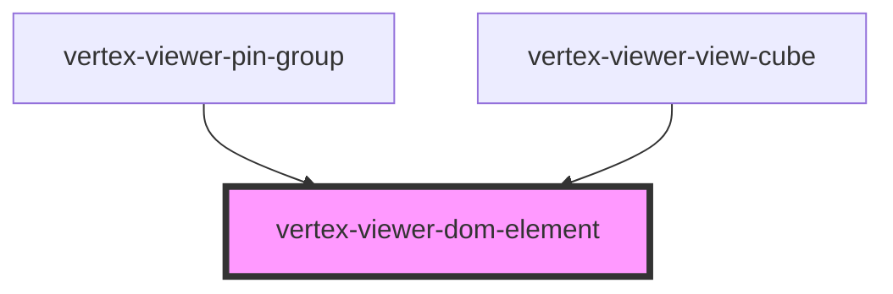

# vertex-viewer-dom-element

The `<vertex-viewer-dom-element>` is an element that specifies the 3D position,
rotation, and scale of a DOM element. They're expected to be added as children
to a `<vertex-viewer-dom-renderer>`.

**Note:** This element cannot contain other `<vertex-viewer-dom-element>`. Use
[`<vertex-viewer-dom-group>`](../viewer-dom-group/readme.md) for representing
element hierarchies.

See [`<vertex-viewer-dom-renderer>`](../viewer-dom-renderer/readme.md) for more
information.

<!-- Auto Generated Below -->

## Overview

The `ViewerDomElement` is responsible for managing a
`<vertex-viewer-dom-element>` element. These elements are intended to be
added as children to a `<vertex-viewer-dom-renderer>` and represent an
individual DOM element within a local 3D scene.

## Properties

| Property          | Attribute          | Description                                                                                                                                                                                                                                     | Type                                                                                                                               | Default                   |
| ----------------- | ------------------ | ----------------------------------------------------------------------------------------------------------------------------------------------------------------------------------------------------------------------------------------------- | ---------------------------------------------------------------------------------------------------------------------------------- | ------------------------- |
| `billboardOff`    | `billboard-off`    | Disables the billboarding behavior of the element. When billboarding is enabled, the element will always be oriented towards the screen.                                                                                                        | `boolean`                                                                                                                          | `false`                   |
| `detached`        | `detached`         | **EXPERIMENTAL** Indicates if the element is detached from geometry. This property can be used with a CSS selector to modify the appearance of the element when its detached.                                                                   | `boolean`                                                                                                                          | `false`                   |
| `detachedOff`     | `detached-off`     | **EXPERIMENTAL** Disables detached testing for this element. Defaults to disabled. When enabled, the elements position will be tested against the current depth buffer. If the position is detached, then the `detached` attribute will be set. | `boolean`                                                                                                                          | `true`                    |
| `interactionsOff` | `interactions-off` | Disables interaction events from children.                                                                                                                                                                                                      | `boolean`                                                                                                                          | `false`                   |
| `matrix`          | --                 | The local matrix of this element.                                                                                                                                                                                                               | `[number, number, number, number, number, number, number, number, number, number, number, number, number, number, number, number]` | `Matrix4.makeIdentity()`  |
| `occluded`        | `occluded`         | Indicates if the element is hidden by geometry. This property can be used with a CSS selector to modify the appearance of the element when its occluded.                                                                                        | `boolean`                                                                                                                          | `false`                   |
| `occlusionOff`    | `occlusion-off`    | Disables occlusion testing for this element. Defaults to enabled. When enabled, the elements position will be tested against the current depth buffer. If the position is occluded, then the `occluded` attribute will be set.                  | `boolean`                                                                                                                          | `false`                   |
| `position`        | --                 | The local 3D position of where this element is located.                                                                                                                                                                                         | `Vector3`                                                                                                                          | `Vector3.origin()`        |
| `positionJson`    | `position`         | The local 3D position of where this element is located, as a JSON string. JSON representation can either be in the format of `[x, y, z]` or `{"x": 0, "y": 0, "z": 0}`.                                                                         | `string`                                                                                                                           | `''`                      |
| `quaternion`      | --                 | The local rotation of this element.                                                                                                                                                                                                             | `Quaternion`                                                                                                                       | `Quaternion.create()`     |
| `quaternionJson`  | `quaternion`       | The local quaternion rotation of this element, as a JSON string. JSON representation can either be `[x, y, z, w]` or `{"x": 0, "y": 0, "z": 0, "w": 1}`.                                                                                        | `string`                                                                                                                           | `''`                      |
| `rotation`        | --                 | The local rotation of this element in Euler angles.                                                                                                                                                                                             | `Euler \| undefined`                                                                                                               | `undefined`               |
| `rotationJson`    | `rotation`         | The local rotation of this element in Euler angles, as a JSON string. JSON representation can either be `[x, y, z, order]` or `{"x": 0, "y": 0, "z": 0, "order": "xyz"}`.                                                                       | `string \| undefined`                                                                                                              | `undefined`               |
| `scale`           | --                 | The local scale of this element.                                                                                                                                                                                                                | `Vector3`                                                                                                                          | `Vector3.create(1, 1, 1)` |
| `scaleJson`       | `scale`            | The local scale of this element, as a JSON string. JSON string representation can either be in the format of `[x, y, z]` or `{"x": 0, "y": 0, "z": 0}`.                                                                                         | `string`                                                                                                                           | `''`                      |

## Events

| Event                   | Description                                                         | Type                   |
| ----------------------- | ------------------------------------------------------------------- | ---------------------- |
| `detachedStateChanged`  | **EXPERIMENTAL** Dispatched when the detached state is changed.     | `CustomEvent<boolean>` |
| `occlusionStateChanged` | Dispatched when the occlusion state is changed.                     | `CustomEvent<boolean>` |
| `propertyChange`        | An event that is emitted when any property on the dom group changes | `CustomEvent<void>`    |

## Dependencies

### Used by

 - [vertex-viewer-pin-group](../viewer-pin-group)
 - [vertex-viewer-view-cube](../viewer-view-cube)

### Graph

----------------------------------------------

*Built with [StencilJS](https://stenciljs.com/)*
