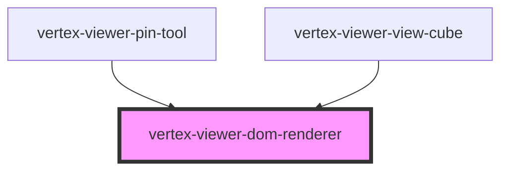

# vertex-viewer-dom-renderer

The `<vertex-viewer-dom-renderer>` is a component that is used to position and
transform DOM elements over a rendered scene. This element is useful for
creating interactive visual effects, like annotations, using HTML/CSS/JS.

Wrap elements in a `<vertex-viewer-dom-element>` to specify the 3D position,
rotation and scale of an element.

Renderer needs to be connected to a `<vertex-viewer>` in order to be notified
when the scene is rendered. If added as a child of a `<vertex-viewer>` element,
the renderer will be connected automatically.

_note: In order to support multiple viewer-dom-renderer components in your viewer, be sure to give a unique #id element to the renderer_

**Example:** Creating a DOM renderer.

```html
<html>
  <head>
    <style>
      .pin {
        width: 20px;
        height: 20px;
        border-radius: 50%;
        display: flex;
        align-items: center;
        justify-content: center;
      }
    </style>
  </head>
  <body>
    <vertex-viewer id="viewer" src="urn:vertex:stream-key:my-key">
      <vertex-viewer-dom-renderer>
        <vertex-viewer-dom-element position="[0, 0, 0]">
          <div class="pin">1</div>
        </vertex-viewer-dom-element>
      </vertex-viewer-dom-renderer>
    </vertex-viewer>
  </body>
</html>
```

## 2D vs 3D Drawing Modes

The renderer supports either a 2D or a 3D drawing mode. In 3D mode, the renderer
will use CSS 3D transforms to position and transform an element, which allows
elements to be scaled and rotated with the model. In 2D mode, the renderer will
use a simpler CSS 2D transform that will position elements, but will not rotate
or scale them.

By default, the renderer will use 3D mode. Use the `draw-mode` attribute to
change the mode of the renderer.

## Positioning, Rotation, Scaling

The `<vertex-viewer-dom-element>` has attributes for setting the 3D position,
rotation and scale of a DOM element. Our
[@vertexvis/geometry](https://www.npmjs.com/package/@vertexvis/geometry) package
is a helper library for common 3D math operations.

**Example:** Positioning elements using HTML attributes.

```html
<html>
  <body>
    <vertex-viewer id="viewer" src="urn:vertex:stream-key:my-key">
      <vertex-viewer-dom-renderer>
        <vertex-viewer-dom-element
          position="[0, 100, 0]"
          rotation="[90, 180, 0]"
          scale="[0.5, 0.5, 0.5]"
        >
          <div class="pin">1</div>
        </vertex-viewer-dom-element>
      </vertex-viewer-dom-renderer>
    </vertex-viewer>
  </body>
</html>
```

**Example:** Positioning elements using JS.

```html
<html>
  <body>
    <vertex-viewer id="viewer" src="urn:vertex:stream-key:my-key">
      <vertex-viewer-dom-renderer>
        <vertex-viewer-dom-element id="my-pin">
          <div class="pin">1</div>
        </vertex-viewer-dom-element>
      </vertex-viewer-dom-renderer>
    </vertex-viewer>

    <script type="module">
      import { Vector3 } from 'https://unpkg.com/@vertexvis/geometry@latest/dist/cdn/bundle.esm.js';

      const pin = document.getElementById('my-pin');

      function animate() {
        requestAnimationFrame((time) => {
          const ms = 3000;
          const scale = 1 + (time % ms) / ms;
          pin.scale = Vector3.create(scale, scale, scale);

          animate();
        })
      }
      animate();
    </script>
  </body>
</html>
```

## Grouping and Hierarchies

Use the `<vertex-viewer-dom-group>` to create groupings and hierarchies of
elements. This is useful for sharing positioning, rotating, and scaling for a
group of elements.

**Example:** Positioning a group of elements.

```html
<html>
  <body>
    <vertex-viewer id="viewer" src="urn:vertex:stream-key:my-key">
      <vertex-viewer-dom-renderer>
        <vertex-viewer-dom-group position="[500, 0, 0]" scale="[0.5, 0.5, 0.5]">
          <!-- Pin 1 -->
          <vertex-viewer-dom-element position="[0, 100, 0]" rotation="[90, 180, 0]">
            <div class="pin">1</div>
          </vertex-viewer-dom-element>

          <vertex-viewer-dom-group position="[0, 500, 0]" rotation="[90, 180, 0]">
            <!-- Pin 2 -->
            <vertex-viewer-dom-element position="[0, 100, 0]">
              <div class="pin">2</div>
            </vertex-viewer-dom-element>

            <!-- Pin 3 -->
            <vertex-viewer-dom-element position="[0, 0, 100]">
              <div class="pin">3</div>
            </vertex-viewer-dom-element>
          </vertex-viewer-dom-group>
        </vertex-viewer-dom-group>
      </vertex-viewer-dom-renderer>
    </vertex-viewer>
  </body>
</html>
```

## Billboarding

When using a 3D draw mode, elements will always be reoriented towards the
screen. You can disable billboarding to orient elements based on their rotation
property.

```html
<html>
  <body>
    <vertex-viewer id="viewer" src="urn:vertex:stream-key:my-key">
      <vertex-viewer-dom-renderer>
        <!-- Element with billboarding disabled -->
        <vertex-viewer-dom-element id="my-pin" billboard-off>
          <div class="pin">1</div>
        </vertex-viewer-dom-element>
      </vertex-viewer-dom-renderer>
    </vertex-viewer>
  </body>
</html>
```

## Occlusion
The renderer supports occluding its elements based on the element's position and
depth information returned on a frame. If depth buffers are requested for all 
frames, the occlusion state will be updated on every frame. Conversely, if depth 
buffers are only requested on final frames, the occlusion state will only be calculated
on final frames and will always report occluded on transitional frames.

Occlusion can be enabled or disabled per element by setting its `occlusion-off`
attribute.

**Example:** Styling an element when occluded.

```html
<html>
  <head>
    <style>
      vertex-viewer-dom-element[occluded] {
        opacity: 0;
      }
    </style>
  </head>
  <body>
    <!-- Opt-in to depth buffers for all frames. -->
    <vertex-viewer id="viewer" src="urn:vertex:stream-key:my-key" depth-buffers="all">
      <vertex-viewer-dom-renderer>
        <!-- This element will be included in occlusion testing. -->
        <vertex-viewer-dom-element position="[0, 0, 100]">
          <div class="pin">1</div>
        </vertex-viewer-dom-element>

        <!-- This element will be exempt from occlusion testing. -->
        <vertex-viewer-dom-element position="[0, 0, -100]" occlusion-off>
          <div class="pin">2</div>
        </vertex-viewer-dom-element>
      </vertex-viewer-dom-renderer>
    </vertex-viewer>
  </body>
</html>
```

## Detachment
The renderer supports determining whether an element is detached from geometry based on the element's position and
depth information returned on a frame. If depth buffers are requested for all
frames, the detached state will be updated on every frame. Conversely, if depth
buffers are only requested on final frames, the detached state will only be calculated
on final frames and will always report detached on transitional frames.

Detachment testing can be enabled or disabled per element by setting its `detached-off`
attribute.

**This feature is experimental and is turned off by default.**

**Example:** Styling an element when detached.

```html
<html>
  <head>
    <style>
      vertex-viewer-dom-element[detached] {
        opacity: 0;
      }
    </style>
  </head>
  <body>
    <!-- Opt-in to depth buffers for all frames. -->
    <vertex-viewer id="viewer" src="urn:vertex:stream-key:my-key" depth-buffers="all">
      <vertex-viewer-dom-renderer>
        <!-- This element will be included in detachment testing. -->
        <vertex-viewer-dom-element position="[0, 0, 100]" detached-off="false">
          <div class="pin">1</div>
        </vertex-viewer-dom-element>

        <!-- This element will be exempt from detachment testing. -->
        <vertex-viewer-dom-element position="[0, 0, -100]">
          <div class="pin">2</div>
        </vertex-viewer-dom-element>
      </vertex-viewer-dom-renderer>
    </vertex-viewer>
  </body>
</html>
```

<!-- Auto Generated Below -->


## Properties

| Property                  | Attribute                    | Description                                                                                                                                                                                                                                                                                | Type                                   | Default     |
| ------------------------- | ---------------------------- | ------------------------------------------------------------------------------------------------------------------------------------------------------------------------------------------------------------------------------------------------------------------------------------------ | -------------------------------------- | ----------- |
| `camera`                  | --                           | The current camera of the frame.  This property will automatically be set when supplying a viewer to the component, or when added as a child to `<vertex-viewer>`.                                                                                                                         | `FrameCameraBase \| undefined`         | `undefined` |
| `depthBuffer`             | --                           | The current depth buffer of the frame.  This property will automatically be set when supplying a viewer to the component, or when added as a child to `<vertex-viewer>`.                                                                                                                   | `DepthBuffer \| undefined`             | `undefined` |
| `drawMode`                | `draw-mode`                  | Specifies the drawing mode for the renderer.  When in `3d` mode, elements are positioned using CSS 3D transforms and will scale and rotate with the camera. In `2d` mode, a simpler 2D transform is used, and elements will not scale or rotate with camera changes.                       | `"2d" \| "3d"`                         | `'3d'`      |
| `propagateEventsToViewer` | `propagate-events-to-viewer` | Specifies whether to propagate events to the viewer's interaction handlers  When `true` any viewer change will result in registering the host element of the dom renderer as a listenable element to the viewers interaction handlers. When false, no events will propogate to the viewer. | `boolean`                              | `true`      |
| `viewer`                  | --                           | The viewer synced to this renderer. This property will automatically be assigned if the renderer is a child of `<vertex-viewer>`.                                                                                                                                                          | `HTMLVertexViewerElement \| undefined` | `undefined` |


## Dependencies

### Used by

 - [vertex-viewer-pin-tool](../viewer-pin-tool)
 - [vertex-viewer-view-cube](../viewer-view-cube)

### Graph


----------------------------------------------

*Built with [StencilJS](https://stenciljs.com/)*
