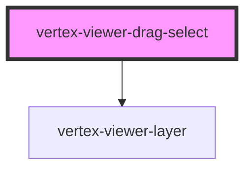

# vertex-viewer-drag-select

<!-- Auto Generated Below -->

## Properties

| Property     | Attribute | Description                                                                                                                      | Type                                      | Default     |
| ------------ | --------- | -------------------------------------------------------------------------------------------------------------------------------- | ----------------------------------------- | ----------- |
| `controller` | --        |                                                                                                                                  | `ViewerDragSelectController \| undefined` | `undefined` |
| `viewer`     | --        | The viewer that this component is bound to. This is automatically assigned if added to the light-dom of a parent viewer element. | `HTMLVertexViewerElement \| undefined`    | `undefined` |

## Dependencies

### Depends on

- [vertex-viewer-layer](../viewer-layer)

### Graph

----------------------------------------------

*Built with [StencilJS](https://stenciljs.com/)*
