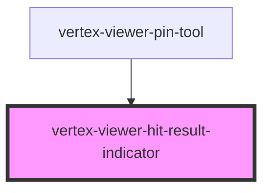

# vertex-viewer-hit-result-indicator

The `<vertex-viewer-hit-result-indicator>` is a component that renders a WebGL indicator provided
a `position` and `normal` of a hit result.

## Displaying a Static Indicator

The indicator requires both a `position` and `normal` to be provided before the indicator will be
displayed. This can be set directly on the element to display a static indicator.

**Example:** Static Indicator Position

```html
<html>
  <head>
    <style>
      html,
      body {
        font-family: Roboto, Arial, Helvetica, sans-serif;
        width: 100%;
        height: 100%;
        padding: 0;
        margin: 0;
      }
      
      #viewer {
        width: 100%;
        height: 100%;
      }
    </style>
    
    <script type="module">
      function main() {
        const indicator = document.querySelector('vertex-viewer-hit-result-indicator');
        
        indicator.position = { 
          x: 1,
          y: 2,
          z: 3
        };
        indicator.normal = {
          x: 0,
          y: 1,
          z: 0
        };
      }

      main();
    </script>
  </head>
  <body>
    <vertex-viewer id="viewer" src="urn:vertex:stream-key:xwa3EgD3xfeETw164U9XmxopKZ0c8n1gt93j">
      <vertex-viewer-hit-result-indicator></vertex-viewer-hit-result-indicator>
    </vertex-viewer>
  </body>
</html>
```

## Displaying a Dynamic Indicator

The indicator can also be programmatically updated to reflect ongoing hit results by providing
the result of the `Raycaster.hitItems()` method.

**Example:** Dynamic Indicator Position

```html
<html>
  <head>
    <style>
      html,
      body {
        font-family: Roboto, Arial, Helvetica, sans-serif;
        width: 100%;
        height: 100%;
        padding: 0;
        margin: 0;
      }
      
      #viewer {
        width: 100%;
        height: 100%;
      }
    </style>

    <script type="module">
      function main() {
        const viewer = document.querySelector('vertex-viewer');
        const indicator = document.querySelector('vertex-viewer-hit-result-indicator');
        
        viewer.addEventListener('tap', async (e) => {
          const detail = e.detail;
          const scene = await viewer.scene();
          const raycaster = scene.raycaster();
          const hitResult = await raycaster.hitItems(e.detail.position);
          const hit = hitResult.hits[0];

          if (hit != null) {
            indicator.position = hit.hitPoint;
            indicator.normal = hit.hitNormal;
          }
        });
      }

      main();
    </script>
  </head>
  <body>
    <vertex-viewer id="viewer" src="urn:vertex:stream-key:xwa3EgD3xfeETw164U9XmxopKZ0c8n1gt93j">
      <vertex-viewer-hit-result-indicator></vertex-viewer-hit-result-indicator>
    </vertex-viewer>
  </body>
</html>
```


<!-- Auto Generated Below -->


## Properties

| Property   | Attribute | Description                                                                                                                                                                                   | Type                                   | Default     |
| ---------- | --------- | --------------------------------------------------------------------------------------------------------------------------------------------------------------------------------------------- | -------------------------------------- | ----------- |
| `normal`   | --        | The normal of this indicator. This value will be represented as an arrow, and will be used alongside the provided `position` to display a plane.                                              | `Vector3 \| undefined`                 | `undefined` |
| `position` | --        | The position of this indicator. A point will be displayed at this position, and it will be used alongside the provided `normal` to display a plane and normal arrow centered at the position. | `Vector3 \| undefined`                 | `undefined` |
| `viewer`   | --        | The viewer to connect to this indicator. If nested within a <vertex-viewer>, this property will be populated automatically.                                                                   | `HTMLVertexViewerElement \| undefined` | `undefined` |


## CSS Custom Properties

| Name                                          | Description                                                                                      |
| --------------------------------------------- | ------------------------------------------------------------------------------------------------ |
| `--viewer-hit-result-indicator-arrow-color`   | A CSS color for the arrow representing the normal for this hit indicator. Defaults to `#0099cc`. |
| `--viewer-hit-result-indicator-outline-color` | A CSS color for the outline of the plane and arrow. Defaults to `#000000`.                       |
| `--viewer-hit-result-indicator-plane-color`   | A CSS color for the plane for this hit indicator. Defaults to `#0099cc`.                         |
| `--viewer-hit-result-indicator-plane-opacity` | A CSS number for the opacity of the plane for this hit indicator. Defaults to `0.75`.            |


## Dependencies

### Used by

 - [vertex-viewer-pin-tool](../viewer-pin-tool)

### Graph


----------------------------------------------

*Built with [StencilJS](https://stenciljs.com/)*
