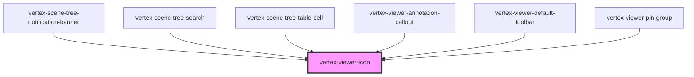

# vertex-viewer-icon

A `<vertex-viewer-icon>` is an element that renders an SVG icon from the Vertex
SDK icon set.

## Size

The icon size can be specified using the `size` attribute.

```html
<vertex-viewer-icon size="sm"></vertex-viewer-icon>
<vertex-viewer-icon size="md"></vertex-viewer-icon>
<vertex-viewer-icon size="lg"></vertex-viewer-icon>
```

You can also specify a custom size by applying a `font-size` CSS property on the
component.

```html
<style>
  .icon {
    font-size: 64px;
  }
</style>

<vertex-viewer-icon class="icon"></vertex-viewer-icon>
```

## Color

Specify the color of the icon by applying a `color` CSS property on the
component.

```html
<style>
  .icon {
    color: red;
  }
</style>

<vertex-viewer-icon class="icon"></vertex-viewer-icon>
```

<!-- Auto Generated Below -->


## Properties

| Property | Attribute | Description                                                                                                                                                                                                                                                          | Type                                                                                                                                                                                                                             | Default     |
| -------- | --------- | -------------------------------------------------------------------------------------------------------------------------------------------------------------------------------------------------------------------------------------------------------------------- | -------------------------------------------------------------------------------------------------------------------------------------------------------------------------------------------------------------------------------- | ----------- |
| `name`   | `name`    | The name of the icon to render.                                                                                                                                                                                                                                      | `"chevron-down" \| "chevron-right" \| "close-circle" \| "comment-filled" \| "comment-show" \| "eye-half" \| "eye-half-dotted" \| "eye-open" \| "fit-all" \| "info" \| "locate" \| "lock" \| "pin-fill" \| "search" \| undefined` | `undefined` |
| `size`   | `size`    | The size of the icon. Can be `'sm' \| 'md' \| 'lg' \| undefined`. Predefined sizes are set to:   * `sm`: 16px  * `md`: 24px  * `lg`: 32px  A custom size can be supplied by setting this field to `undefined` and setting `font-size` through CSS. Defaults to `md`. | `"lg" \| "md" \| "sm" \| undefined`                                                                                                                                                                                              | `'md'`      |


## Dependencies

### Used by

 - [vertex-scene-tree-notification-banner](../scene-tree-notification-banner)
 - [vertex-scene-tree-search](../scene-tree-search)
 - [vertex-scene-tree-table-cell](../scene-tree-table-cell)
 - [vertex-viewer-annotation-callout](../viewer-annotation-callout)
 - [vertex-viewer-default-toolbar](../viewer-default-toolbar)
 - [vertex-viewer-pin-group](../viewer-pin-group)

### Graph


----------------------------------------------

*Built with [StencilJS](https://stenciljs.com/)*
