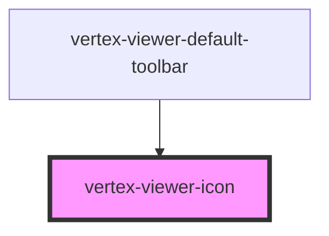

# vertex-viewer-icon

<!-- Auto Generated Below -->

## Properties

| Property | Attribute | Description                                                                                                                                                                                                                                                          | Type                                | Default     |
| -------- | --------- | -------------------------------------------------------------------------------------------------------------------------------------------------------------------------------------------------------------------------------------------------------------------- | ----------------------------------- | ----------- |
| `name`   | `name`    | The name of the icon to render.                                                                                                                                                                                                                                      | `"fit-all" \| undefined`            | `undefined` |
| `size`   | `size`    | The size of the icon. Can be `'sm' \| 'md' \| 'lg' \| undefined`. Predefined sizes are set to:   * `sm`: 16px  * `md`: 24px  * `lg`: 32px  A custom size can be supplied by setting this field to `undefined` and setting `font-size` through CSS. Defaults to `md`. | `"lg" \| "md" \| "sm" \| undefined` | `'md'`      |

## Dependencies

### Used by

 - [vertex-viewer-default-toolbar](../viewer-default-toolbar)

### Graph

----------------------------------------------

*Built with [StencilJS](https://stenciljs.com/)*
