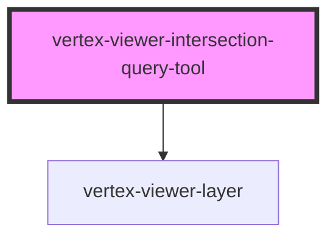

# vertex-viewer-intersection-query-tool

<!-- Auto Generated Below -->

## Properties

| Property           | Attribute           | Description                                                                                                                                                                                                                                                                                                                                                                                        | Type                                             | Default     |
| ------------------ | ------------------- | -------------------------------------------------------------------------------------------------------------------------------------------------------------------------------------------------------------------------------------------------------------------------------------------------------------------------------------------------------------------------------------------------- | ------------------------------------------------ | ----------- |
| `controller`       | --                  | The controller that is responsible for performing operations using the intersection query and updating the model.                                                                                                                                                                                                                                                                                  | `VolumeIntersectionQueryController \| undefined` | `undefined` |
| `defaultOperation` | `default-operation` | The default operation to perform when a drag has completed and the intersection query will be run. Defaults to `select`, and can be changed to `deselect`.  The operation behavior for this intersection query tool can also be changed by providing a custom implementation of the `VolumeIntersectionQueryController`, or by using the `setOperationTransform` method of the default controller. | `"deselect" \| "select"`                         | `'select'`  |
| `model`            | --                  | The model that contains the points representing the corners of the box displayed on screen, the type of the query to be performed, and methods for setting these values.                                                                                                                                                                                                                           | `VolumeIntersectionQueryModel \| undefined`      | `undefined` |
| `viewer`           | --                  | The viewer that this component is bound to. This is automatically assigned if added to the light-dom of a parent viewer element.                                                                                                                                                                                                                                                                   | `HTMLVertexViewerElement \| undefined`           | `undefined` |

## Dependencies

### Depends on

- [vertex-viewer-layer](../viewer-layer)

### Graph

----------------------------------------------

*Built with [StencilJS](https://stenciljs.com/)*
