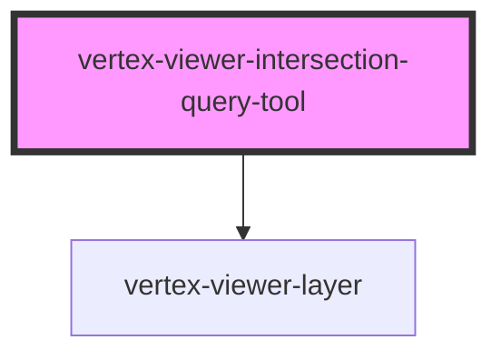

# vertex-viewer-intersection-query-tool

<!-- Auto Generated Below -->

## Properties

| Property           | Attribute           | Description                                                                                                                                                                                                                                                                                                                                                                                        | Type                                             | Default     |
| ------------------ | ------------------- | -------------------------------------------------------------------------------------------------------------------------------------------------------------------------------------------------------------------------------------------------------------------------------------------------------------------------------------------------------------------------------------------------- | ------------------------------------------------ | ----------- |
| `controller`       | --                  | The controller that is responsible for performing operations using the intersection query and updating the model.                                                                                                                                                                                                                                                                                  | `VolumeIntersectionQueryController \| undefined` | `undefined` |
| `defaultOperation` | `default-operation` | The default operation to perform when a drag has completed and the intersection query will be run. Defaults to `select`, and can be changed to `deselect`.  The operation behavior for this intersection query tool can also be changed by providing a custom implementation of the `VolumeIntersectionQueryController`, or by using the `setOperationTransform` method of the default controller. | `"deselect" \| "select"`                         | `'select'`  |
| `model`            | --                  | The model that contains the points representing the corners of the box displayed on screen, the type of the query to be performed, and methods for setting these values.                                                                                                                                                                                                                           | `VolumeIntersectionQueryModel \| undefined`      | `undefined` |
| `viewer`           | --                  | The viewer that this component is bound to. This is automatically assigned if added to the light-dom of a parent viewer element.                                                                                                                                                                                                                                                                   | `HTMLVertexViewerElement \| undefined`           | `undefined` |

## CSS Custom Properties

| Name                                                         | Description                                                                                                                                                                                                              |
| ------------------------------------------------------------ | ------------------------------------------------------------------------------------------------------------------------------------------------------------------------------------------------------------------------ |
| `--viewer-intersection-query-outline-border-radius`          | A CSS length that specifies the border radius of the drawn box. Defaults to `0.25rem`.                                                                                                                                   |
| `--viewer-intersection-query-outline-exclusive-border-style` | A border style that specifies the type of border to display around the box for an exclusive query. Defaults to `solid`.                                                                                                  |
| `--viewer-intersection-query-outline-exclusive-color`        | A CSS color that specifies the color of box for an exclusive query. This will be used in combination with `--viewer-intersection-query-outline-fill-opacity` for the background color of the box. Defaults to `#0099cc`. |
| `--viewer-intersection-query-outline-fill-opacity`           | A number between 0 and 1 that specifies the opacity of the background of the drawn box. Defaults to `0.25`.                                                                                                              |
| `--viewer-intersection-query-outline-inclusive-border-style` | A border style that specifies the type of border to display around the box for an inclusive query. Defaults to `dashed`.                                                                                                 |
| `--viewer-intersection-query-outline-inclusive-color`        | A CSS color that specifies the color of box for an inclusive query. This will be used in combination with `--viewer-intersection-query-outline-fill-opacity` for the background color of the box. Defaults to `#00cc00`. |

## Dependencies

### Depends on

- [vertex-viewer-layer](../viewer-layer)

### Graph

----------------------------------------------

*Built with [StencilJS](https://stenciljs.com/)*
