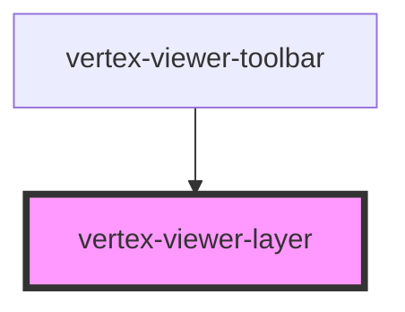

# vertex-viewer-layer

The `<vertex-viewer-layer>` component is a container that stretches to fill the
viewport of a `<vertex-viewer>`.

**Example:** Positioning an element at the bottom of a viewer.

```html
<html>
  <head>
    <style>
      .toolbar {
        position: absolute;
        bottom: 20px;
        left: 20px;
      }
    </style>
  </head>
  <body>
    <vertex-viewer id="viewer" src="urn:vertexvis:stream-key:my-key">
      <vertex-viewer-layer>
        <div class="toolbar">
          <button>Click Me</button>
        </div>
      </vertex-viewer-layer>
    </vertex-viewer>
  </body>
</html>
```

<!-- Auto Generated Below -->


## Dependencies

### Used by

 - [vertex-viewer-toolbar](../viewer-toolbar)

### Graph


----------------------------------------------

*Built with [StencilJS](https://stenciljs.com/)*
