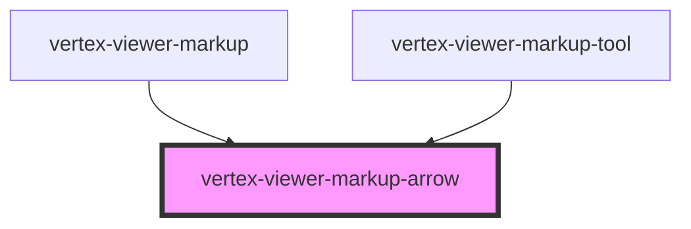

# vertex-viewer-markup-arrow

<!-- Auto Generated Below -->

## Properties

| Property               | Attribute                 | Description                                                                                                                                                                                                                                                                                                               | Type                                                            | Default            |
| ---------------------- | ------------------------- | ------------------------------------------------------------------------------------------------------------------------------------------------------------------------------------------------------------------------------------------------------------------------------------------------------------------------- | --------------------------------------------------------------- | ------------------ |
| `end`                  | --                        | The position of the ending anchor. Can either be an instance of a `Point` or a JSON string representation in the format of `[x, y]` or `{"x": 0, "y": 0}`.  Points are expected to be relative coordinates from `[-0.5, 0.5]`, e.g. `[0, 0]` corresponds to a point in the center of the viewport.                        | `Point \| undefined`                                            | `undefined`        |
| `endJson`              | `end`                     | The position of the ending anchor, as a JSON string. Can either be an instance of a `Point` or a JSON string representation in the format of `[x, y]` or `{"x": 0, "y": 0}`.  Points are expected to be relative coordinates from `[-0.5, 0.5]`, e.g. `[0, 0]` corresponds to a point in the center of the viewport.      | `string \| undefined`                                           | `undefined`        |
| `endLineAnchorStyle`   | `end-line-anchor-style`   | The style of the ending anchor. This defaults to 'arrow-triangle.'                                                                                                                                                                                                                                                        | `"arrow-line" \| "arrow-triangle" \| "dot" \| "hash" \| "none"` | `'arrow-triangle'` |
| `mode`                 | `mode`                    | A mode that specifies how the markup component should behave. When unset, the component will not respond to interactions with the handles. When `edit`, the markup anchors are interactive and the user is able to reposition them. When `create`, anytime the user clicks on the canvas, a new markup will be performed. | `"" \| "create" \| "edit"`                                      | `''`               |
| `start`                | --                        | The position of the starting anchor. Can either be an instance of a `Point` or a JSON string representation in the format of `[x, y]` or `{"x": 0, "y": 0}`.  Points are expected to be relative coordinates from `[-0.5, 0.5]`, e.g. `[0, 0]` corresponds to a point in the center of the viewport.                      | `Point \| undefined`                                            | `undefined`        |
| `startJson`            | `start`                   | The position of the starting anchor, as a JSON string. Can either be an instance of a `Point` or a JSON string representation in the format of `[x, y]` or `{"x": 0, "y": 0}`.  Points are expected to be relative coordinates from `[-0.5, 0.5]`, e.g. `[0, 0]` corresponds to a point in the center of the viewport.    | `string \| undefined`                                           | `undefined`        |
| `startLineAnchorStyle` | `start-line-anchor-style` | The style of the starting anchor. This defaults to none.                                                                                                                                                                                                                                                                  | `"arrow-line" \| "arrow-triangle" \| "dot" \| "hash" \| "none"` | `'none'`           |
| `viewer`               | --                        | The viewer to connect to markups.  This property will automatically be set when a child of a `<vertex-viewer-markup>` or `<vertex-viewer>` element.                                                                                                                                                                       | `HTMLVertexViewerElement \| undefined`                          | `undefined`        |

## Events

| Event           | Description                                                                                                             | Type                                              |
| --------------- | ----------------------------------------------------------------------------------------------------------------------- | ------------------------------------------------- |
| `editBegin`     | An event that is dispatched anytime the user begins editing the markup.                                                 | `CustomEvent<void>`                               |
| `editEnd`       | An event that is dispatched when the user has finished editing the markup.                                              | `CustomEvent<void>`                               |
| `markupUpdated` | An event that is dispatched with the updated markup element after the markup has changed.                               | `CustomEvent<HTMLVertexViewerMarkupArrowElement>` |
| `viewRendered`  | An event that is dispatched when this markup element is in view mode (`this.mode === ""`), and it completes a rerender. | `CustomEvent<void>`                               |

## Methods

### `dispose() => Promise<void>`

#### Returns

Type: `Promise<void>`

## CSS Custom Properties

| Name                                                          | Description                                                                            |
| ------------------------------------------------------------- | -------------------------------------------------------------------------------------- |
| `--viewer-markup-arrow-bounds-anchor-height`                  | A CSS length that specifies the height of the resize and reposition anchors.           |
| `--viewer-markup-arrow-bounds-anchor-width`                   | A CSS length that specifies the width of the resize and reposition anchors.            |
| `--viewer-markup-arrow-bounds-cap-background-color`           | A CSS color that specifies the background color of the arrow start/end resize anchors. |
| `--viewer-markup-arrow-bounds-cap-border-color`               | A CSS color that specifies the color of arrow start/end resize anchors' border.        |
| `--viewer-markup-arrow-bounds-cap-border-width`               | A CSS length that specifies the width of arrow start/end resize anchors' border.       |
| `--viewer-markup-arrow-bounds-center-anchor-background-color` | A CSS color that specifies the background color of the center resize anchor.           |
| `--viewer-markup-arrow-bounds-center-anchor-border-color`     | A CSS color that specifies the color of the center resize anchor's border.             |
| `--viewer-markup-arrow-bounds-center-anchor-border-width`     | A CSS length that specifies the width of the center resize anchor's border.            |
| `--viewer-markup-arrow-bounds-outline-color`                  | A CSS color that specifies the color of selected arrow outline.                        |
| `--viewer-markup-arrow-bounds-outline-width`                  | A CSS color that specifies the width of the selected arrow outline.                    |
| `--viewer-markup-arrow-head-fill-color`                       | A CSS color that specifies the color of the arrow head's fill.                         |
| `--viewer-markup-arrow-head-fill-opacity`                     | A number between 0 and 1 that specifies the opacity of the arrow head's fill.          |
| `--viewer-markup-arrow-head-stroke-color`                     | A CSS color that specifies the color of the arrow head's outline.                      |
| `--viewer-markup-arrow-head-stroke-width`                     | A CSS length that specifies the width of the arrow head's outline.                     |
| `--viewer-markup-arrow-line-stroke-color`                     | A CSS color that specifies the color of the arrow line's outline.                      |
| `--viewer-markup-arrow-line-stroke-width`                     | A CSS length that specifies the width of the arrow line's outline.                     |

## Dependencies

### Used by

 - [vertex-viewer-markup](../viewer-markup)
 - [vertex-viewer-markup-tool](../viewer-markup-tool)

### Graph

----------------------------------------------

*Built with [StencilJS](https://stenciljs.com/)*
