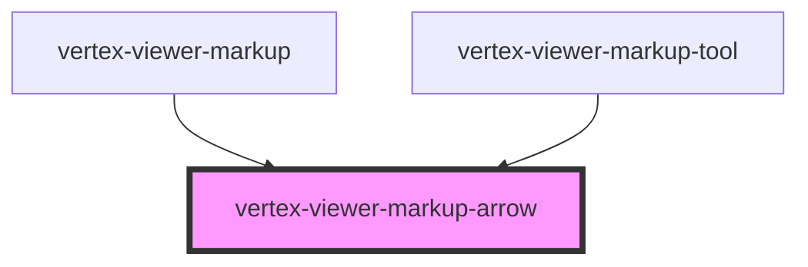

# vertex-viewer-markup-arrow

<!-- Auto Generated Below -->

## Properties

| Property    | Attribute | Description                                                                                                                                                                                                                                                                                                                               | Type                                   | Default     |
| ----------- | --------- | ----------------------------------------------------------------------------------------------------------------------------------------------------------------------------------------------------------------------------------------------------------------------------------------------------------------------------------------- | -------------------------------------- | ----------- |
| `end`       | --        | The position of the ending anchor. Can either be an instance of a `Point` or a JSON string representation in the format of `[x, y]` or `{"x": 0, "y": 0}`.                                                                                                                                                                                | `Point \| undefined`                   | `undefined` |
| `endJson`   | `end`     | The position of the ending anchor, as a JSON string. Can either be an instance of a `Point` or a JSON string representation in the format of `[x, y]` or `{"x": 0, "y": 0}`.                                                                                                                                                              | `string \| undefined`                  | `undefined` |
| `mode`      | `mode`    | A mode that specifies how the measurement component should behave. When unset, the component will not respond to interactions with the handles. When `edit`, the measurement anchors are interactive and the user is able to reposition them. When `replace`, anytime the user clicks on the canvas, a new measurement will be performed. | `"" \| "edit" \| "replace"`            | `''`        |
| `start`     | --        | The position of the starting anchor. Can either be an instance of a `Point` or a JSON string representation in the format of `[x, y]` or `{"x": 0, "y": 0}`.                                                                                                                                                                              | `Point \| undefined`                   | `undefined` |
| `startJson` | `start`   | The position of the starting anchor, as a JSON string. Can either be an instance of a `Point` or a JSON string representation in the format of `[x, y]` or `{"x": 0, "y": 0}`.                                                                                                                                                            | `string \| undefined`                  | `undefined` |
| `viewer`    | --        | The viewer to connect to measurements.  This property will automatically be set when a child of a `<vertex-viewer-measurements>` or `<vertex-viewer>` element.                                                                                                                                                                            | `HTMLVertexViewerElement \| undefined` | `undefined` |

## Events

| Event       | Description | Type                |
| ----------- | ----------- | ------------------- |
| `editBegin` |             | `CustomEvent<void>` |
| `editEnd`   |             | `CustomEvent<void>` |

## Dependencies

### Used by

 - [vertex-viewer-markup](../viewer-markup)
 - [vertex-viewer-markup-tool](../viewer-markup-tool)

### Graph

----------------------------------------------

*Built with [StencilJS](https://stenciljs.com/)*
