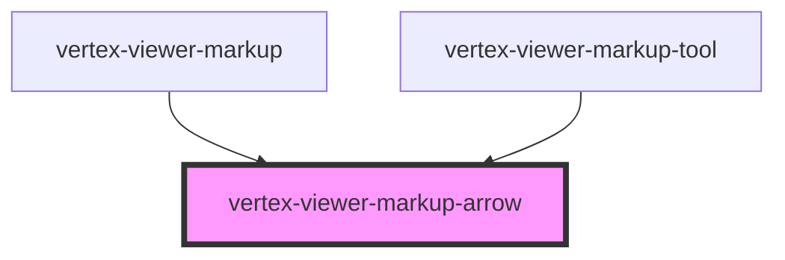

# vertex-viewer-markup-arrow

<!-- Auto Generated Below -->

## Properties

| Property               | Attribute                 | Description                                                                                                                                                                                                                                                                                                                                                                                                                                                                     | Type                                                            | Default            |
| ---------------------- | ------------------------- | ------------------------------------------------------------------------------------------------------------------------------------------------------------------------------------------------------------------------------------------------------------------------------------------------------------------------------------------------------------------------------------------------------------------------------------------------------------------------------- | --------------------------------------------------------------- | ------------------ |
| `centeringBehavior`    | `centering-behavior`      | Defines the behavior of the provided markup when the originating viewport is smaller than the current viewport, or is scaled to a size smaller than the current viewport using the `scale` property.  Options: - `x-only`: Markup will be centered horizontally, but not vertically. - `y-only`: Markup will be centered vertically, but not horizontally. - `both`: Markup will be centered both horizontally and vertically. - `none`: Markup will not be centered (default). | `"both" \| "none" \| "x-only" \| "y-only"`                      | `'none'`           |
| `end`                  | --                        | The position of the ending anchor. Can either be an instance of a `Point` or a JSON string representation in the format of `[x, y]` or `{"x": 0, "y": 0}`.  Points are expected to be relative coordinates from `[-0.5, 0.5]`, e.g. `[0, 0]` corresponds to a point in the center of the viewport.                                                                                                                                                                              | `Point \| undefined`                                            | `undefined`        |
| `endJson`              | `end`                     | The position of the ending anchor, as a JSON string. Can either be an instance of a `Point` or a JSON string representation in the format of `[x, y]` or `{"x": 0, "y": 0}`.  Points are expected to be relative coordinates from `[-0.5, 0.5]`, e.g. `[0, 0]` corresponds to a point in the center of the viewport.                                                                                                                                                            | `string \| undefined`                                           | `undefined`        |
| `endLineAnchorStyle`   | `end-line-anchor-style`   | The style of the ending anchor. This defaults to 'arrow-triangle.'                                                                                                                                                                                                                                                                                                                                                                                                              | `"arrow-line" \| "arrow-triangle" \| "dot" \| "hash" \| "none"` | `'arrow-triangle'` |
| `mode`                 | `mode`                    | A mode that specifies how the markup component should behave. When unset, the component will not respond to interactions with the handles. When `edit`, the markup anchors are interactive and the user is able to reposition them. When `create`, anytime the user clicks on the canvas, a new markup will be performed.                                                                                                                                                       | `"" \| "create" \| "edit"`                                      | `''`               |
| `offset`               | --                        | The current offset of the visible viewport. This value is used to determine where markup should be rendered relative to the current viewport, enabling some markup to appear "off-screen".  When provided, all computed coordinates will be offset by this amount.                                                                                                                                                                                                              | `Point \| undefined`                                            | `undefined`        |
| `originatingViewport`  | --                        | The original viewport dimensions where this markup was created. This value is used to determine where the markup should be rendered relative to the current viewport, enabling some markup to appear "off-screen".  When provided, all NDC values will be considered relative to this viewport.                                                                                                                                                                                 | `Dimensions \| undefined`                                       | `undefined`        |
| `scale`                | `scale`                   | The scale to render this markup at. This value is used to scale the element's bounds along with any `offset` to determine the final computed coordinates.  When provided, all computed coordinates will be scaled by this amount.                                                                                                                                                                                                                                               | `number`                                                        | `1`                |
| `start`                | --                        | The position of the starting anchor. Can either be an instance of a `Point` or a JSON string representation in the format of `[x, y]` or `{"x": 0, "y": 0}`.  Points are expected to be relative coordinates from `[-0.5, 0.5]`, e.g. `[0, 0]` corresponds to a point in the center of the viewport.                                                                                                                                                                            | `Point \| undefined`                                            | `undefined`        |
| `startJson`            | `start`                   | The position of the starting anchor, as a JSON string. Can either be an instance of a `Point` or a JSON string representation in the format of `[x, y]` or `{"x": 0, "y": 0}`.  Points are expected to be relative coordinates from `[-0.5, 0.5]`, e.g. `[0, 0]` corresponds to a point in the center of the viewport.                                                                                                                                                          | `string \| undefined`                                           | `undefined`        |
| `startLineAnchorStyle` | `start-line-anchor-style` | The style of the starting anchor. This defaults to none.                                                                                                                                                                                                                                                                                                                                                                                                                        | `"arrow-line" \| "arrow-triangle" \| "dot" \| "hash" \| "none"` | `'none'`           |
| `viewer`               | --                        | The viewer to connect to markups.  This property will automatically be set when a child of a `<vertex-viewer-markup>` or `<vertex-viewer>` element.                                                                                                                                                                                                                                                                                                                             | `HTMLVertexViewerElement \| undefined`                          | `undefined`        |

## Events

| Event              | Description                                                                                                             | Type                             |
| ------------------ | ----------------------------------------------------------------------------------------------------------------------- | -------------------------------- |
| `interactionBegin` | An event that is dispatched anytime the user begins interacting with the markup.                                        | `CustomEvent<void>`              |
| `interactionEnd`   | An event that is dispatched when the user has finished interacting with the markup.                                     | `CustomEvent<MarkupInteraction>` |
| `viewRendered`     | An event that is dispatched when this markup element is in view mode (`this.mode === ""`), and it completes a rerender. | `CustomEvent<void>`              |

## Methods

### `dispose() => Promise<void>`

#### Returns

Type: `Promise<void>`

## CSS Custom Properties

| Name                                                          | Description                                                                                                                                                                                             |
| ------------------------------------------------------------- | ------------------------------------------------------------------------------------------------------------------------------------------------------------------------------------------------------- |
| `--viewer-markup-arrow-bounds-anchor-height`                  | A CSS length that specifies the height of the resize and reposition anchors.                                                                                                                            |
| `--viewer-markup-arrow-bounds-anchor-width`                   | A CSS length that specifies the width of the resize and reposition anchors.                                                                                                                             |
| `--viewer-markup-arrow-bounds-cap-background-color`           | A CSS color that specifies the background color of the arrow start/end resize anchors.                                                                                                                  |
| `--viewer-markup-arrow-bounds-cap-border-color`               | A CSS color that specifies the color of arrow start/end resize anchors' border.                                                                                                                         |
| `--viewer-markup-arrow-bounds-cap-border-width`               | A CSS length that specifies the width of arrow start/end resize anchors' border.                                                                                                                        |
| `--viewer-markup-arrow-bounds-center-anchor-background-color` | A CSS color that specifies the background color of the center resize anchor.                                                                                                                            |
| `--viewer-markup-arrow-bounds-center-anchor-border-color`     | A CSS color that specifies the color of the center resize anchor's border.                                                                                                                              |
| `--viewer-markup-arrow-bounds-center-anchor-border-width`     | A CSS length that specifies the width of the center resize anchor's border.                                                                                                                             |
| `--viewer-markup-arrow-bounds-outline-color`                  | A CSS color that specifies the color of selected arrow outline.                                                                                                                                         |
| `--viewer-markup-arrow-bounds-outline-width`                  | A CSS color that specifies the width of the selected arrow outline.                                                                                                                                     |
| `--viewer-markup-arrow-head-fill-color`                       | A CSS color that specifies the color of the arrow head's fill.                                                                                                                                          |
| `--viewer-markup-arrow-head-fill-opacity`                     | A number between 0 and 1 that specifies the opacity of the arrow head's fill.                                                                                                                           |
| `--viewer-markup-arrow-head-stroke-color`                     | A CSS color that specifies the color of the arrow head's outline.                                                                                                                                       |
| `--viewer-markup-arrow-head-stroke-width`                     | A CSS length that specifies the width of the arrow head's outline. Note that this is scaled by the component's scale factor, so providing a scale other than 1 will result in a different stroke width. |
| `--viewer-markup-arrow-line-stroke-color`                     | A CSS color that specifies the color of the arrow line's outline.                                                                                                                                       |
| `--viewer-markup-arrow-line-stroke-width`                     | A CSS length that specifies the width of the arrow line's outline. Note that this is scaled by the component's scale factor, so providing a scale other than 1 will result in a different stroke width. |
| `--viewer-markup-arrow-scale`                                 | A number that specifies the scale of the arrow. This is used to scale the arrow's stroke width. Defaults to 1, and is managed internally by the component.                                              |

## Dependencies

### Used by

 - [vertex-viewer-markup](../viewer-markup)
 - [vertex-viewer-markup-tool](../viewer-markup-tool)

### Graph

```mermaid
graph TD;
  vertex-viewer-markup --> vertex-viewer-markup-arrow
  vertex-viewer-markup-tool --> vertex-viewer-markup-arrow
  style vertex-viewer-markup-arrow fill:#f9f,stroke:#333,stroke-width:4px
```

----------------------------------------------

*Built with [StencilJS](https://stenciljs.com/)*
