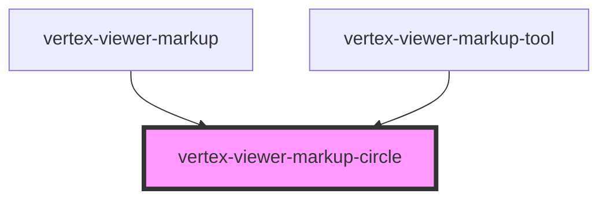

# vertex-viewer-markup-circle

<!-- Auto Generated Below -->

## Properties

| Property     | Attribute | Description                                                                                                                                                                                                                                                                                                                                                                      | Type                                   | Default     |
| ------------ | --------- | -------------------------------------------------------------------------------------------------------------------------------------------------------------------------------------------------------------------------------------------------------------------------------------------------------------------------------------------------------------------------------- | -------------------------------------- | ----------- |
| `bounds`     | --        | The bounds of the circle. Can either be an instance of a `Rectangle` or a JSON string representation in the format of `[x, y, width, height]` or `{"x": 0, "y": 0, "width": 10, "height": 10}`.  Bounds are expected to have relative coordinates, e.g. `[0.5, 0.5, 0.5, 0.5]` corresponds to a circle with a diameter of half the viewport width in the center of the viewport. | `Rectangle \| undefined`               | `undefined` |
| `boundsJson` | `bounds`  | The bounds of the circle. Can either be an instance of a `Rectangle` or a JSON string representation in the format of `[x, y, width, height]` or `{"x": 0, "y": 0, "width": 10, "height": 10}`.  Bounds are expected to have relative coordinates, e.g. `[0.5, 0.5, 0.5, 0.5]` corresponds to a circle with a diameter of half the viewport width in the center of the viewport. | `string \| undefined`                  | `undefined` |
| `mode`       | `mode`    | A mode that specifies how the markup component should behave. When unset, the component will not respond to interactions with the handles. When `edit`, the markup anchors are interactive and the user is able to reposition them. When `replace`, anytime the user clicks on the canvas, a new markup will be performed.                                                       | `"" \| "edit" \| "replace"`            | `''`        |
| `viewer`     | --        | The viewer to connect to markups.  This property will automatically be set when a child of a `<vertex-viewer-markup>` or `<vertex-viewer>` element.                                                                                                                                                                                                                              | `HTMLVertexViewerElement \| undefined` | `undefined` |

## Events

| Event        | Description                                                                | Type                |
| ------------ | -------------------------------------------------------------------------- | ------------------- |
| `editBegin`  | An event that is dispatched anytime the user begins editing the markup.    | `CustomEvent<void>` |
| `editCancel` | An event that is dispatched when the user cancels editing of the markup.   | `CustomEvent<void>` |
| `editEnd`    | An event that is dispatched when the user has finished editing the markup. | `CustomEvent<void>` |

## Methods

### `dispose() => Promise<void>`

#### Returns

Type: `Promise<void>`

## CSS Custom Properties

| Name                                                       | Description                                                                                      |
| ---------------------------------------------------------- | ------------------------------------------------------------------------------------------------ |
| `--viewer-markup-circle-bounds-center-anchor-fill-color`   | A CSS color that specifies the color of the center resize anchor's fill.                         |
| `--viewer-markup-circle-bounds-center-anchor-fill-opacity` | A number between 0 and 1 that specifies the opacity of the center resize anchor's fill.          |
| `--viewer-markup-circle-bounds-center-anchor-stroke-color` | A CSS color that specifies the color of the center resize anchor's outline.                      |
| `--viewer-markup-circle-bounds-center-anchor-stroke-width` | A CSS length that specifies the width of the center resize anchor's outline.                     |
| `--viewer-markup-circle-bounds-edge-anchor-fill-color`     | A CSS color that specifies the color of the edge and corner resize anchor fill.                  |
| `--viewer-markup-circle-bounds-edge-anchor-fill-opacity`   | A number between 0 and 1 that specifies the opacity of the edge and corner resize anchors' fill. |
| `--viewer-markup-circle-bounds-edge-anchor-stroke-color`   | A CSS color that specifies the color of the edge and corner resize anchors' outlines.            |
| `--viewer-markup-circle-bounds-edge-anchor-stroke-width`   | A CSS length that specifies the width of the edge and corner resize anchors' outlines.           |
| `--viewer-markup-circle-bounds-outline-stroke-color`       | A CSS color that specifies the color of the circle's selected bounding box outline.              |
| `--viewer-markup-circle-bounds-outline-stroke-width`       | A CSS length that specifies the width of the circle's selected bounding box outline.             |
| `--viewer-markup-circle-ellipse-fill-color`                | A CSS color that specifies the color of the circle's fill.                                       |
| `--viewer-markup-circle-ellipse-fill-opacity`              | A number between 0 and 1 that specifies the opacity of the circle's fill.                        |
| `--viewer-markup-circle-ellipse-stroke-color`              | A CSS color that specifies the color of the circle's outline.                                    |
| `--viewer-markup-circle-ellipse-stroke-width`              | A CSS length that specifies the width of the circle's outline.                                   |

## Dependencies

### Used by

 - [vertex-viewer-markup](../viewer-markup)
 - [vertex-viewer-markup-tool](../viewer-markup-tool)

### Graph

----------------------------------------------

*Built with [StencilJS](https://stenciljs.com/)*
