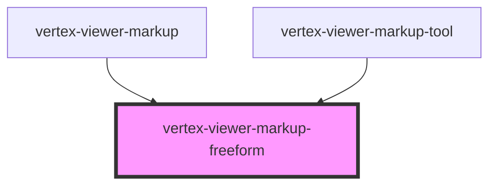

# vertex-viewer-markup-freeform

<!-- Auto Generated Below -->

## Properties

| Property     | Attribute | Description                                                                                                                                                                                                                                                                                                                                                                                                                                                               | Type                                   | Default     |
| ------------ | --------- | ------------------------------------------------------------------------------------------------------------------------------------------------------------------------------------------------------------------------------------------------------------------------------------------------------------------------------------------------------------------------------------------------------------------------------------------------------------------------- | -------------------------------------- | ----------- |
| `bounds`     | --        | The bounds of the freeform. Can either be an instance of a `Rectangle` or a JSON string representation in the format of `[x, y, width, height]` or `{"x": 0, "y": 0, "width": 10, "height": 10}`.  Bounds are expected to have relative coordinates, with `[x, y]` from `[-0.5, 0.5]` and `[width, height]` from `[0, 1]`, e.g. `[0, 0, 0.25, 0.25]`corresponds to a freeform with a diameter of one fourth the viewport's smallest size in the center of the viewport.   | `Rectangle \| undefined`               | `undefined` |
| `boundsJson` | `bounds`  | The bounds of the freeform. Can either be an instance of a `Rectangle` or a JSON string representation in the format of `[x, y, width, height]` or `{"x": 0, "y": 0, "width": 0.1, "height": 0.1}`.  Bounds are expected to have relative coordinates, with `[x, y]` from `[-0.5, 0.5]` and `[width, height]` from `[0, 1]`, e.g. `[0, 0, 0.25, 0.25]`corresponds to a freeform with a diameter of one fourth the viewport's smallest size in the center of the viewport. | `string \| undefined`                  | `undefined` |
| `mode`       | `mode`    | A mode that specifies how the markup component should behave. When unset, the component will not respond to interactions with the handles. When `edit`, the markup anchors are interactive and the user is able to reposition them. When `create`, anytime the user clicks on the canvas, a new markup will be performed.                                                                                                                                                 | `"" \| "create" \| "edit"`             | `''`        |
| `points`     | --        | The positions of the various points of this freeform markup. Can either be an array of `Point`s or a JSON string representation in the format of `[[x1, y1], [x2, y2]]` or `[{"x": 0, "y": 0}, {"x": 0, "y": 0}]`.  Points are expected to be relative coordinates from `[-0.5, 0.5]`, e.g. `[0, 0]` corresponds to a point in the center of the viewport.                                                                                                                | `Point[] \| undefined`                 | `undefined` |
| `pointsJson` | `points`  | The positions of the various points of this freeform markup. Can either be an array of `Point`s or a JSON string representation in the format of `[[x1, y1], [x2, y2]]` or `[{"x": 0, "y": 0}, {"x": 0, "y": 0}]`.  Points are expected to be relative coordinates from `[-0.5, 0.5]`, e.g. `[0, 0]` corresponds to a point in the center of the viewport.                                                                                                                | `string \| undefined`                  | `undefined` |
| `viewer`     | --        | The viewer to connect to markups.  This property will automatically be set when a child of a `<vertex-viewer-markup>` or `<vertex-viewer>` element.                                                                                                                                                                                                                                                                                                                       | `HTMLVertexViewerElement \| undefined` | `undefined` |

## Events

| Event        | Description                                                                | Type                |
| ------------ | -------------------------------------------------------------------------- | ------------------- |
| `editBegin`  | An event that is dispatched anytime the user begins editing the markup.    | `CustomEvent<void>` |
| `editCancel` | An event that is dispatched when the user cancels editing of the markup.   | `CustomEvent<void>` |
| `editEnd`    | An event that is dispatched when the user has finished editing the markup. | `CustomEvent<void>` |

## Methods

### `dispose() => Promise<void>`

#### Returns

Type: `Promise<void>`

## Dependencies

### Used by

 - [vertex-viewer-markup](../viewer-markup)
 - [vertex-viewer-markup-tool](../viewer-markup-tool)

### Graph

----------------------------------------------

*Built with [StencilJS](https://stenciljs.com/)*
