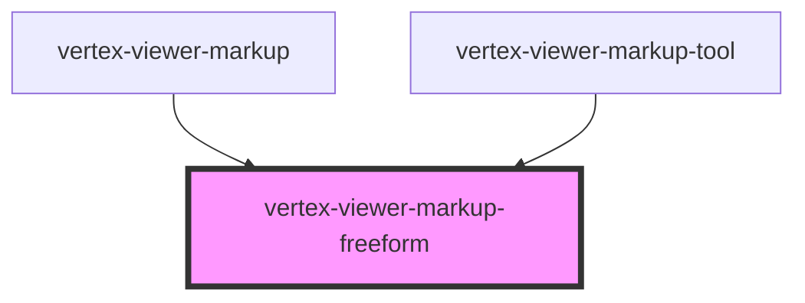

# vertex-viewer-markup-freeform

<!-- Auto Generated Below -->

## Properties

| Property     | Attribute | Description                                                                                                                                                                                                                                                                                                                                                                                                                                                               | Type                                   | Default     |
| ------------ | --------- | ------------------------------------------------------------------------------------------------------------------------------------------------------------------------------------------------------------------------------------------------------------------------------------------------------------------------------------------------------------------------------------------------------------------------------------------------------------------------- | -------------------------------------- | ----------- |
| `bounds`     | --        | The bounds of the freeform. Can either be an instance of a `Rectangle` or a JSON string representation in the format of `[x, y, width, height]` or `{"x": 0, "y": 0, "width": 10, "height": 10}`.  Bounds are expected to have relative coordinates, with `[x, y]` from `[-0.5, 0.5]` and `[width, height]` from `[0, 1]`, e.g. `[0, 0, 0.25, 0.25]`corresponds to a freeform with a diameter of one fourth the viewport's smallest size in the center of the viewport.   | `Rectangle \| undefined`               | `undefined` |
| `boundsJson` | `bounds`  | The bounds of the freeform. Can either be an instance of a `Rectangle` or a JSON string representation in the format of `[x, y, width, height]` or `{"x": 0, "y": 0, "width": 0.1, "height": 0.1}`.  Bounds are expected to have relative coordinates, with `[x, y]` from `[-0.5, 0.5]` and `[width, height]` from `[0, 1]`, e.g. `[0, 0, 0.25, 0.25]`corresponds to a freeform with a diameter of one fourth the viewport's smallest size in the center of the viewport. | `string \| undefined`                  | `undefined` |
| `mode`       | `mode`    | A mode that specifies how the markup component should behave. When unset, the component will not respond to interactions with the handles. When `edit`, the markup anchors are interactive and the user is able to reposition them. When `create`, anytime the user clicks on the canvas, a new markup will be performed.                                                                                                                                                 | `"" \| "create" \| "edit"`             | `''`        |
| `points`     | --        | The positions of the various points of this freeform markup. Can either be an array of `Point`s or a JSON string representation in the format of `[[x1, y1], [x2, y2]]` or `[{"x": 0, "y": 0}, {"x": 0, "y": 0}]`.  Points are expected to be relative coordinates from `[-0.5, 0.5]`, e.g. `[0, 0]` corresponds to a point in the center of the viewport.                                                                                                                | `Point[] \| undefined`                 | `undefined` |
| `pointsJson` | `points`  | The positions of the various points of this freeform markup. Can either be an array of `Point`s or a JSON string representation in the format of `[[x1, y1], [x2, y2]]` or `[{"x": 0, "y": 0}, {"x": 0, "y": 0}]`.  Points are expected to be relative coordinates from `[-0.5, 0.5]`, e.g. `[0, 0]` corresponds to a point in the center of the viewport.                                                                                                                | `string \| undefined`                  | `undefined` |
| `viewer`     | --        | The viewer to connect to markups.  This property will automatically be set when a child of a `<vertex-viewer-markup>` or `<vertex-viewer>` element.                                                                                                                                                                                                                                                                                                                       | `HTMLVertexViewerElement \| undefined` | `undefined` |

## Events

| Event              | Description                                                                                                             | Type                             |
| ------------------ | ----------------------------------------------------------------------------------------------------------------------- | -------------------------------- |
| `interactionBegin` | An event that is dispatched anytime the user begins interacting with the markup.                                        | `CustomEvent<void>`              |
| `interactionEnd`   | An event that is dispatched when the user has finished interacting with the markup.                                     | `CustomEvent<MarkupInteraction>` |
| `viewRendered`     | An event that is dispatched when this markup element is in view mode (`this.mode === ""`), and it completes a rerender. | `CustomEvent<void>`              |

## Methods

### `dispose() => Promise<void>`

#### Returns

Type: `Promise<void>`

## CSS Custom Properties

| Name                                                             | Description                                                                              |
| ---------------------------------------------------------------- | ---------------------------------------------------------------------------------------- |
| `--viewer-markup-freeform-bounds-anchor-height`                  | A CSS length that specifies the height of the resize and reposition anchors.             |
| `--viewer-markup-freeform-bounds-anchor-width`                   | A CSS length that specifies the width of the resize and reposition anchors.              |
| `--viewer-markup-freeform-bounds-center-anchor-background-color` | A CSS color that specifies the background color of the center reposition anchor.         |
| `--viewer-markup-freeform-bounds-center-anchor-border-color`     | A CSS color that specifies the color of the center reposition anchor's border.           |
| `--viewer-markup-freeform-bounds-center-anchor-border-width`     | A CSS length that specifies the width of the center reposition anchor's border.          |
| `--viewer-markup-freeform-bounds-edge-anchor-background-color`   | A CSS color that specifies the background color of the edge and corner resize anchors.   |
| `--viewer-markup-freeform-bounds-edge-anchor-border-color`       | A CSS color that specifies the color of the edge and corner resize anchors' borders.     |
| `--viewer-markup-freeform-bounds-edge-anchor-border-width`       | A CSS length that specifies the width of the edge and corner resize anchors' borders.    |
| `--viewer-markup-freeform-bounds-outline-border-color`           | A CSS color that specifies the color of the circle's selected bounding box border.       |
| `--viewer-markup-freeform-bounds-outline-border-width`           | A CSS length that specifies the width of the circle's selected bounding box border.      |
| `--viewer-markup-freeform-line-cap`                              | The cap behavior for the lines making up this freeform markup. Defaults to `round`.      |
| `--viewer-markup-freeform-line-join`                             | The join behavior between the lines making up this freeform markup. Defaults to `round`. |
| `--viewer-markup-freeform-stroke-color`                          | A CSS color that specifies the color of the freeform line.                               |
| `--viewer-markup-freeform-stroke-width`                          | A CSS length that specifies the width of the freeform line.                              |

## Dependencies

### Used by

 - [vertex-viewer-markup](../viewer-markup)
 - [vertex-viewer-markup-tool](../viewer-markup-tool)

### Graph

----------------------------------------------

*Built with [StencilJS](https://stenciljs.com/)*
