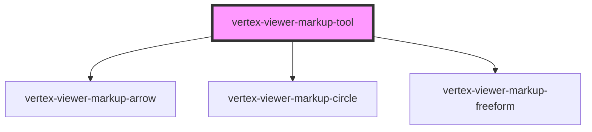

# vertex-viewer-markup-tool

<!-- Auto Generated Below -->

## Properties

| Property             | Attribute              | Description                                                                                                                                            | Type                                   | Default     |
| -------------------- | ---------------------- | ------------------------------------------------------------------------------------------------------------------------------------------------------ | -------------------------------------- | ----------- |
| `arrowTemplateId`    | `arrow-template-id`    | An HTML template that describes the HTML to use for new arrow markup. It's expected that the template contains a `<vertex-viewer-markup-arrow>`.       | `string \| undefined`                  | `undefined` |
| `circleTemplateId`   | `circle-template-id`   | An HTML template that describes the HTML to use for new circle markup. It's expected that the template contains a `<vertex-viewer-markup-circle>`.     | `string \| undefined`                  | `undefined` |
| `disabled`           | `disabled`             | Disables markups.  This property will automatically be set when a child of a `<vertex-viewer-markup>` element.                                         | `boolean`                              | `false`     |
| `freeformTemplateId` | `freeform-template-id` | An HTML template that describes the HTML to use for new freeform markup. It's expected that the template contains a `<vertex-viewer-markup-freeform>`. | `string \| undefined`                  | `undefined` |
| `tool`               | `tool`                 | The type of markup.  This property will automatically be set when a child of a `<vertex-viewer-markup>` element.                                       | `"arrow" \| "circle" \| "freeform"`    | `'arrow'`   |
| `viewer`             | --                     | The viewer to connect to markup.  This property will automatically be set when a child of a `<vertex-viewer-markup>` or `<vertex-viewer>` element.     | `HTMLVertexViewerElement \| undefined` | `undefined` |

## Events

| Event         | Description                                                        | Type                                                         |
| ------------- | ------------------------------------------------------------------ | ------------------------------------------------------------ |
| `markupBegin` | An event that is dispatched when a user begins a new markup.       | `CustomEvent<void>`                                          |
| `markupEnd`   | An event that is dispatched when a user has finished their markup. | `CustomEvent<ArrowMarkup \| CircleMarkup \| FreeformMarkup>` |

## Methods

### `reset() => Promise<void>`

Resets the state of the internally managed markup element
to allow for creating a new markup. This state is automatically
managed when this element is placed as a child of a
`<vertex-viewer-markup>` element.

#### Returns

Type: `Promise<void>`

## Dependencies

### Depends on

- [vertex-viewer-markup-arrow](../viewer-markup-arrow)
- [vertex-viewer-markup-circle](../viewer-markup-circle)
- [vertex-viewer-markup-freeform](../viewer-markup-freeform)

### Graph

----------------------------------------------

*Built with [StencilJS](https://stenciljs.com/)*
