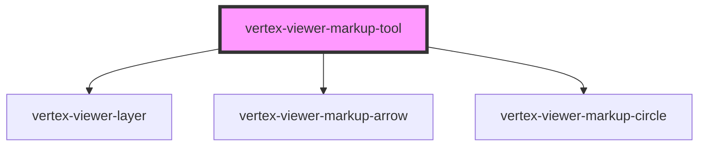

# vertex-viewer-markup-tool

<!-- Auto Generated Below -->

## Properties

| Property           | Attribute            | Description                                                                                                                                                                                                                                                                                                             | Type                                   | Default     |
| ------------------ | -------------------- | ----------------------------------------------------------------------------------------------------------------------------------------------------------------------------------------------------------------------------------------------------------------------------------------------------------------------- | -------------------------------------- | ----------- |
| `arrowTemplateId`  | `arrow-template-id`  | //  * An ID to an HTML template that describes the HTML content to use for //  * distance measurements. It's expected that the template contains a //  * `<vertex-viewer-measurement-distance>`. //  * //  * This property will automatically be set when a child of a //  * `<vertex-viewer-measurements>` element. // | `string \| undefined`                  | `undefined` |
| `circleTemplateId` | `circle-template-id` |                                                                                                                                                                                                                                                                                                                         | `string \| undefined`                  | `undefined` |
| `disabled`         | `disabled`           | Disables measurements.  This property will automatically be set when a child of a `<vertex-viewer-measurements>` element.                                                                                                                                                                                               | `boolean`                              | `false`     |
| `tool`             | `tool`               | The type of measurement.  This property will automatically be set when a child of a `<vertex-viewer-measurements>` element.                                                                                                                                                                                             | `"arrow" \| "circle"`                  | `'arrow'`   |
| `viewer`           | --                   | The viewer to connect to measurements.  This property will automatically be set when a child of a `<vertex-viewer-measurements>` or `<vertex-viewer>` element.                                                                                                                                                          | `HTMLVertexViewerElement \| undefined` | `undefined` |

## Events

| Event         | Description | Type                                       |
| ------------- | ----------- | ------------------------------------------ |
| `markupBegin` |             | `CustomEvent<void>`                        |
| `markupEnd`   |             | `CustomEvent<ArrowMarkup \| CircleMarkup>` |

## Dependencies

### Depends on

- [vertex-viewer-layer](../viewer-layer)
- [vertex-viewer-markup-arrow](../viewer-markup-arrow)
- [vertex-viewer-markup-circle](../viewer-markup-circle)

### Graph

----------------------------------------------

*Built with [StencilJS](https://stenciljs.com/)*
