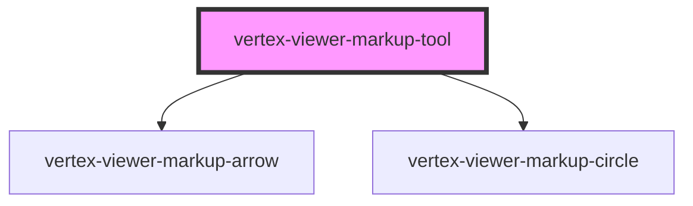

# vertex-viewer-markup-tool

<!-- Auto Generated Below -->

## Properties

| Property           | Attribute            | Description                                                                                                                                        | Type                                   | Default     |
| ------------------ | -------------------- | -------------------------------------------------------------------------------------------------------------------------------------------------- | -------------------------------------- | ----------- |
| `arrowTemplateId`  | `arrow-template-id`  | An HTML template that describes the HTML to use for new arrow markup. It's expected that the template contains a `<vertex-viewer-markup-arrow>`.   | `string \| undefined`                  | `undefined` |
| `circleTemplateId` | `circle-template-id` | An HTML template that describes the HTML to use for new circle markup. It's expected that the template contains a `<vertex-viewer-markup-circle>`. | `string \| undefined`                  | `undefined` |
| `disabled`         | `disabled`           | Disables markups.  This property will automatically be set when a child of a `<vertex-viewer-markup>` element.                                     | `boolean`                              | `false`     |
| `tool`             | `tool`               | The type of markup.  This property will automatically be set when a child of a `<vertex-viewer-markup>` element.                                   | `"arrow" \| "circle"`                  | `'arrow'`   |
| `viewer`           | --                   | The viewer to connect to markup.  This property will automatically be set when a child of a `<vertex-viewer-markup>` or `<vertex-viewer>` element. | `HTMLVertexViewerElement \| undefined` | `undefined` |

## Events

| Event              | Description                                                          | Type                                       |
| ------------------ | -------------------------------------------------------------------- | ------------------------------------------ |
| `markupBegin`      | An event that is dispatched when a user begins a new markup.         | `CustomEvent<void>`                        |
| `markupEditCancel` | An event that is dispatched when a user has cancelled a markup edit. | `CustomEvent<void>`                        |
| `markupEnd`        | An event that is dispatched when a user has finished their markup.   | `CustomEvent<ArrowMarkup \| CircleMarkup>` |

## Dependencies

### Depends on

- [vertex-viewer-markup-arrow](../viewer-markup-arrow)
- [vertex-viewer-markup-circle](../viewer-markup-circle)

### Graph

----------------------------------------------

*Built with [StencilJS](https://stenciljs.com/)*
