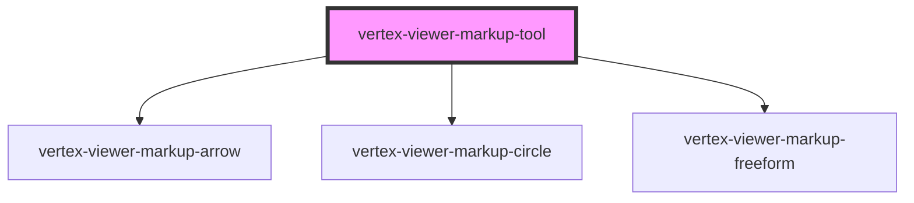

# vertex-viewer-markup-tool

<!-- Auto Generated Below -->

## Properties

| Property               | Attribute                 | Description                                                                                                                                                                                                                                                                                                                                                                                                                                                                     | Type                                                            | Default            |
| ---------------------- | ------------------------- | ------------------------------------------------------------------------------------------------------------------------------------------------------------------------------------------------------------------------------------------------------------------------------------------------------------------------------------------------------------------------------------------------------------------------------------------------------------------------------- | --------------------------------------------------------------- | ------------------ |
| `arrowTemplateId`      | `arrow-template-id`       | An HTML template that describes the HTML to use for new arrow markup. It's expected that the template contains a `<vertex-viewer-markup-arrow>`.                                                                                                                                                                                                                                                                                                                                | `string \| undefined`                                           | `undefined`        |
| `centeringBehavior`    | `centering-behavior`      | Defines the behavior of the provided markup when the originating viewport is smaller than the current viewport, or is scaled to a size smaller than the current viewport using the `scale` property.  Options: - `x-only`: Markup will be centered horizontally, but not vertically. - `y-only`: Markup will be centered vertically, but not horizontally. - `both`: Markup will be centered both horizontally and vertically. - `none`: Markup will not be centered (default). | `"both" \| "none" \| "x-only" \| "y-only"`                      | `'none'`           |
| `circleTemplateId`     | `circle-template-id`      | An HTML template that describes the HTML to use for new circle markup. It's expected that the template contains a `<vertex-viewer-markup-circle>`.                                                                                                                                                                                                                                                                                                                              | `string \| undefined`                                           | `undefined`        |
| `disabled`             | `disabled`                | Disables markups.  This property will automatically be set when a child of a `<vertex-viewer-markup>` element.                                                                                                                                                                                                                                                                                                                                                                  | `boolean`                                                       | `false`            |
| `endLineAnchorStyle`   | `end-line-anchor-style`   | The style of the ending anchor. This defaults to 'arrow-triangle.'                                                                                                                                                                                                                                                                                                                                                                                                              | `"arrow-line" \| "arrow-triangle" \| "dot" \| "hash" \| "none"` | `'arrow-triangle'` |
| `freeformTemplateId`   | `freeform-template-id`    | An HTML template that describes the HTML to use for new freeform markup. It's expected that the template contains a `<vertex-viewer-markup-freeform>`.                                                                                                                                                                                                                                                                                                                          | `string \| undefined`                                           | `undefined`        |
| `offset`               | --                        | The current offset of the visible viewport. This value is used to determine where markup should be rendered relative to the current viewport, enabling some markup to appear "off-screen".  When provided, all computed coordinates will be offset by this amount.                                                                                                                                                                                                              | `Point \| undefined`                                            | `undefined`        |
| `originatingViewport`  | --                        | The original viewport dimensions where this markup was created. This value is used to determine where the markup should be rendered relative to the current viewport, enabling some markup to appear "off-screen".  When provided, all NDC values will be considered relative to this viewport.                                                                                                                                                                                 | `Dimensions \| undefined`                                       | `undefined`        |
| `scale`                | `scale`                   | The scale to render this markup at. This value is used to scale the element's bounds along with any `offset` to determine the final computed coordinates.  When provided, all computed coordinates will be scaled by this amount.                                                                                                                                                                                                                                               | `number`                                                        | `1`                |
| `startLineAnchorStyle` | `start-line-anchor-style` | The style of the starting anchor. This defaults to none.                                                                                                                                                                                                                                                                                                                                                                                                                        | `"arrow-line" \| "arrow-triangle" \| "dot" \| "hash" \| "none"` | `'none'`           |
| `tool`                 | `tool`                    | The type of markup.  This property will automatically be set when a child of a `<vertex-viewer-markup>` element.                                                                                                                                                                                                                                                                                                                                                                | `"arrow" \| "circle" \| "freeform"`                             | `'arrow'`          |
| `viewer`               | --                        | The viewer to connect to markup.  This property will automatically be set when a child of a `<vertex-viewer-markup>` or `<vertex-viewer>` element.                                                                                                                                                                                                                                                                                                                              | `BasicViewer \| undefined`                                      | `undefined`        |

## Events

| Event         | Description                                                        | Type                                                         |
| ------------- | ------------------------------------------------------------------ | ------------------------------------------------------------ |
| `markupBegin` | An event that is dispatched when a user begins a new markup.       | `CustomEvent<void>`                                          |
| `markupEnd`   | An event that is dispatched when a user has finished their markup. | `CustomEvent<ArrowMarkup \| CircleMarkup \| FreeformMarkup>` |

## Methods

### `reset() => Promise<void>`

Resets the state of the internally managed markup element
to allow for creating a new markup. This state is automatically
managed when this element is placed as a child of a
`<vertex-viewer-markup>` element.

#### Returns

Type: `Promise<void>`

## Dependencies

### Depends on

- [vertex-viewer-markup-arrow](../viewer-markup-arrow)
- [vertex-viewer-markup-circle](../viewer-markup-circle)
- [vertex-viewer-markup-freeform](../viewer-markup-freeform)

### Graph

```mermaid
graph TD;
  vertex-viewer-markup-tool --> vertex-viewer-markup-arrow
  vertex-viewer-markup-tool --> vertex-viewer-markup-circle
  vertex-viewer-markup-tool --> vertex-viewer-markup-freeform
  style vertex-viewer-markup-tool fill:#f9f,stroke:#333,stroke-width:4px
```

----------------------------------------------

*Built with [StencilJS](https://stenciljs.com/)*
