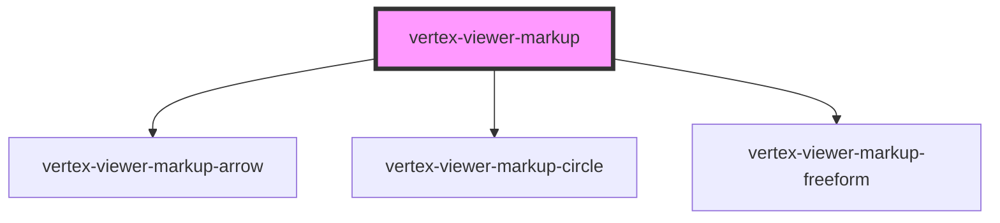

# vertex-viewer-markup

The `<vertex-viewer-markup>` component manages the presentation, creation
and editing of markup for the viewer.

## Create markup UI

The `<vertex-viewer-markup-tool>` can be added as a child to this component
to manage the creation of new markup through user interactions. When a new
markup is added, it's assigned an ID. This ID can be passed to
`getMarkupElement` or `selected-markup-id` to select a markup.

**Example:** Creating new markup through user interaction.

```html
<html>
<body>
  <vertex-viewer src="urn:vertexvis:stream-key:my-key">
    <vertex-viewer-markup id="markup">
      <vertex-viewer-markup-tool></vertex-viewer-markup-tool>
    </vertex-viewer-markup>
  </vertex-viewer>

  <script type="module">
    const markup = document.getElementById('markup');

    // An event is dispatched whenever a new markup is added.
    markup.addEventListener('markupAdded', (event) => {
      console.log(`markup added`, event.detail.id, event.detail.distance);
    })
  </script>
</body>
</html>
```

The markup type to create can be customized using the `tool` attribute on
the component.

**Example:** Changing the markup tool.

```html
<html>
<body>
  <vertex-viewer src="urn:vertexvis:stream-key:my-key">
    <vertex-viewer-markup tool="circle">
      <vertex-viewer-markup-tool></vertex-viewer-markup-tool>
    </vertex-viewer-markup>
  </vertex-viewer>
</body>
</html>
```

## Create Markup Programmatically.

Markup can be added programmatically using the `addMarkup()` or by
adding a markup as a child of this component.

**Note:** For the component to manage selection for markup added
as children, provide a unique ID to the element.

```html
<html>
<body>
  <button id="add-markup-btn">Add markup</button>

  <vertex-viewer src="urn:vertexvis:stream-key:my-key">
    <vertex-viewer-markup id="markup">
      <vertex-viewer-markup-tool></vertex-viewer-markup-tool>

      <!-- A markup added as a child component -->
      <vertex-viewer-markup-arrow
        id="my-markup-id"
        start="[-0.25, 0.25]"
        end="[0, 0]"
      ></vertex-viewer-markup-arrow>
    </vertex-viewer-markup>
  </vertex-viewer>

  <script type="module">
    import { ArrowMarkup } from 'https://unpkg.com/@vertexvis/viewer@latest/dist/viewer/index.esm.js'

    const markup = document.getElementById('markup');
    const button = document.getElementById('add-markup-btn');
    button.addEventListener('click', async () => {
      const arrow = new ArrowMarkup({
        start: { x: -0.25, y: 0.5 },
        end: { x: 0, y: 0 },
      });

      // Returns the HTML element for the newly added markup.
      const element = await markup.addMarkup(arrow);
    });
  </script>
</body>
</html>
```

## Styling markup

HTML templates and CSS variables are used to customize the styling of
markup that are added programmatically or through user interaction. See
the documentation of
[`<vertex-viewer-markup-arrow>`](../viewer-markup-arrow/readme.md)/[`<vertex-viewer-markup-circle>`](../viewer-markup-circle/readme.md)
for all styling options.

When a new markup is added, the markup's HTML from the template will
be cloned and added to the component.

**Example:** Styling markup.

```html
<html>
<head>
  <style>
    /* Styling for the markup resize and reposition anchors */
    .arrow-markup {
      --viewer-arrow-markup-background-color: black;
      --viewer-arrow-markup-border-color: white;
    }

    .arrow-markup .anchor {
      background-color: var(--viewer-arrow-markup-background-color);
      border: 1px solid var(--viewer-arrow-markup-border-color);
      box-sizing: border-box;
      width: 10px;
      height: 10px;
      border-radius: 100%;
    }
  </style>
</head>

<body>
  <!-- The template for arrow markup -->
  <template id="my-arrow-markup">
    <vertex-viewer-markup-arrow class="arrow-markup">
      <div slot="start-anchor" class="anchor"></div>
      <div slot="end-anchor" class="anchor"></div>
    </vertex-viewer-markup-arrow>
  </template>

  <vertex-viewer src="urn:vertexvis:stream-key:my-key">
    <!-- Pass the template ID to use for arrow markup -->
    <vertex-viewer-markup arrow-template-id="my-arrow-markup">
      <vertex-viewer-markup-tool></vertex-viewer-markup-tool>
    </vertex-viewer-markup>
  </vertex-viewer>
</body>
</html>
```

<!-- Auto Generated Below -->


## Properties

| Property             | Attribute              | Description                                                                                                                                            | Type                                   | Default     |
| -------------------- | ---------------------- | ------------------------------------------------------------------------------------------------------------------------------------------------------ | -------------------------------------- | ----------- |
| `arrowTemplateId`    | `arrow-template-id`    | An HTML template that describes the HTML to use for new arrow markup. It's expected that the template contains a `<vertex-viewer-markup-arrow>`.       | `string \| undefined`                  | `undefined` |
| `circleTemplateId`   | `circle-template-id`   | An HTML template that describes the HTML to use for new circle markup. It's expected that the template contains a `<vertex-viewer-markup-circle>`.     | `string \| undefined`                  | `undefined` |
| `disabled`           | `disabled`             | If `true`, disables adding or editing of markup through user interaction.                                                                              | `boolean`                              | `false`     |
| `freeformTemplateId` | `freeform-template-id` | An HTML template that describes the HTML to use for new freeform markup. It's expected that the template contains a `<vertex-viewer-markup-freeform>`. | `string \| undefined`                  | `undefined` |
| `selectNew`          | `select-new`           | Indicates if new markup should be automatically selected.                                                                                              | `boolean`                              | `false`     |
| `selectedMarkupId`   | `selected-markup-id`   | The ID of the markup that is selected.                                                                                                                 | `string \| undefined`                  | `undefined` |
| `tool`               | `tool`                 | The type of markup to perform.                                                                                                                         | `"arrow" \| "circle" \| "freeform"`    | `'arrow'`   |
| `viewer`             | --                     | The viewer to connect to markup. If nested within a <vertex-viewer>, this property will be populated automatically.                                    | `HTMLVertexViewerElement \| undefined` | `undefined` |


## Events

| Event           | Description                                                                                 | Type                                                                                                                              |
| --------------- | ------------------------------------------------------------------------------------------- | --------------------------------------------------------------------------------------------------------------------------------- |
| `markupAdded`   | Dispatched when a new markup is added, either through user interaction or programmatically. | `CustomEvent<HTMLVertexViewerMarkupArrowElement \| HTMLVertexViewerMarkupCircleElement \| HTMLVertexViewerMarkupFreeformElement>` |
| `markupRemoved` | Dispatched when a markup is removed, either through user interaction or programmatically.   | `CustomEvent<HTMLVertexViewerMarkupArrowElement \| HTMLVertexViewerMarkupCircleElement \| HTMLVertexViewerMarkupFreeformElement>` |


## Methods

### `addMarkup(markup: Markup) => Promise<HTMLVertexViewerMarkupArrowElement | HTMLVertexViewerMarkupCircleElement | HTMLVertexViewerMarkupFreeformElement>`

Adds a new markup as a child to this component. A new markup
component will be created from the template specified by
`arrow-template-id`, `circle-template-id`, or if undefined
a default element will be created.

#### Returns

Type: `Promise<HTMLVertexViewerMarkupArrowElement | HTMLVertexViewerMarkupCircleElement | HTMLVertexViewerMarkupFreeformElement>`

The markup element that was created.

### `getMarkupElement(id: string) => Promise<HTMLVertexViewerMarkupArrowElement | HTMLVertexViewerMarkupCircleElement | HTMLVertexViewerMarkupFreeformElement | undefined>`

Returns the markup element associated to the given ID.

#### Returns

Type: `Promise<HTMLVertexViewerMarkupArrowElement | HTMLVertexViewerMarkupCircleElement | HTMLVertexViewerMarkupFreeformElement | undefined>`

A markup element, or `undefined`.

### `getMarkupElements() => Promise<Array<HTMLVertexViewerMarkupArrowElement | HTMLVertexViewerMarkupCircleElement | HTMLVertexViewerMarkupFreeformElement>>`

Returns a list of markup elements that are children of this component.

#### Returns

Type: `Promise<(HTMLVertexViewerMarkupArrowElement | HTMLVertexViewerMarkupCircleElement | HTMLVertexViewerMarkupFreeformElement)[]>`

A list of all markups.

### `removeMarkup(id: string) => Promise<HTMLVertexViewerMarkupArrowElement | HTMLVertexViewerMarkupCircleElement | HTMLVertexViewerMarkupFreeformElement | undefined>`

Removes a markup with the given ID, and returns the HTML element
associated to the markup. Returns `undefined` if no markup is
found.

#### Returns

Type: `Promise<HTMLVertexViewerMarkupArrowElement | HTMLVertexViewerMarkupCircleElement | HTMLVertexViewerMarkupFreeformElement | undefined>`

The markup element, or undefined.


## Dependencies

### Depends on

- [vertex-viewer-markup-arrow](../viewer-markup-arrow)
- [vertex-viewer-markup-circle](../viewer-markup-circle)
- [vertex-viewer-markup-freeform](../viewer-markup-freeform.tsx)

### Graph


----------------------------------------------

*Built with [StencilJS](https://stenciljs.com/)*
