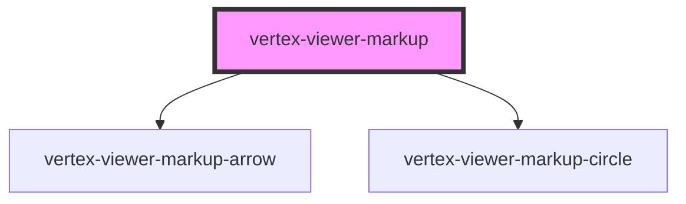

# vertex-viewer-markup

<!-- Auto Generated Below -->

## Properties

| Property           | Attribute            | Description                                                                                                         | Type                                   | Default     |
| ------------------ | -------------------- | ------------------------------------------------------------------------------------------------------------------- | -------------------------------------- | ----------- |
| `arrowTemplateId`  | `arrow-template-id`  |                                                                                                                     | `string \| undefined`                  | `undefined` |
| `circleTemplateId` | `circle-template-id` |                                                                                                                     | `string \| undefined`                  | `undefined` |
| `disabled`         | `disabled`           | If `true`, disables adding or editing of markup through user interaction.                                           | `boolean`                              | `false`     |
| `selectedMarkupId` | `selected-markup-id` | The ID of the markup that is selected.                                                                              | `string \| undefined`                  | `undefined` |
| `tool`             | `tool`               | The type of markup to perform.                                                                                      | `"arrow" \| "circle"`                  | `'arrow'`   |
| `viewer`           | --                   | The viewer to connect to markup. If nested within a <vertex-viewer>, this property will be populated automatically. | `HTMLVertexViewerElement \| undefined` | `undefined` |

## Methods

### `addMarkup(markup: Markup) => Promise<HTMLVertexViewerMarkupArrowElement | HTMLVertexViewerMarkupCircleElement>`

Adds a new markup as a child to this component. A new markup
component will be created from the template specified by
`arrow-template-id` or if undefined a default element will be created.

#### Returns

Type: `Promise<HTMLVertexViewerMarkupArrowElement | HTMLVertexViewerMarkupCircleElement>`

### `getMarkupElements() => Promise<Array<HTMLVertexViewerMarkupArrowElement | HTMLVertexViewerMarkupCircleElement>>`

Returns a list of measurement elements that are children of this component.

#### Returns

Type: `Promise<(HTMLVertexViewerMarkupArrowElement | HTMLVertexViewerMarkupCircleElement)[]>`

## Dependencies

### Depends on

- [vertex-viewer-markup-arrow](../viewer-markup-arrow)
- [vertex-viewer-markup-circle](../viewer-markup-circle)

### Graph

----------------------------------------------

*Built with [StencilJS](https://stenciljs.com/)*
