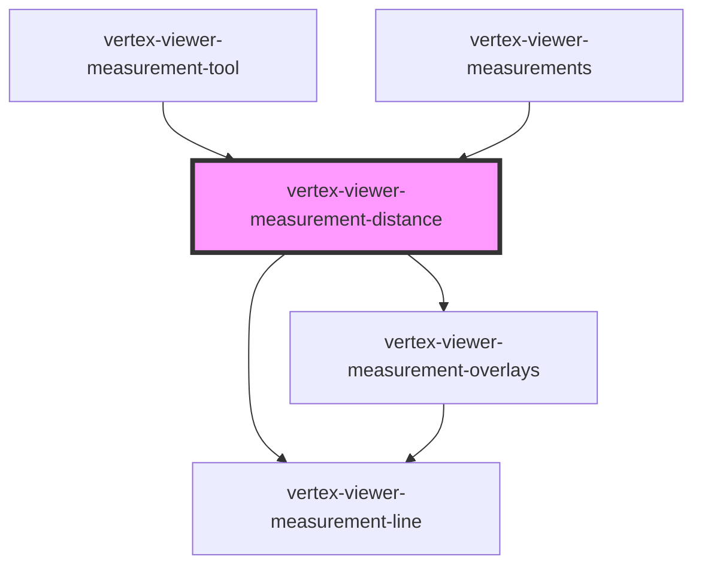

# vertex-viewer-measurement-distance

The `<vertex-viewer-measurement-distance>` is a component for displaying
point-to-point measurements between two 3D points. The component will place
anchors at each point with a line between the two anchors and display the
approximate distance between the two points.

Measurements should be placed in a `<vertex-viewer-measurements>` to be
displayed correctly.

**Example:** Creating a measurement between two points.

```html
<html>
<body>
  <vertex-viewer id="viewer" src="urn:vertexvis:stream-key:my-key">
    <vertex-viewer-measurements>
      <vertex-viewer-measurement-distance
        start-json="[10, -5, 0]"
        end-json="[150, 100, -50]"
      ></vertex-viewer-measurement-distance>
    </vertex-viewer-measurements>
  </vertex-viewer>
</body>
</html>
```

## Units of Measurement and Formatting

The displayed units of measurement and precision can be configured by setting
the `units` and `fractional-digits` attributes. Currently supported units
include: `millimeters`, `centimeters`, `meters`, `inches`, `feet`, `yards`.

**Example:** Settings units and fractional digits.

```html
<html>
<body>
  <vertex-viewer id="viewer" src="urn:vertexvis:stream-key:my-key">
    <vertex-viewer-measurements>
      <vertex-viewer-measurement-distance
        start-json="[10, -5, 0]"
        end-json="[150, 100, -50]"
        units="inches"
        fractional-digits="1"
      ></vertex-viewer-measurement-distance>
    </vertex-viewer-measurements>
  </vertex-viewer>
</body>
</html>
```

Default formatting can be overridden by setting the `labelFormatter` property.
This is a function that is passed the distance in real space and should return a
string.

**Example:** Replacing the default distance formatter.

```html
<html>
<body>
  <vertex-viewer id="viewer" src="urn:vertexvis:stream-key:my-key">
    <vertex-viewer-measurements>
      <vertex-viewer-measurement-distance
        id="measurement"
        start-json="[10, -5, 0]"
        end-json="[150, 100, -50]"
        units="in"
      ></vertex-viewer-measurement-distance>
    </vertex-viewer-measurements>
  </vertex-viewer>

  <script type="module">
    const measurement = document.getElementById('measurement');
    measurement.labelFormatter = (distance) => `${distance}"`;
  </script>
</body>
</html>
```

## Styling Anchors and Labels

The component exposes slots for customizing the HTML of the anchors.

**Example:** Providing custom anchors.

```html
<html>
<head>
  <style>
    .anchor {
      width: 10px;
      height: 10px;
      background-color: var(--viewer-distance-measurement-accent-color);
      border: 1px solid var(--viewer-distance-measurement-contrast-color);
    }
  </style>
</head>
<body>
  <vertex-viewer id="viewer" src="urn:vertexvis:stream-key:my-key">
    <vertex-viewer-measurements>
      <vertex-viewer-measurement-distance
        id="measurement"
        start-json="[10, -5, 0]"
        end-json="[150, 100, -50]"
        units="inches"
      >
        <div slot="start-anchor" class="anchor"></div>
        <div slot="end-anchor" class="anchor"></div>
      </vertex-viewer-measurement-distance>
    </vertex-viewer-measurements>
  </vertex-viewer>
</body>
</html>
```

The component also supports slots for supplying a label to the anchor. The label
will be positioned alongside the anchor, and its distance can be customized
using the `anchor-label-offset` attribute.

**Example:** Providing anchor labels.

```html
<html>
<head>
  <style>
    .label {
      width: 10px;
      height: 10px;
      background-color: var(--viewer-distance-measurement-accent-color);
      display: flex;
      align-items: center;
      justify-content: center;
    }
  </style>
</head>
<body>
  <vertex-viewer id="viewer" src="urn:vertexvis:stream-key:my-key">
    <vertex-viewer-measurements>
      <vertex-viewer-measurement-distance
        id="measurement"
        start-json="[10, -5, 0]"
        end-json="[150, 100, -50]"
        units="inches"
      >
        <div slot="start-label" class="label">A</div>
        <div slot="end-label" class="label">B</div>
      </vertex-viewer-measurement-distance>
    </vertex-viewer-measurements>
  </vertex-viewer>
</body>
</html>
```

<!-- Auto Generated Below -->


## Properties

| Property                 | Attribute                   | Description                                                                                                                                                                                                                                                                                                                               | Type                                                                          | Default                       |
| ------------------------ | --------------------------- | ----------------------------------------------------------------------------------------------------------------------------------------------------------------------------------------------------------------------------------------------------------------------------------------------------------------------------------------- | ----------------------------------------------------------------------------- | ----------------------------- |
| `anchorLabelOffset`      | `anchor-label-offset`       | The distance from an anchor to its label.                                                                                                                                                                                                                                                                                                 | `number`                                                                      | `20`                          |
| `camera`                 | --                          | The camera used to position the anchors. If `viewer` is defined, then the projection view matrix of the viewer will be used.                                                                                                                                                                                                              | `FramePerspectiveCamera \| undefined`                                         | `undefined`                   |
| `distance`               | `distance`                  | The distance between `start` and `end` in real world units. Value will be undefined if the start and end positions are undefined, or if the measurement is invalid.                                                                                                                                                                       | `number \| undefined`                                                         | `undefined`                   |
| `end`                    | --                          | The position of the ending anchor. Can either be an instance of a `Vector3` or a JSON string representation in the format of `[x, y, z]` or `{"x": 0, "y": 0, "z": 0}`.                                                                                                                                                                   | `Vector3 \| undefined`                                                        | `undefined`                   |
| `endJson`                | `end`                       | The position of the ending anchor, as a JSON string. Can either be an instance of a `Vector3` or a JSON string representation in the format of `[x, y, z]` or `{"x": 0, "y": 0, "z": 0}`.                                                                                                                                                 | `string \| undefined`                                                         | `undefined`                   |
| `fractionalDigits`       | `fractional-digits`         | The number of fraction digits to display.                                                                                                                                                                                                                                                                                                 | `number`                                                                      | `2`                           |
| `interactingAnchor`      | `interacting-anchor`        | A property that reflects which anchor is currently being interacted with.                                                                                                                                                                                                                                                                 | `"end" \| "none" \| "start"`                                                  | `'none'`                      |
| `invalid`                | `invalid`                   | Indicates if the measurement is invalid. A measurement is invalid if either the start or end position are not on the surface of the model.                                                                                                                                                                                                | `boolean`                                                                     | `false`                       |
| `labelFormatter`         | --                          | An optional formatter that can be used to format the display of a distance. The formatting function is passed a calculated real-world distance and is expected to return a string.                                                                                                                                                        | `((value: number \| undefined) => string) \| undefined`                       | `undefined`                   |
| `lineCapLength`          | `line-cap-length`           | The length of the caps at each end of the distance measurement.                                                                                                                                                                                                                                                                           | `number`                                                                      | `MEASUREMENT_LINE_CAP_LENGTH` |
| `mode`                   | `mode`                      | A mode that specifies how the measurement component should behave. When unset, the component will not respond to interactions with the handles. When `edit`, the measurement anchors are interactive and the user is able to reposition them. When `replace`, anytime the user clicks on the canvas, a new measurement will be performed. | `"" \| "edit" \| "replace"`                                                   | `''`                          |
| `showAxisReferenceLines` | `show-axis-reference-lines` | Enables the display of axis reference lines between the start and end point.                                                                                                                                                                                                                                                              | `boolean`                                                                     | `false`                       |
| `snapDistance`           | `snap-distance`             | The distance, in pixels, between the mouse and nearest snappable edge. A value of 0 disables snapping.                                                                                                                                                                                                                                    | `number`                                                                      | `MEASUREMENT_SNAP_DISTANCE`   |
| `start`                  | --                          | The position of the starting anchor. Can either be an instance of a `Vector3` or a JSON string representation in the format of `[x, y, z]` or `{"x": 0, "y": 0, "z": 0}`.                                                                                                                                                                 | `Vector3 \| undefined`                                                        | `undefined`                   |
| `startJson`              | `start`                     | The position of the starting anchor, as a JSON string. Can either be an instance of a `Vector3` or a JSON string representation in the format of `[x, y, z]` or `{"x": 0, "y": 0, "z": 0}`.                                                                                                                                               | `string \| undefined`                                                         | `undefined`                   |
| `units`                  | `units`                     | The unit of measurement.                                                                                                                                                                                                                                                                                                                  | `"centimeters" \| "feet" \| "inches" \| "meters" \| "millimeters" \| "yards"` | `'millimeters'`               |
| `viewer`                 | --                          | The viewer to connect to this measurement. The measurement will redraw any time the viewer redraws the scene.                                                                                                                                                                                                                             | `HTMLVertexViewerElement \| undefined`                                        | `undefined`                   |


## Events

| Event       | Description                                                                     | Type                |
| ----------- | ------------------------------------------------------------------------------- | ------------------- |
| `editBegin` | An event that is dispatched anytime the user begins editing the measurement.    | `CustomEvent<void>` |
| `editEnd`   | An event that is dispatched when the user has finished editing the measurement. | `CustomEvent<void>` |


## Methods

### `computeElementMetrics() => Promise<ViewerMeasurementDistanceElementMetrics | undefined>`

Computes the bounding boxes of the anchors and label. **Note:** invoking
this function uses `getBoundingClientRect` internally and will cause a
relayout of the DOM.

#### Returns

Type: `Promise<ViewerMeasurementDistanceElementMetrics | undefined>`


## Slots

| Slot             | Description                                                                                                                            |
| ---------------- | -------------------------------------------------------------------------------------------------------------------------------------- |
| `"end-anchor"`   | An HTML element for the ending point anchor.                                                                                           |
| `"end-label"`    | An HTML or text element that displays next to the end anchor.                                                                          |
| `"indicator"`    | An HTML element for the measurement indicator. The indicator represents the position where a measurement will be placed while editing. |
| `"start-anchor"` | An HTML element for the starting point anchor.                                                                                         |
| `"start-label"`  | An HTML or text element that displays next to the start anchor.                                                                        |


## CSS Custom Properties

| Name                                                   | Description                                                                                         |
| ------------------------------------------------------ | --------------------------------------------------------------------------------------------------- |
| `--viewer-measurement-distance-accent-color`           | A CSS color that specifies the color of lines, anchors and borders.                                 |
| `--viewer-measurement-distance-contrast-color`         | A CSS color that specifies a color opposite of the accent color.                                    |
| `--viewer-measurement-distance-distance-border`        | A CSS border that specifies the border color or image for the measurement's label.                  |
| `--viewer-measurement-distance-distance-border-radius` | A CSS length that specifies the border radius for the measurement's label.                          |
| `--viewer-measurement-distance-distance-padding`       | A CSS length that specifies the padding of the measurement's label.                                 |
| `--viewer-measurement-distance-invalid-accent-color`   | A CSS color that specifies the color of lines, anchors and borders when the measurement is invalid. |
| `--viewer-measurement-distance-invalid-contrast-color` | A CSS color that specifies a color opposite of the accent color when the measurement is invalid.    |
| `--viewer-measurement-distance-line-fill-width`        | A CSS length that width of the measurement line's fill.                                             |
| `--viewer-measurement-distance-line-stroke-width`      | A CSS length that width of the measurement line's stroke.                                           |


## Dependencies

### Used by

 - [vertex-viewer-measurement-tool](../viewer-measurement-tool)
 - [vertex-viewer-measurements](../viewer-measurements)

### Depends on

- [vertex-viewer-measurement-overlays](../viewer-measurement-overlays)
- [vertex-viewer-measurement-line](../viewer-measurement-line)

### Graph


----------------------------------------------

*Built with [StencilJS](https://stenciljs.com/)*
