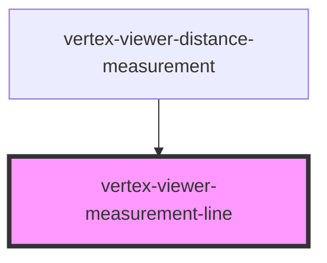

# vertex-viewer-measurement-line

<!-- Auto Generated Below -->

## Properties

| Property       | Attribute        | Description | Type     | Default          |
| -------------- | ---------------- | ----------- | -------- | ---------------- |
| `end`          | --               |             | `Point`  | `Point.create()` |
| `endCapLength` | `end-cap-length` |             | `number` | `0`              |
| `start`        | --               |             | `Point`  | `Point.create()` |

## Dependencies

### Used by

 - [vertex-viewer-distance-measurement](../viewer-distance-measurement)

### Graph

----------------------------------------------

*Built with [StencilJS](https://stenciljs.com/)*
