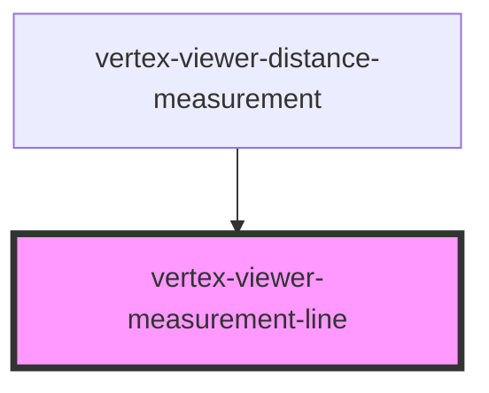

# vertex-viewer-measurement-line

<!-- Auto Generated Below -->

## Properties

| Property        | Attribute        | Description                                                                                                                                  | Type     | Default          |
| --------------- | ---------------- | -------------------------------------------------------------------------------------------------------------------------------------------- | -------- | ---------------- |
| `capLength`     | `cap-length`     | A length of the line cap. The line cap is a line at each end of a line.                                                                      | `number` | `0`              |
| `end`           | --               | A point that specifies the ending point of the line.                                                                                         | `Point`  | `Point.create()` |
| `pointerEvents` | `pointer-events` | The type of [SVG pointer events](https://developer.mozilla.org/en-US/docs/Web/SVG/Attribute/pointer-events) that the line should respond to. | `string` | `'none'`         |
| `start`         | --               | A point that specifies the starting point of the line.                                                                                       | `Point`  | `Point.create()` |

## CSS Custom Properties

| Name                                             | Description                                                   |
| ------------------------------------------------ | ------------------------------------------------------------- |
| `--viewer-measurement-line-end-cap-visibility`   | An CSS visibility value for the cap at the end of the line.   |
| `--viewer-measurement-line-fill`                 | An SVG stroke that specifies the color fill of the line.      |
| `--viewer-measurement-line-fill-width`           | A CSS length that specifies the width of the fill.            |
| `--viewer-measurement-line-start-cap-visibility` | An CSS visibility value for the cap at the start of the line. |
| `--viewer-measurement-line-stroke`               | An SVG stroke that specifies the color stroke of the line.    |
| `--viewer-measurement-line-stroke-opacity`       | An SVG stroke that specifies the stroke opacity of the line.  |
| `--viewer-measurement-line-stroke-width`         | A CSS length that specifies the width of the stroke.          |

## Dependencies

### Used by

 - [vertex-viewer-distance-measurement](../viewer-distance-measurement)

### Graph

----------------------------------------------

*Built with [StencilJS](https://stenciljs.com/)*
