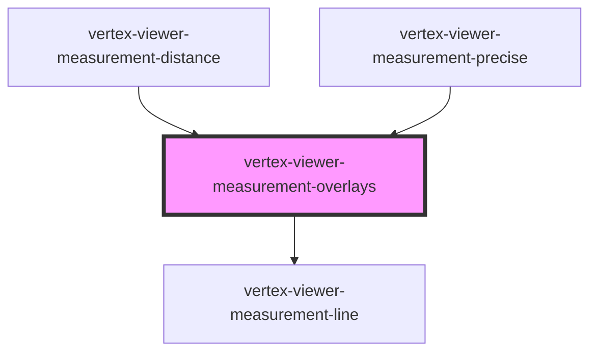

# vertex-viewer-measurement-overlays

<!-- Auto Generated Below -->

## Properties

| Property              | Attribute | Description                                      | Type                                   | Default                           |
| --------------------- | --------- | ------------------------------------------------ | -------------------------------------- | --------------------------------- |
| `measurementOverlays` | --        | The model that contains the overlays to present. | `MeasurementOverlayManager`            | `new MeasurementOverlayManager()` |
| `viewer`              | --        | The viewer that this component is bound to.      | `HTMLVertexViewerElement \| undefined` | `undefined`                       |

## CSS Custom Properties

| Name                                         | Description                                       |
| -------------------------------------------- | ------------------------------------------------- |
| `--viewer-measurement-overlays-x-axis-color` | A CSS color for overlays representing the X axis. |
| `--viewer-measurement-overlays-y-axis-color` | A CSS color for overlays representing the Y axis. |
| `--viewer-measurement-overlays-z-axis-color` | A CSS color for overlays representing the Z axis. |

## Dependencies

### Used by

 - [vertex-viewer-measurement-distance](../viewer-measurement-distance)
 - [vertex-viewer-measurement-precise](../viewer-measurement-precise)

### Depends on

- [vertex-viewer-measurement-line](../viewer-measurement-line)

### Graph

----------------------------------------------

*Built with [StencilJS](https://stenciljs.com/)*
